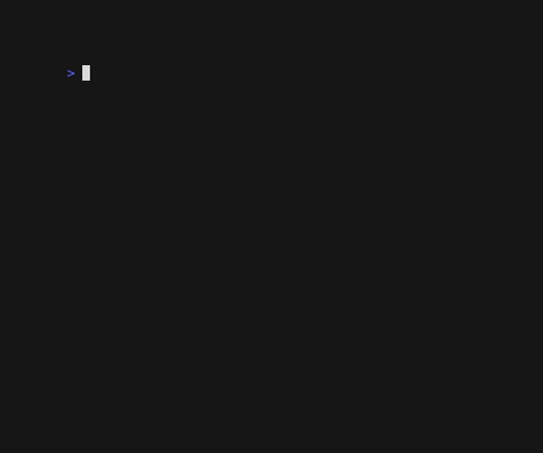
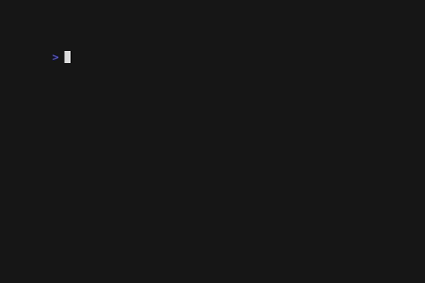

# glazed - Output structured data in a variety of formats

> Add the icing to your structured data!

Glazed is a library that makes it easy to output structured data.
When programming, we have a rich understanding of the data we are working with,
yet when we output it to the user, we are forced to use a flat, unstructured format.

It tries to implement some of the ideas listed in
[14 great tips to make amazing command line applications](https://dev.to/wesen/14-great-tips-to-make-amazing-cli-applications-3gp3).

It is in early alpha, and will change. Contributions are welcome,
but this project is going to be an experimental playground for a while,
while I try to figure out what is possible and worth tackling.

## Features

With glazed, you can output object and table data in a rich variety of ways:

- as human-readable tables


- as CSV/TSV


- as markdown


- as JSON



You can flatten fields (happens by default when outputting to a table)


You can select and reorder fields:



You can filter out fields:


- use go templates to customize output
- output individual objects or rows as separate files

Glazed provides a variety of "middlewares" with which you can:

- flatten nested objects into rows
- create new fields based on go templates
- filter and reorder columns

```go
of := formatters.NewCSVOutputFormatter()

of.AddTableMiddleware(middlewares.NewFlattenObjectMiddleware())
of.AddTableMiddleware(middlewares.NewFieldsFilterMiddleware(
	[]string{"a", "b"},
	[]string{"c"}
)

for _, obj := range objects {
	of.AddRow(&types.SimpleRow{Hash: obj})
}

s, err := of.Output()
fmt.Println(s)
```

For easy integration into your own tools, glazed provides:

- a simple API for:
  - input processors
  - row and object middlewares
  - output formatters
- bindings and helpers for:
  - go command-line flag parsing
  - cobra and viper libraries
  - YAML driven configuration

Glazed also comes with the glaze tool which can be use for simple data manipulation
and rich terminal output, leveraging the glazed library.

## Getting started

### Using the glaze command line tool

First, [install the glaze tool](#Installation).

- Show 4-5 cool examples

### Developing with glazed

Write a tiny command line tool:
- if CLI flags can be set up quickly, do that
- generate a random table
- output it using glazed

## Examples

### Output formats

- json
- yaml
- csv
- ascii
- markdown
- html

### File output

- Single file output
- Multi file output

### Flattening structures

- json to rows

### Filtering columns

- filters and fields

### Go template support

- single string template
- multi file templates
- field templates

### Markdown output and templating

- Multi markdown template output with index page
- markdown template file

### Configuration file

- some examples

### Schema documentation

- show how to output schema

## Using glaze as a library

### Middlewares

- ObjectMiddleware
- RowMiddleware
- TableMiddleware

### Formatters

- TableOutputFormatter
- CsvOutputFormatter

### Command Line Integration

- cobra integration
- viper integration
- calibrate from config files

### Schema documentation

- show how to load different schemas

## The glaze tool

### Installation

Run the `glaze` to using `go run ./cmd/glaze`.

### Import formats

- json / json rows / multiple files
- yaml / multiple files
- csv
- cut / ascii
- sqlite / SQL
- binary parser

### Output flags

## Current RFCs

I keep a list of the current planned features as RFC documents.

- [01 - Flag helpers](doc/rfcs/drafts/01_2022-11-13_flag-helpers.md)
- [02 - Multi-file output](doc/rfcs/drafts/02_2022-11-13_multi-file-output.md)
- [03 - SQLite output](doc/rfcs/drafts/03_2022-11-13_sqlite-output.md)
- [04 - Configuration files](doc/rfcs/drafts/04_2022-11-13_configuration-file.md)
- [05 - Glaze CLI tool](doc/rfcs/drafts/05_2022-11-19_glaze-cli-tool.md)

## General brainstorm

- documentation for each subsystem

## Future ideas

### Glaze CLI

#### UX

- table app that can hide/show/rename/reorder columns
- markdown rendering with glow
- style aliases (like pretty=oneline for git)
  - maybe styles can also have additional parameters
- sparklines and other shenanigans

#### File Formats

- add support for arbitrary input / output SQL
- add support for inputting binary data and providing a parser
- add support for pcap input
- add support for excel input
- parquet format (and pandas? numpy?)
- excel export
  - annotate excel export with as much metadata as possible

#### Transformation

- add jq support
- search engine  / autocompletion based on known schema
  - use query language to create hyperlinks in output

#### Misc glaze features

- add support for pushing to cloud resources
  - dynamodb
  - S3
  - SQL connectors (see arbitrary input / output SQL)
- add support for serving over HTTP
  - API server to render local data
  - HTML frontend
- serve a local SQL database? meh...
  - useful if you want the user to modify the DB? why not just output sqlite
- cloud / network API output forms, for example to store something in s3 or other databases
  - SQL
  - dynamodb
  - s3
- do we want some kind of transformation DSL / configuration DSL to do
  more complicated things? Definitely not at first, before having the use case for it.
- hyperlinked schema definitions
- collect metadata and event logs to what led to the creation of the data itself

