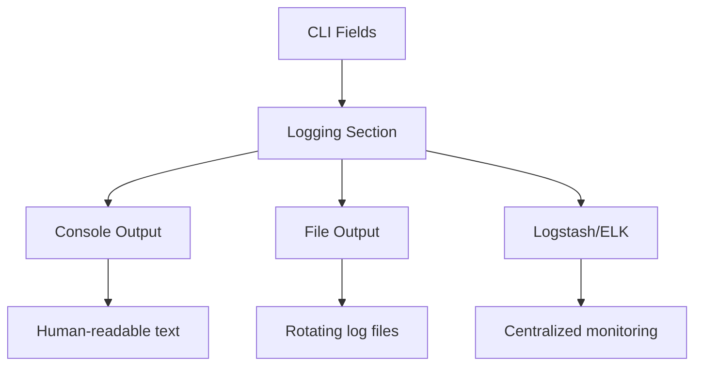

# Logging Section API Reference

## Overview

The Glazed logging section provides comprehensive logging configuration for CLI applications through command-line fields, environment variables, and configuration files. The section handles setup for console output, file logging, and centralized log aggregation while supporting multiple output formats and verbosity levels.

### Key Capabilities

- **Multiple output targets**: Console, file, and Logstash integration
- **Structured logging**: JSON and text formats with contextual fields
- **Automatic configuration**: Single function call for complete setup
- **Production features**: Log rotation, centralized collection, performance optimization

## Architecture



The logging section transforms command-line fields into configured log outputs, supporting development, testing, and production deployment scenarios.

## Implementation

### Basic Integration

Add the logging section to any Glazed command:

```go
import (
    "github.com/go-go-golems/glazed/pkg/cmds/logging"
    "github.com/rs/zerolog/log"
)

func NewMyCommand() (*MyCommand, error) {
    loggingSection, err := logging.NewLoggingSection()
    if err != nil {
        return nil, fmt.Errorf("failed to create logging section: %w", err)
    }
    
    cmdDesc := cmds.NewCommandDescription(
        "my-command",
        cmds.WithShort("Command with logging support"),
        cmds.WithSectionsList(loggingSection),
    )
    
    return &MyCommand{CommandDescription: cmdDesc}, nil
}

func (c *MyCommand) RunIntoGlazeProcessor(
    ctx context.Context,
    parsedSections *values.Values,
    gp middlewares.Processor,
) error {
    // Initialize logging settings from parsed sections
    var settings logging.LoggingSettings
    if err := parsedSections.DecodeSectionInto(logging.LoggingSectionSlug, &settings); err != nil {
        return fmt.Errorf("failed to get logging settings: %w", err)
    }
    
    if err := logging.InitLoggerFromSettings(&settings); err != nil {
        return fmt.Errorf("failed to initialize logger: %w", err)
    }
    
    log.Info().Msg("Processing started")
    // Command implementation
    return nil
}
```

### Structured Logging Patterns

Use structured fields for effective logging:

```go
func processFile(fileName string) error {
    start := time.Now()
    
    log.Debug().
        Str("file", fileName).
        Msg("Starting file processing")
    
    data, err := os.ReadFile(fileName)
    if err != nil {
        log.Error().
            Str("file", fileName).
            Err(err).
            Msg("Failed to read file")
        return fmt.Errorf("reading file %s: %w", fileName, err)
    }
    
    log.Info().
        Str("file", fileName).
        Int("bytes_processed", len(data)).
        Dur("duration", time.Since(start)).
        Msg("File processed successfully")
    
    return nil
}
```

### Contextual Loggers

Create loggers with persistent context for complex operations:

```go
func processUser(userID string) error {
    userLogger := log.With().
        Str("user_id", userID).
        Str("operation", "user_processing").
        Logger()
    
    userLogger.Info().Msg("Starting user processing")
    
    if err := validateUser(userID); err != nil {
        userLogger.Error().
            Err(err).
            Msg("User validation failed")
        return err
    }
    
    userLogger.Info().Msg("User processing completed")
    return nil
}
```

## Configuration Fields

### Command-Line Flags

| Field | Type | Default | Description |
|-----------|------|---------|-------------|
| `--log-level` | choice | `info` | Verbosity level (trace, debug, info, warn, error, fatal) |
| `--log-format` | choice | `text` | Output format (text, json) |
| `--log-file` | string | `""` | Output file path with automatic rotation |
| `--with-caller` | bool | `false` | Include source file and line number |
| `--log-to-stdout` | bool | `false` | Force output to stdout regardless of other settings |
| `--logstash-enabled` | bool | `false` | Enable Logstash output |
| `--logstash-host` | string | `""` | Logstash server hostname |
| `--logstash-port` | int | `5044` | Logstash server port |
| `--logstash-protocol` | string | `tcp` | Connection protocol |
| `--logstash-app-name` | string | `""` | Application identifier in logs |
| `--logstash-environment` | string | `""` | Environment tag (dev, staging, prod) |

### Log Levels

| Level | Purpose | Usage |
|-------|---------|-------|
| `trace` | Extremely detailed execution flow | Performance debugging |
| `debug` | Detailed diagnostic information | Development troubleshooting |
| `info` | General application progress | Default production level |
| `warn` | Unexpected conditions that don't halt execution | Monitoring degraded performance |
| `error` | Error conditions with continued execution | Problem tracking |
| `fatal` | Critical errors requiring application termination | System failures |

### Output Formats

**Text format** (human-readable):
```
INFO  2023-12-07T10:30:00Z Processing started
DEBUG 2023-12-07T10:30:01Z File loaded file=data.csv rows=1000
```

**JSON format** (machine-readable):
```json
{"level":"info","time":"2023-12-07T10:30:00Z","message":"Processing started"}
{"level":"debug","time":"2023-12-07T10:30:01Z","message":"File loaded","file":"data.csv","rows":1000}
```

## Production Deployment

### File Logging

Configure automatic log rotation for production:

```bash
myapp process-data \
    --log-level info \
    --log-format json \
    --log-file /var/log/myapp/application.log
```

File logging features:
- **Rotation**: 10MB maximum file size
- **Retention**: 3 backup files, 28-day retention
- **Thread safety**: Atomic writes for concurrent operations

### Centralized Logging

Send logs directly to ELK stack:

```bash
myapp process-data \
    --log-level info \
    --log-format json \
    --logstash-host logs.company.com \
    --logstash-port 5044 \
    --logstash-app-name myapp \
    --logstash-environment production
```

### Environment Variables

Configure logging through environment variables:

```bash
export MYAPP_LOG_LEVEL=info
export MYAPP_LOG_FORMAT=json
export MYAPP_LOG_FILE=/var/log/myapp.log
export MYAPP_LOGSTASH_HOST=logs.company.com
export MYAPP_LOGSTASH_PORT=5044
```

## API Reference

### Core Types

#### LoggingSettings

```go
type LoggingSettings struct {
    WithCaller          bool   `glazed:"with-caller"`
    LogLevel            string `glazed:"log-level"`
    LogFormat           string `glazed:"log-format"`
    LogFile             string `glazed:"log-file"`
    LogToStdout         bool   `glazed:"log-to-stdout"`
    LogstashEnabled     bool   `glazed:"logstash-enabled"`
    LogstashHost        string `glazed:"logstash-host"`
    LogstashPort        int    `glazed:"logstash-port"`
    LogstashProtocol    string `glazed:"logstash-protocol"`
    LogstashAppName     string `glazed:"logstash-app-name"`
    LogstashEnvironment string `glazed:"logstash-environment"`
}
```

### Functions

#### Working with Logging Settings

To initialize logging from parsed sections, use the standard pattern:

```go
// Extract logging settings from parsed sections
var settings logging.LoggingSettings
if err := parsedSections.DecodeSectionInto(logging.LoggingSectionSlug, &settings); err != nil {
    return fmt.Errorf("failed to get logging settings: %w", err)
}

// Initialize logger from settings
if err := logging.InitLoggerFromSettings(&settings); err != nil {
    return fmt.Errorf("failed to initialize logger: %w", err)
}
```

#### InitLoggerFromSettings

```go
func InitLoggerFromSettings(settings *LoggingSettings) error
```

Configures global logger from logging settings struct.

**Usage**:
```go
if err := logging.InitLoggerFromSettings(&settings); err != nil {
    return fmt.Errorf("failed to initialize logger: %w", err)
}
```

#### Custom Validation Pattern

For custom validation of logging settings:

```go
var settings logging.LoggingSettings
if err := parsedSections.DecodeSectionInto(logging.LoggingSectionSlug, &settings); err != nil {
    return fmt.Errorf("failed to extract logging settings: %w", err)
}

// Custom validation
if settings.LogstashHost != "" && settings.LogstashPort <= 0 {
    return fmt.Errorf("invalid logstash configuration")
}

return logging.SetupLogging(settings)
```

#### NewLoggingSection

```go
func NewLoggingSection() (schema.Section, error)
```

Creates field section for command definitions.

**Usage**:
```go
loggingSection, err := logging.NewLoggingSection()
if err != nil {
    return nil, err
}

cmdDesc := cmds.NewCommandDescription(
    "my-command",
    cmds.WithSectionsList(loggingSection),
)
```

## Performance Optimization

### Conditional Expensive Operations

Avoid performance penalties for debug logging:

```go
// Efficient: Check if debug is enabled before expensive operations
if log.Debug().Enabled() {
    expensiveData := calculateComplexDebuggingInfo()
    log.Debug().
        Interface("debug_data", expensiveData).
        Msg("Detailed debug information")
}

// Always efficient: Simple field logging
log.Info().
    Str("user", userID).
    Int("count", itemCount).
    Dur("elapsed", duration).
    Msg("Operation completed")
```

## Configuration Examples

### Development Configuration

```yaml
logging:
  log-level: debug
  log-format: text
  with-caller: true
```

### Production Configuration

```yaml
logging:
  log-level: info
  log-format: json
  log-file: /var/log/application.log
  logstash-enabled: true
  logstash-host: logs.company.com
  logstash-port: 5044
  logstash-app-name: myapp
  logstash-environment: production
```

## Common Issues

### No Log Output

**Symptoms**: Application runs but produces no log output

**Solutions**:
1. Verify logging initialization is called before logging:
   ```go
   var settings logging.LoggingSettings
   parsedSections.DecodeSectionInto(logging.LoggingSectionSlug, &settings)
   logging.InitLoggerFromSettings(&settings)
   ```
2. Check log level filtering: use `--log-level debug`
3. Verify file permissions for `--log-file` destinations

### Incorrect Format

**Symptoms**: Unexpected output format (JSON instead of text or vice versa)

**Solutions**:
1. Explicitly set format: `--log-format json` or `--log-format text`
2. Check environment variables: `LOG_FORMAT` may override settings
3. Verify configuration file format settings

### Logstash Connection Failures

**Symptoms**: Cannot connect to Logstash server

**Solutions**:
1. Test network connectivity: `telnet logstash-host 5044`
2. Verify firewall rules and network policies
3. Ensure Logstash TCP input configuration
4. Check DNS resolution for hostnames

## See Also

- [Custom Section Tutorial](../tutorials/custom-section.md): Creating custom field sections
- [Sections Guide](../topics/sections-guide.md): Field section system overview
- [Commands Guide](../topics/commands-guide.md): Building CLI commands
- [Configuration Guide](../topics/configuration-guide.md): Advanced configuration patterns
