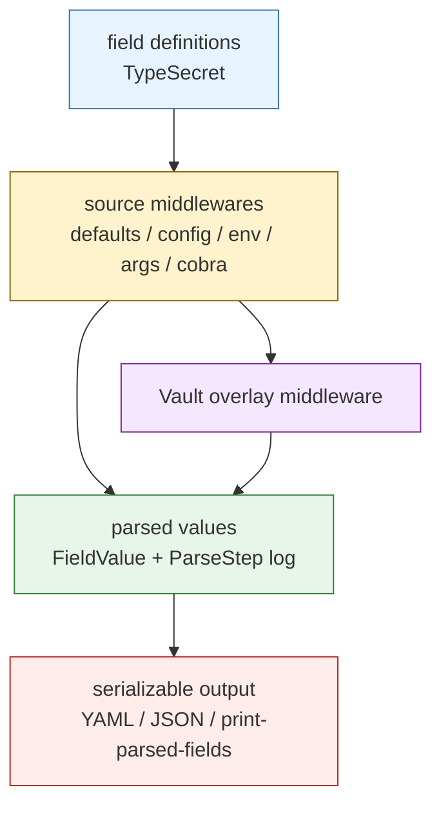
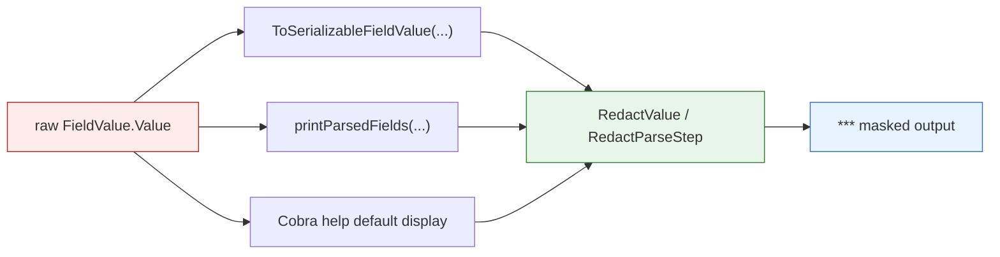
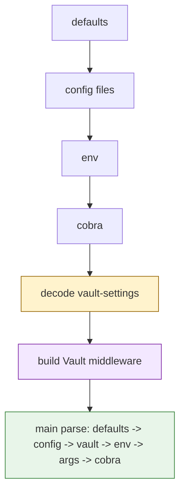

# Glazed Secret Redaction and Vault Bootstrap

This work started as a request that looked deceptively small: add Vault-backed secret support to Glazed, and make secret-bearing output safe. In practice it turned into a clean two-phase piece of framework work. The first phase hardened Glazed's existing `TypeSecret` behavior so debug and serialization paths stopped leaking raw values. The second phase added a real source-layer Vault integration with bootstrap parsing, precedence tests, and a much sharper rule about which fields are actually eligible for secret hydration.

The result is not a giant secret-management framework. It is a smaller, more useful step: Glazed now has a central redaction policy and a reusable Vault source story that composes with its existing source middleware model.

> [!summary]
> This project report covers three concrete outcomes:
> 1. `TypeSecret` is now actually safe across Glazed's main parsed-value output paths, not just one rendering helper
> 2. Vault support landed as reusable `pkg/cmds/sources` APIs with bootstrap parsing and precedence-aware tests
> 3. the implementation deliberately did **not** add a `credentials` alias or a broader resolver framework, keeping the first merge tight and defensible

## Why this work existed

Glazed already had part of the story. It already knew about `fields.TypeSecret`, and it already treated secret values as strings during parsing. That made it tempting to think the framework already had "secret support". But the reality was more uneven.

The leak was not in one obvious place. It was spread across debug and serialization surfaces:

- `RenderValue` masked secret values
- `ToSerializableFieldValue(...)` still copied raw secret values and parse logs
- `--print-parsed-fields` still emitted raw `FieldValue.Value` and raw `ParseStep.Value`
- Cobra help/default rendering could still show a secret default

At the same time, a migrated proof of concept already existed in `vault-envrc-generator`. That code had the right overall middleware shape, but it was still too broad for a framework primitive because it updated any matching field by name instead of only sensitive fields.

So the real job was not "invent a secret system". It was:

1. make the existing sensitivity semantic real and central,
2. port the good part of the older Vault middleware shape,
3. keep the feature small enough that it would actually land cleanly in Glazed core.

## Current project status

This work is implemented, committed, tested, and documented.

What landed:

- Phase 1 secret redaction hardening in Glazed core
- Phase 2 Vault settings, token/path helpers, Vault overlay middleware, and bootstrap helper
- focused tests for both phases
- a ticket-level design guide and diary under this GL-009 ticket

What was intentionally left out:

- no `credentials` alias
- no generic secret-provider registry
- no `SecretRef` field model
- no higher-level `appconfig.WithVault(...)` wrapper

That omission is part of the design quality here, not a missing feature accidentally deferred.

## Project shape

This was a workspace-level effort, but the main implementation target was the `glazed` repo inside the workspace:

- workspace root:
  - `/home/manuel/workspaces/2025-09-10/add-vault-middleware-to-glazed`
- main target repo:
  - `/home/manuel/workspaces/2025-09-10/add-vault-middleware-to-glazed/glazed`
- reference repo used for migration analysis:
  - `/home/manuel/workspaces/2025-09-10/add-vault-middleware-to-glazed/vault-envrc-generator`

The most important code locations are:

- redaction:
  - `/home/manuel/workspaces/2025-09-10/add-vault-middleware-to-glazed/glazed/pkg/cmds/fields/sensitive.go`
  - `/home/manuel/workspaces/2025-09-10/add-vault-middleware-to-glazed/glazed/pkg/cmds/fields/serialize.go`
  - `/home/manuel/workspaces/2025-09-10/add-vault-middleware-to-glazed/glazed/pkg/cli/helpers.go`
  - `/home/manuel/workspaces/2025-09-10/add-vault-middleware-to-glazed/glazed/pkg/cmds/fields/cobra.go`
- Vault support:
  - `/home/manuel/workspaces/2025-09-10/add-vault-middleware-to-glazed/glazed/pkg/cmds/sources/vault_settings.go`
  - `/home/manuel/workspaces/2025-09-10/add-vault-middleware-to-glazed/glazed/pkg/cmds/sources/vault.go`
  - `/home/manuel/workspaces/2025-09-10/add-vault-middleware-to-glazed/glazed/pkg/cmds/sources/vault_test.go`

The most important design evidence lives in:

- the GL-009 design guide
- the GL-009 diary
- the migrated `vault-envrc-generator` middleware and Vault-layer code

## Architecture

The easiest mental model is that this feature sits on top of Glazed's existing field-definition and source-middleware pipeline.



The crucial design point is that Vault was added as **another source middleware**, not as a parallel config system. That keeps the feature aligned with how Glazed already thinks:

- defaults set the baseline
- config files overlay them
- Vault can hydrate sensitive values
- env/args/flags still get the final word if they are placed later in the chain

## What changed

The implementation landed in two phases with separate code commits.

### Phase 1. Central secret redaction

Commit:

- `c4445fa780898da9b3e4612409968ceac5e5e99a`
  - `Redact secret values in debug and serialization output`

This phase introduced a shared sensitivity/redaction layer in `pkg/cmds/fields`.

Before this change, the framework had a mismatch:

- secret values were masked in one rendering path
- but not in the serialization and parse-debugging paths that engineers actually use while troubleshooting config problems

The fix was to make redaction a central concern instead of an ad hoc formatting choice.

#### Phase 1 flow



The interesting part was not only redacting the final field value. Parse logs and metadata can also leak secret-bearing source material. The implementation therefore redacts:

- `FieldValue.Value`
- `ParseStep.Value`
- string-bearing metadata like config `map-value`
- secret defaults as displayed by Cobra help

But it does **not** blindly destroy all metadata. Structural metadata such as a config file index is still useful for debugging and safe to preserve.

#### Phase 1 pseudocode

```go
func ToSerializableFieldValue(value *FieldValue) *SerializableFieldValue {
    t := value.Definition.Type

    return &SerializableFieldValue{
        Definition: value.Definition,
        Value:      RedactValue(t, value.Value),
        Log:        mapEach(value.Log, func(step ParseStep) ParseStep {
            return RedactParseStep(t, step)
        }),
    }
}
```

That is the right kind of framework fix: one shared behavior, many safer call sites.

### Phase 2. Vault middleware and bootstrap parsing

Commit:

- `b18ccb696dd828dfa99b3fc1cd3c6a12d0dc397d`
  - `Add Vault source middleware and bootstrap helper`

This phase added a reusable Vault settings section and source middleware under `pkg/cmds/sources`.

The two core APIs are:

```go
func NewVaultSettingsSection() (schema.Section, error)
func GetVaultSettings(parsed *values.Values) (*VaultSettings, error)
func BootstrapVaultSettings(configFiles []string, envPrefixes []string, cmd *cobra.Command) (*VaultSettings, error)
func FromVaultSettings(vs *VaultSettings, options ...fields.ParseOption) sources.Middleware
```

The design stayed deliberately narrow:

- `vault-token` is `TypeSecret`
- only `TypeSecret` fields are eligible for Vault hydration
- Vault is inserted as a source middleware, not as a new framework execution model
- bootstrap parsing only targets `vault-settings`

#### Why bootstrap parsing was necessary

This is the subtle part that makes the work more interesting than "just fetch secrets from Vault".

The same config sources play two different roles:

1. they may need to configure Vault itself
2. they may also need to override final app field values **after** Vault hydration

That creates a precedence cycle if you try to do everything in one pass.

The fix is a mini parse of just the Vault provider settings:



This preserves the intended rule:

- config/env/flags can decide how to connect to Vault
- but env/args/flags still get to override the final secret-backed application fields

#### Phase 2 pseudocode

```go
func FromVaultSettings(vs *VaultSettings, options ...fields.ParseOption) Middleware {
    return func(next HandlerFunc) HandlerFunc {
        return func(schema_ *schema.Schema, parsedValues *values.Values) error {
            if err := next(schema_, parsedValues); err != nil {
                return err
            }

            client := newVaultClientFromSettings(vs)
            path := renderVaultPath(client, vs.SecretPath)
            secrets := client.ReadPath(path)

            for each section in schema_ {
                if section.slug == "vault-settings" {
                    continue
                }

                for each definition in section.definitions {
                    if !definition.Type.IsSensitive() {
                        continue
                    }

                    if raw, ok := secrets[definition.Name]; ok {
                        update parsedValues with source=vault, path=path
                    }
                }
            }
        }
    }
}
```

That `IsSensitive()` check is the design center of the whole feature. It prevents the framework from turning a coincidental key-name match into an implicit overwrite of ordinary fields.

## Implementation details

This part of the work is worth understanding because it reflects a specific framework philosophy: use the smallest change that makes the system easier to reason about.

### 1. Keep one sensitivity semantic

One of the early design proposals suggested accepting a second spelling like `credentials`. That sounds harmless, but it would have widened the change set across every place Glazed already knows about `TypeSecret`:

- parsing
- validation
- reflect assignment
- Cobra integration
- JSON schema generation
- codegen
- output rendering
- docs and tests

None of that work actually helps with redaction or Vault precedence. So the implemented version simply stayed on `TypeSecret`.

That is a good example of framework restraint: saying "no" to a superficially easy feature can make the actual feature much better.

### 2. Fix redaction once, not at every call site

The dangerous version of this work would have looked like a lot of local `if type == secret { print(\"***\") }` patches. That would solve today's leak and create tomorrow's maintenance hazard.

Instead, the implementation concentrated the behavior in field helpers and then routed existing output paths through those helpers. That makes it much easier to reason about what "secret-safe output" actually means in Glazed.

### 3. Treat Vault as another source

The strongest architectural decision in the second phase is that Vault is not special in the parser. It is just another middleware with a very specific placement in the source order.

That keeps the mental model compact:

```text
defaults -> config -> vault -> env -> args -> cobra
```

The moment Vault becomes "special parser magic", the framework becomes much harder to debug.

### 4. Skip implicit field matching except for declared sensitive fields

The migrated `vault-envrc-generator` code demonstrated the right overlay shape, but it still updated any matching field name. That is too permissive for framework code.

The implemented rule is much better:

> only fields explicitly declared as sensitive are eligible for secret hydration

That rule aligns security semantics with hydration semantics, which is exactly what you want in a reusable library.

### 5. Keep the public surface at the source layer

A tempting next step would have been a dedicated `appconfig.WithVault(...)` wrapper analogous to `WithProfile(...)`. The implementation did not go there yet.

That was the right call for this change set because:

- the helper already proves the bootstrap model
- the source-layer API is immediately reusable
- a higher-level wrapper can still be added later if multiple apps want the same bootstrap wiring

In other words, the abstraction was delayed until there is actual repetition to justify it.

## Verification

The work was not left at "looks good in the diff".

### Phase 1 validation

- focused tests:
  - `go test ./pkg/cmds/fields ./pkg/cli`
- commit hooks also ran broader validation when the redaction code was committed

### Phase 2 validation

- focused tests:
  - `go test ./pkg/cmds/sources`
- the `b18ccb6` pre-commit hook also ran:
  - repo-wide tests
  - `golangci-lint`
  - `gosec`
  - `govulncheck`

The final ticket validation also passed:

- `docmgr doctor --ticket GL-009-VAULT-SECRETS --stale-after 30`

## Important project docs

The ticket documentation for this work is unusually important because it includes both the design reasoning and the implementation diary.

Key docs:

- `/home/manuel/workspaces/2025-09-10/add-vault-middleware-to-glazed/glazed/ttmp/2026/04/02/GL-009-VAULT-SECRETS--add-vault-backed-secrets-and-redaction-to-glazed/design-doc/01-intern-guide-vault-backed-secrets-credentials-aliases-and-redaction-in-glazed.md`
- `/home/manuel/workspaces/2025-09-10/add-vault-middleware-to-glazed/glazed/ttmp/2026/04/02/GL-009-VAULT-SECRETS--add-vault-backed-secrets-and-redaction-to-glazed/reference/01-diary.md`
- `/home/manuel/workspaces/2025-09-10/add-vault-middleware-to-glazed/glazed/ttmp/2026/04/02/GL-009-VAULT-SECRETS--add-vault-backed-secrets-and-redaction-to-glazed/changelog.md`

These docs are the best place to look if someone later asks:

- why no `credentials` alias?
- why source-layer APIs instead of a parser wrapper?
- why bootstrap parsing at all?
- why only `TypeSecret` fields get hydrated?

## Open questions

- Should a later follow-up add `appconfig.WithVault(...)` once multiple apps repeat the same bootstrap wiring?
- Should token lookup remain CLI-based through `vault token lookup`, or should a future version move toward a pure API-based strategy?
- Should templated Vault paths eventually be able to see more application context than token metadata?
- Is there enough downstream demand to justify examples/help pages in Glazed itself, or should that wait for the first real consumer command?

## Near-term next steps

- adopt the new Vault source helpers in a real downstream Glazed-based CLI
- add an example command or help page once there is a concrete usage pattern worth documenting
- watch whether repeated caller code justifies a higher-level `appconfig` wrapper
- keep resisting framework-generalization pressure until there is a second real provider or mapping requirement

## Project working rule

> [!important]
> When a framework feature touches both security semantics and precedence semantics, prefer the smallest implementation that makes the invariants clearer.
> In this project, that meant:
> 1. one sensitivity semantic (`TypeSecret`)
> 2. one central redaction policy
> 3. one source-layer Vault middleware
> 4. one bootstrap helper instead of a broader configuration framework
