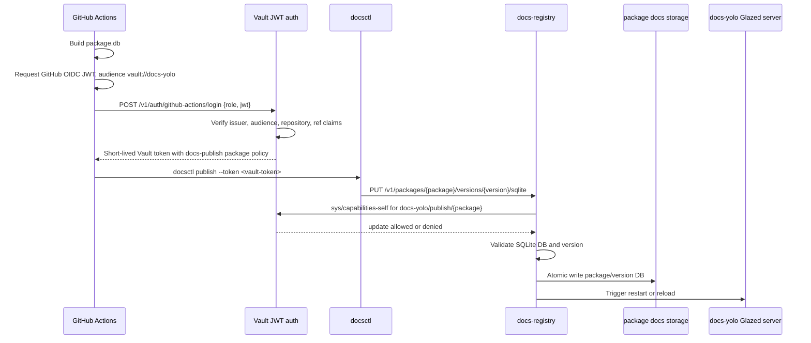
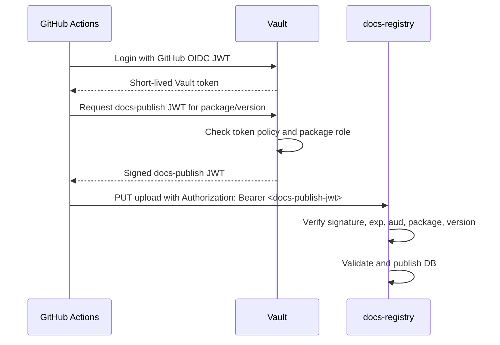

# Vault GitHub OIDC and signed JWT docs publishing auth implementation guide

## Executive summary

The Phase 1 docs publishing model for `docs.yolo.scapegoat.dev` uses static package publish tokens stored and rotated through Vault. That is a good bootstrap path, but it still leaves long-lived repository secrets in GitHub. Phase 2 and Phase 3 remove those long-lived package secrets.

Phase 2 uses **GitHub Actions OIDC to Vault JWT auth**. A package release workflow asks GitHub for a short-lived OIDC identity token. Vault verifies the token claims, including repository and ref constraints, and returns a short-lived Vault token with a policy such as `docs-yolo/publish/pinocchio`. The docs registry receives that Vault token from `docsctl publish` and asks Vault whether the token has permission to publish the requested package.

Phase 3 refines the boundary. Instead of sending Vault client tokens to the registry, Vault signs a purpose-built **docs publish JWT**. The registry validates that JWT locally using Vault's public verification key or a configured JWKS endpoint. The token contains only application-level claims such as package, repository, version pattern, permissions, and expiry.

Recommended progression:

```text
Phase 1: static per-package tokens stored in Vault
Phase 2: GitHub OIDC -> Vault JWT auth -> short-lived Vault token -> registry checks Vault capabilities
Phase 3: GitHub OIDC -> Vault -> Vault-signed docs-publish JWT -> registry validates JWT locally
```

Do not skip Phase 1 if the registry, storage, validation, and reload path are not working yet. Auth sophistication should not block proving the core publishing pipeline. Once publishing works, Phase 2 is the right security upgrade.

## Problem statement

The docs publishing system needs to answer this question for every upload:

> Is this caller allowed to publish documentation for package `<package>` at version `<version>`?

With static tokens, the answer is based on a long-lived shared secret in a repository. That is acceptable for an internal MVP but weak for broader third-party publishing because:

- secrets can leak from CI logs or repository settings;
- rotation is manual;
- a token does not prove which workflow, ref, or commit used it;
- token scoping is enforced only by the registry's token table;
- onboarding many repositories becomes operationally tedious.

GitHub Actions already has an identity model. Workflows can request an OIDC token from GitHub with claims like repository, ref, actor, workflow, and SHA. Vault can validate that token and mint short-lived credentials. The goal is to reuse that identity instead of distributing long-lived docs publish secrets.

## Current platform context

The Hetzner k3s platform already uses Vault as a central control plane for secrets and machine auth. Relevant evidence from the k3s repository:

- `HK3S-0004` documents enabling Vault Kubernetes auth and baseline workload policies. It establishes the pattern that machine identities should receive least-privilege Vault policies rather than broad tokens.
- The Vault backup playbook documents a production pattern where a workload authenticates to Vault and uses scoped permissions for snapshot operations.
- Existing GitOps apps are organized under `gitops/applications/*` and `gitops/kustomize/*`, so the docs registry and any Vault-related Kubernetes runtime pieces should follow that structure.

This guide focuses on GitHub-to-Vault auth, not Kubernetes service-account-to-Vault auth. The registry may also need Kubernetes auth to read Vault config, but publisher identity comes from GitHub OIDC.

## Terms

- **GitHub OIDC token**: A short-lived JWT issued by `https://token.actions.githubusercontent.com` to a GitHub Actions job when the workflow grants `id-token: write`.
- **Vault JWT auth**: A Vault auth method that verifies a JWT/OIDC token from an external issuer and maps matching claims to Vault policies.
- **Vault client token**: A token issued by Vault after login. In Phase 2, this token is sent to the registry and checked against Vault capabilities.
- **Docs publish JWT**: A Phase 3 application-specific JWT signed by Vault for the docs registry. It is not a Vault client token.
- **Package ownership catalog**: The mapping from package name to repositories allowed to publish that package.

## Phase 2 architecture: GitHub OIDC to Vault token capabilities

### High-level flow



### GitHub Actions requirements

Every publishing workflow needs:

```yaml
permissions:
  contents: read
  id-token: write
```

The package release job should run only on trusted refs. For immutable version publishing, use tags:

```yaml
on:
  push:
    tags:
      - 'v*'
```

Example workflow:

```yaml
name: Publish Glazed docs

on:
  push:
    tags:
      - 'v*'

jobs:
  publish-docs:
    runs-on: ubuntu-latest
    permissions:
      contents: read
      id-token: write

    steps:
      - uses: actions/checkout@v4

      - name: Build help DB
        run: |
          mkdir -p dist/help
          pinocchio help export \
            --format sqlite \
            --output-path dist/help/pinocchio.db

      - name: Login to Vault using GitHub OIDC
        id: vault-login
        run: |
          JWT="$(curl -sS \
            -H "Authorization: bearer ${ACTIONS_ID_TOKEN_REQUEST_TOKEN}" \
            "${ACTIONS_ID_TOKEN_REQUEST_URL}&audience=vault://docs-yolo" \
            | jq -r .value)"

          VAULT_TOKEN="$(curl -sS \
            --request POST \
            --data "$(jq -n --arg jwt "$JWT" --arg role "docs-publish-pinocchio" '{jwt:$jwt, role:$role}')" \
            "${VAULT_ADDR}/v1/auth/github-actions/login" \
            | jq -r .auth.client_token)"

          echo "::add-mask::$VAULT_TOKEN"
          echo "VAULT_TOKEN=$VAULT_TOKEN" >> "$GITHUB_ENV"

      - name: Publish help DB
        run: |
          docsctl publish \
            --server https://registry.docs.yolo.scapegoat.dev \
            --package pinocchio \
            --version "${GITHUB_REF_NAME}" \
            --file dist/help/pinocchio.db \
            --token "${VAULT_TOKEN}"
```

In production, prefer `hashicorp/vault-action` if it supports the exact JWT role flow we want. The explicit curl version is useful for understanding the protocol.

### Vault JWT auth setup

Enable a dedicated auth mount:

```bash
vault auth enable -path=github-actions jwt
```

Configure GitHub as the issuer:

```bash
vault write auth/github-actions/config \
  oidc_discovery_url="https://token.actions.githubusercontent.com" \
  bound_issuer="https://token.actions.githubusercontent.com"
```

Create one role per package or one templated role generator. A per-package role is easier to audit:

```bash
vault write auth/github-actions/role/docs-publish-pinocchio \
  role_type="jwt" \
  user_claim="repository" \
  bound_audiences="vault://docs-yolo" \
  bound_claims='{"repository":"go-go-golems/pinocchio","ref_type":"tag"}' \
  token_policies="docs-publish-pinocchio" \
  token_ttl="10m" \
  token_max_ttl="30m"
```

For branches, bind to an exact protected branch:

```json
{
  "repository": "go-go-golems/glazed",
  "ref": "refs/heads/main"
}
```

Do not allow arbitrary branches to publish immutable package versions.

### Vault policy model

Policy for one package:

```hcl
# docs-publish-pinocchio.hcl

path "auth/token/lookup-self" {
  capabilities = ["read"]
}

path "sys/capabilities-self" {
  capabilities = ["update"]
}

path "docs-yolo/publish/pinocchio" {
  capabilities = ["update"]
}
```

The path `docs-yolo/publish/pinocchio` does not have to store real data. It is an authorization namespace. The registry asks Vault whether the caller token has `update` on that path.

### Registry authorization pseudocode

```go
type VaultCapabilitiesAuth struct {
    VaultAddress string
    HTTPClient   *http.Client
}

type PublishRequest struct {
    Package string
    Version string
}

type PublisherIdentity struct {
    Subject    string
    Package    string
    Repository string
    Method     string
}

func (a *VaultCapabilitiesAuth) AuthorizePublish(ctx context.Context, token string, req PublishRequest) (*PublisherIdentity, error) {
    if token == "" {
        return nil, ErrUnauthorized
    }
    if !ValidPackageName(req.Package) || !ValidVersion(req.Version) {
        return nil, ErrForbidden
    }

    path := fmt.Sprintf("docs-yolo/publish/%s", req.Package)

    caps, err := a.CapabilitiesSelf(ctx, token, []string{path})
    if err != nil {
        return nil, err
    }
    if !caps[path].Contains("update") {
        return nil, ErrForbidden
    }

    meta, err := a.LookupSelf(ctx, token)
    if err != nil {
        // Optional. Authorization already succeeded, but identity improves audit logs.
        meta = TokenMetadata{}
    }

    return &PublisherIdentity{
        Subject:    meta.DisplayName,
        Package:    req.Package,
        Repository: meta.Metadata["repository"],
        Method:     "vault-capabilities",
    }, nil
}
```

HTTP request to Vault:

```http
POST /v1/sys/capabilities-self
X-Vault-Token: <publisher-vault-token>
Content-Type: application/json

{"paths":["docs-yolo/publish/pinocchio"]}
```

Expected response:

```json
{
  "capabilities": ["update"]
}
```

### Registry handler pseudocode

```go
func (h *Handler) PublishSQLite(w http.ResponseWriter, r *http.Request) {
    packageName := chi.URLParam(r, "package")
    version := chi.URLParam(r, "version")
    token := BearerToken(r.Header.Get("Authorization"))

    identity, err := h.Auth.AuthorizePublish(r.Context(), token, PublishRequest{
        Package: packageName,
        Version: version,
    })
    if err != nil {
        WriteError(w, http.StatusForbidden, "forbidden", "not allowed to publish this package")
        return
    }

    tmp, err := h.Uploads.Receive(r.Body)
    if err != nil {
        WriteError(w, http.StatusBadRequest, "bad_upload", err.Error())
        return
    }
    defer os.Remove(tmp)

    result, err := h.Validator.Validate(tmp, packageName, version)
    if err != nil {
        h.Audit.Reject(identity, packageName, version, err)
        WriteError(w, http.StatusBadRequest, "invalid_help_db", err.Error())
        return
    }

    if err := h.Publisher.Publish(tmp, packageName, version, result); err != nil {
        WriteError(w, http.StatusInternalServerError, "publish_failed", err.Error())
        return
    }

    h.Audit.Accept(identity, packageName, version, result)
    WriteJSON(w, http.StatusOK, result)
}
```

### Phase 2 operational choices

The hardest Phase 2 choice is network topology:

1. **Public Vault auth endpoint**
   - GitHub-hosted runners can log in directly.
   - Vault must be safely exposed over HTTPS.

2. **Self-hosted GitHub runners**
   - Vault remains private.
   - Runner operations become part of the platform.

3. **Registry validates GitHub OIDC directly**
   - No direct GitHub-to-Vault path.
   - Auth policy lives in registry rather than Vault.

If we already expose Vault at a controlled public hostname and are comfortable with the JWT auth surface, Option 1 is workable. If not, self-hosted runners or direct registry OIDC validation may be safer stepping stones.

## Phase 3 architecture: Vault-signed docs publish JWT

Phase 3 improves the registry boundary. The registry should not need to introspect Vault tokens on every publish. Instead, Vault acts as an issuer for a purpose-built token.

### High-level flow



### Docs publish JWT claims

```json
{
  "iss": "vault://docs-yolo",
  "sub": "repo:go-go-golems/pinocchio",
  "aud": "docs-registry",
  "package": "pinocchio",
  "version_pattern": "v*",
  "permissions": ["publish"],
  "repository": "go-go-golems/pinocchio",
  "workflow": "publish-docs.yaml",
  "sha": "abc123",
  "iat": 1777740000,
  "exp": 1777740600,
  "jti": "uuid"
}
```

The registry checks:

```go
if claims.Issuer != "vault://docs-yolo" { deny }
if !claims.Audience.Contains("docs-registry") { deny }
if time.Now().After(claims.ExpiresAt) { deny }
if claims.Package != requestedPackage { deny }
if !claims.Permissions.Contains("publish") { deny }
if !glob.Match(claims.VersionPattern, requestedVersion) { deny }
```

### How Vault signs the JWT

There are two common implementation paths.

#### Option A: Vault Transit signs JWT payloads

Vault Transit can sign bytes. A small issuer service or `docsctl` helper constructs the JWT header/payload and asks Vault Transit to sign the canonical signing input.

Pros:

- Uses Vault as key manager.
- Registry can verify with public key.
- Very explicit.

Cons:

- You must implement JWT construction carefully.
- Transit signing API returns signatures in Vault's format, so encoding needs attention.

#### Option B: small internal token issuer service backed by Vault

A `docs-token-issuer` service runs inside the cluster. It accepts a Vault token, verifies capabilities, asks Vault Transit to sign, and returns a JWT.

Pros:

- Keeps JWT construction server-side.
- Easier to change claim shape.
- `docsctl` stays simple.

Cons:

- Adds another internal service.
- Needs its own auth and audit logs.

Recommended Phase 3 implementation: **Option B**. It centralizes token construction and keeps CI scripts simple.

### Phase 3 token issuer API

```http
POST /v1/docs-publish-tokens
Authorization: Bearer <vault-token>
Content-Type: application/json

{
  "package": "pinocchio",
  "version": "v0.8.1",
  "repository": "go-go-golems/pinocchio",
  "sha": "abc123"
}
```

Response:

```json
{
  "token": "eyJhbGciOiJSUzI1...",
  "expiresAt": "2026-05-02T18:10:00Z"
}
```

Issuer pseudocode:

```go
func (h *Issuer) Issue(w http.ResponseWriter, r *http.Request) {
    vaultToken := BearerToken(r.Header.Get("Authorization"))
    req := DecodeIssueRequest(r.Body)

    path := fmt.Sprintf("docs-yolo/publish/%s", req.Package)
    if !h.Vault.HasCapability(r.Context(), vaultToken, path, "update") {
        WriteError(w, 403, "forbidden", "not allowed")
        return
    }

    claims := DocsPublishClaims{
        Issuer:      "vault://docs-yolo",
        Subject:     req.Repository,
        Audience:    []string{"docs-registry"},
        Package:     req.Package,
        Permissions: []string{"publish"},
        Repository:  req.Repository,
        SHA:         req.SHA,
        IssuedAt:    time.Now(),
        ExpiresAt:   time.Now().Add(10 * time.Minute),
        JWTID:       uuid.NewString(),
    }

    token, err := h.Signer.SignJWT(r.Context(), claims)
    if err != nil { WriteError(w, 500, "sign_failed", err.Error()); return }

    WriteJSON(w, 200, IssueResponse{Token: token, ExpiresAt: claims.ExpiresAt})
}
```

Registry JWT validation pseudocode:

```go
type SignedJWTAuth struct {
    KeySet jwk.Set
}

func (a *SignedJWTAuth) AuthorizePublish(ctx context.Context, token string, req PublishRequest) (*PublisherIdentity, error) {
    claims, err := VerifyDocsPublishJWT(token, a.KeySet)
    if err != nil { return nil, ErrUnauthorized }

    if claims.Package != req.Package { return nil, ErrForbidden }
    if !claims.HasPermission("publish") { return nil, ErrForbidden }
    if !VersionAllowed(claims.VersionPattern, req.Version) { return nil, ErrForbidden }

    return &PublisherIdentity{
        Subject: claims.Subject,
        Package: claims.Package,
        Repository: claims.Repository,
        Method: "vault-signed-jwt",
    }, nil
}
```

## Package ownership catalog

Both Phase 2 and Phase 3 need a package ownership model. The source of truth can begin as a GitOps-managed YAML file and later be mirrored into Vault roles.

```yaml
apiVersion: docs.yolo.scapegoat.dev/v1alpha1
kind: PackagePublisherCatalog
packages:
  pinocchio:
    displayName: Pinocchio
    ownerRepos:
      - go-go-golems/pinocchio
    allowedRefs:
      - type: tag
        pattern: v*
    vaultRole: docs-publish-pinocchio
    vaultPolicy: docs-publish-pinocchio

  glazed:
    displayName: Glazed
    ownerRepos:
      - go-go-golems/glazed
    allowedRefs:
      - type: tag
        pattern: v*
      - type: branch
        pattern: main
    vaultRole: docs-publish-glazed
    vaultPolicy: docs-publish-glazed
```

The catalog drives:

- Vault role creation;
- Vault policy creation;
- registry display names;
- registry package validation;
- onboarding docs for package maintainers.

## Implementation phases

### Phase 2.1: Add auth abstraction to registry

Files likely needed once the registry exists:

```text
cmd/docs-registry/main.go
pkg/docsregistry/auth/auth.go
pkg/docsregistry/auth/static.go
pkg/docsregistry/auth/vault_capabilities.go
pkg/docsregistry/handlers/publish.go
pkg/docsregistry/audit/audit.go
```

Interface:

```go
type PublisherAuth interface {
    AuthorizePublish(ctx context.Context, token string, req PublishRequest) (*PublisherIdentity, error)
}
```

Acceptance criteria:

- Existing static-token auth still works.
- Vault capabilities auth can be enabled by config.
- Unit tests cover allowed package, denied package, invalid token, Vault unavailable.

### Phase 2.2: Bootstrap Vault JWT auth roles

Add operator scripts, likely in the k3s repo:

```text
scripts/bootstrap-docs-yolo-github-actions-auth.sh
vault/policies/docs-yolo/docs-publish-pinocchio.hcl
gitops/kustomize/docs-yolo/package-publisher-catalog.yaml
```

Validation:

```bash
vault auth list | grep github-actions
vault read auth/github-actions/role/docs-publish-pinocchio
vault policy read docs-publish-pinocchio
```

### Phase 2.3: Update package CI templates

Provide a reusable workflow snippet for package repos. It should:

1. export help DB;
2. request GitHub OIDC token;
3. login to Vault;
4. run `docsctl publish` with the short-lived Vault token.

### Phase 3.1: Add token issuer service

Files likely needed:

```text
cmd/docs-token-issuer/main.go
pkg/docstokens/issuer.go
pkg/docstokens/claims.go
pkg/docstokens/signer_vault_transit.go
pkg/docstokens/jwks.go
```

Kubernetes objects:

```text
gitops/kustomize/docs-yolo/token-issuer-deployment.yaml
gitops/kustomize/docs-yolo/token-issuer-service.yaml
gitops/kustomize/docs-yolo/token-issuer-vaultauth.yaml
```

### Phase 3.2: Registry validates docs publish JWTs

Add `SignedJWTAuth` and configure registry with issuer/JWKS.

Acceptance criteria:

- expired JWT denied;
- wrong audience denied;
- wrong package denied;
- missing publish permission denied;
- valid JWT accepted;
- registry does not call Vault during normal publish authorization.

## Testing strategy

### Unit tests

```bash
go test ./pkg/docsregistry/auth/...
go test ./pkg/docstokens/...
```

Test matrix:

| Test | Expected |
|------|----------|
| pinocchio token publishes pinocchio | allowed |
| pinocchio token publishes glazed | denied |
| GitHub JWT from wrong repo | Vault login denied |
| GitHub JWT from branch when role requires tag | Vault login denied |
| Vault token lacks capabilities | registry denies |
| docs JWT expired | registry denies |
| docs JWT wrong package | registry denies |
| docs JWT valid | registry allows |

### Integration tests

Run Vault dev server or test container:

```bash
vault server -dev -dev-root-token-id=root
export VAULT_ADDR=http://127.0.0.1:8200
export VAULT_TOKEN=root
```

Configure JWT auth with a local test key or mock issuer. Then run registry tests against Vault.

### CI validation

For package repos, add a dry-run workflow mode:

```bash
docsctl publish --dry-run \
  --package pinocchio \
  --version v0.8.1 \
  --file dist/help/pinocchio.db
```

For production releases, validate public result:

```bash
curl -fsS https://docs.yolo.scapegoat.dev/api/packages | jq '.packages[] | select(.name=="pinocchio")'
```

## Security review checklist

- GitHub OIDC roles bind `repository` exactly.
- Release publishing roles bind `ref_type=tag` or exact protected branch.
- Vault tokens have short TTLs, ideally 10 minutes.
- Registry never logs bearer tokens.
- `docsctl` masks tokens in CI output.
- Registry audit logs include package, version, repository, workflow, SHA, and decision.
- Token issuer JWTs have short expiry and unique `jti`.
- Registry checks audience and issuer.
- Registry rejects path traversal in package/version names.
- Registry validates SQLite before publishing.

## Rollback plan

If Phase 2 breaks:

1. Keep Phase 1 static-token auth available behind a config flag.
2. Disable Vault capabilities auth in registry config.
3. Rotate any token that may have been logged.
4. Re-run package publish with Phase 1 token.

If Phase 3 breaks:

1. Reconfigure registry to use Phase 2 Vault capabilities auth.
2. Leave token issuer deployed but unused.
3. Inspect issuer audit logs and registry JWT verification errors.

## Open questions

1. Will Vault be publicly reachable from GitHub-hosted runners, or do we need self-hosted runners?
2. Should package publisher roles be generated from a GitOps catalog or maintained manually in Vault?
3. Which JWT signing algorithm should the docs publish JWT use: EdDSA, ES256, or RS256?
4. Should Phase 3 use Vault Transit directly or a token issuer service?
5. How strict should version patterns be for non-tag channels like `main` or `nightly`?

## References

Current Glazed docs deployment and serving references:

- `/home/manuel/workspaces/2026-05-02/multi-package-hosting-glazed/glazed/pkg/help/server/serve.go`
- `/home/manuel/workspaces/2026-05-02/multi-package-hosting-glazed/glazed/pkg/help/loader/sources.go`
- `/home/manuel/workspaces/2026-05-02/multi-package-hosting-glazed/glazed/ttmp/2026/05/02/GG-20260502-DOCS-YOLO-MULTI-PACKAGE--design-docs-yolo-scapegoat-dev-multi-package-glazed-help-deployment/design-doc/01-docs-yolo-scapegoat-dev-multi-package-glazed-help-deployment-design-and-implementation-guide.md`

K3s/Vault platform references:

- `/home/manuel/code/wesen/2026-03-27--hetzner-k3s/ttmp/2026/03/27/HK3S-0004--enable-vault-kubernetes-auth-and-baseline-workload-policies/reference/01-vault-kubernetes-auth-diary.md`
- `/home/manuel/code/wesen/2026-03-27--hetzner-k3s/docs/vault-snapshot-and-server-backup-playbook.md`
- `/home/manuel/code/wesen/2026-03-27--hetzner-k3s/gitops/applications/vault-kubernetes-auth.yaml`
- `/home/manuel/code/wesen/2026-03-27--hetzner-k3s/gitops/applications/vault-secrets-operator.yaml`
