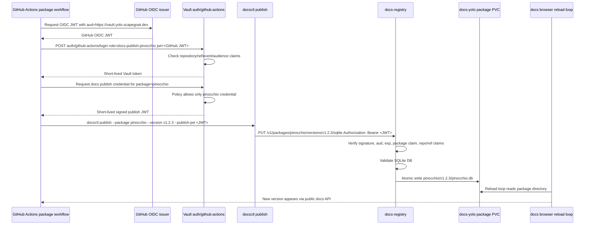

# Vault OIDC Docs Publishing Clean Long-Term Implementation Guide

## 1. Executive summary

This document designs the clean long-term publishing path for `docs.yolo.scapegoat.dev`. The goal is to let trusted package CI workflows publish versioned Glazed help SQLite databases without storing static docs publish tokens in GitHub repository secrets and without carrying a production dependency on the Phase 1 `publishers.json` token-hash catalog.

The chosen approach is **Option B: Vault OIDC with short-lived package-scoped publish credentials**.

In this model:

1. A package repository workflow runs in GitHub Actions.
2. The workflow asks GitHub for an OIDC identity token.
3. Vault validates the GitHub-issued token through the existing `auth/github-actions` JWT auth mount.
4. Vault role constraints decide whether that repository, branch, event, and audience may publish docs for one package.
5. The workflow obtains a short-lived publish credential scoped to exactly one package and one audience, for example `docs-yolo-registry`.
6. `docsctl publish` sends the SQLite database to `docs-registry` with that short-lived credential.
7. `docs-registry` verifies the credential and enforces that the route package matches the credential package claim.
8. If authorization and SQLite validation pass, the registry writes the DB atomically into the package PVC.
9. The browser reload loop sees the new package/version without a restart.

The long-term direction avoids producing more static token plumbing. Phase 1 static tokens remain useful as a local fallback and as already-tested implementation scaffolding, but they should not be the production path if we are going straight to the proper architecture.

The main implementation work is in four areas:

- **Glazed codebase**: add a Vault/JWT publisher auth implementation, update `docs-registry` configuration, and update `docsctl publish` so it can obtain or accept a Vault-issued publish JWT.
- **Vault/K3s platform**: add docs publishing Vault roles and policies using the HK3S-0028 GitHub Actions OIDC pattern.
- **GitOps deployment**: expose the registry through a protected ingress or controlled network path, remove the static publisher catalog requirement, and configure JWT verification material.
- **Package CI**: add workflow steps that request GitHub OIDC, authenticate to Vault, mint/read a short-lived docs publish credential, build/export help DBs, and run `docsctl publish`.

The key security invariant is:

> A GitHub repository can publish only the package name that Vault grants to that repository, and the registry must independently verify that the uploaded route package equals the signed package claim.

## 2. Problem statement and scope

### 2.1 Problem

The current live docs-yolo browser works. It serves multiple packages and versions, and it has a registry implementation that can accept uploads. The remaining question is how production package CI should authenticate to the live registry.

The Phase 1 registry uses static bearer tokens:

```text
incoming Authorization: Bearer <raw token>
  -> registry hashes token
  -> registry compares hash against publishers.json
  -> token hash maps to exactly one package
```

That path works locally and proved the underlying upload, validation, storage, and reload mechanisms. It is not the desired final production model because it introduces long-lived docs publish secrets, a registry-side static token catalog, token rotation procedures, and a later migration away from those same artifacts.

HK3S-0028 already proved a better primitive: GitHub Actions can authenticate to Vault with OIDC and receive short-lived Vault tokens under tightly bound roles. The docs publishing system should use that platform pattern directly.

### 2.2 Scope

This document covers:

- The target Option B architecture.
- How GitHub Actions OIDC, Vault, `docsctl`, and `docs-registry` fit together.
- Required code changes in Glazed.
- Required Vault role/policy additions in the k3s repository.
- Required deployment changes for docs-yolo.
- CI workflow examples for package repositories.
- Testing, rollout, and migration guidance.

This document does **not** implement the changes. It is an implementation guide for a new engineer.

### 2.3 Non-goals

This design intentionally does not attempt to:

- Productionize the static `publishers.json` token catalog.
- Store raw docs publish tokens in GitHub secrets.
- Introduce an external SaaS auth gateway.
- Let arbitrary pull request workflows publish docs.
- Let one repository publish multiple unrelated packages unless Vault roles explicitly grant that mapping.
- Replace the existing package PVC store or browser reload mechanism.

## 3. Terms and mental model

### Package

A Glazed help package name, such as `glazed` or `pinocchio`. Package names are path segments and must pass existing validation before storage.

### Version

A package version string, such as `v1.2.3`, `vtest`, or a release tag. The version is also validated as a safe path segment.

### Help SQLite DB

The artifact uploaded by package CI. It contains the package's exported Glazed help sections. The registry validates the DB before it writes anything into the package store.

### GitHub Actions OIDC token

A short-lived JWT issued by GitHub Actions for a workflow run. Vault validates this token using GitHub's OIDC discovery metadata.

### Vault token

A short-lived token issued by Vault after successful OIDC login. It has Vault policies attached. In HK3S-0028 this token can read a repo-specific GitOps PR credential. In this docs publishing design it should be able to mint or read only a docs publishing credential for the correct package.

### Publish credential

The credential presented to `docs-registry`. In the clean long-term design, this should be a short-lived JWT or comparable signed capability with claims such as package, repository, ref, audience, issued-at, and expiry.

### Registry

The `docs-registry` process running next to the docs browser in the docs-yolo pod. It accepts uploads, authorizes the caller, validates SQLite, and writes the DB into the shared package PVC.

## 4. Current-state architecture, with evidence

### 4.1 The existing registry already has an auth abstraction

The existing Glazed publishing package defines a `PublisherAuth` interface. The registry does not directly know about static token catalog internals; it calls `AuthorizePublish` with a raw bearer token and a package/version request.

Evidence: `/home/manuel/workspaces/2026-05-02/multi-package-hosting-glazed/glazed/pkg/help/publish/auth.go:22-38` defines:

```go
type PublishRequest struct {
    PackageName string
    Version     string
}

type PublisherIdentity struct {
    Subject     string
    PackageName string
    Method      string
}

type PublisherAuth interface {
    AuthorizePublish(ctx context.Context, rawToken string, req PublishRequest) (*PublisherIdentity, error)
}
```

This is the seam to preserve. A Vault/JWT implementation can satisfy the same interface or a small evolved version of it.

### 4.2 The current implementation is static token auth

The current `StaticTokenAuth` maps token hashes to packages. It validates package names, normalizes token hashes, hashes the presented token, compares in constant time, and rejects package mismatch.

Evidence: `pkg/help/publish/auth.go:40-79` defines static publisher token records and starts `AuthorizePublish`. The authorization path hashes the presented token and searches stored hashes at `auth.go:87-90`. The package mismatch check follows shortly after in the same function.

This was correct for Phase 1 because it gave us a concrete package-scoped authorization mechanism. For the long-term solution, the static hash table should be replaced by signed package claims.

### 4.3 The registry authorizes before it reads or validates uploads

The upload route is:

```text
PUT /v1/packages/{package}/versions/{version}/sqlite
```

Evidence: `pkg/help/publish/registry.go:68-72` registers:

```go
mux.HandleFunc("PUT /v1/packages/{package}/versions/{version}/sqlite", h.handlePublishSQLite)
```

The handler extracts the package and version from the route, builds `PublishRequest`, and calls auth before upload body handling:

Evidence: `registry.go:103-113`:

```go
packageName := r.PathValue("package")
version := r.PathValue("version")
req := PublishRequest{PackageName: packageName, Version: version}

identity, err := h.Auth.AuthorizePublish(r.Context(), bearerToken(r), req)
if err != nil {
    writeAuthError(w, err)
    return
}

tmpPath, err := h.receiveUpload(r)
```

This order is good and should remain. Unauthorized callers should not force the server to receive and validate large SQLite files.

### 4.4 SQLite validation and package storage are already separate from auth

After auth, the registry receives the upload into a temp file, validates the SQLite help DB with package/version expectations, and only then calls the package store.

Evidence: `registry.go:125-132`:

```go
result, err := ValidateSQLiteHelpDB(r.Context(), tmpPath, SQLiteValidationOptions{PackageName: packageName, Version: version})
if err != nil {
    writeRegistryError(w, http.StatusBadRequest, "invalid_help_db", err.Error())
    return
}

published, err := h.Store.Publish(r.Context(), packageName, version, tmpPath, result, identity)
```

This means the clean auth project does not need to redesign validation or storage.

### 4.5 `docsctl publish` currently expects a bearer token

The client command currently exposes `--token`, `--token-file`, and `DOCS_YOLO_PUBLISH_TOKEN` as token sources.

Evidence: `cmd/docsctl/publish.go:25-34` defines:

```go
type publishOptions struct {
    Server      string `glazed:"server"`
    PackageName string `glazed:"package"`
    Version     string `glazed:"version"`
    File        string `glazed:"file"`
    Token       string `glazed:"token"`
    TokenFile   string `glazed:"token-file"`
    JSONOutput  bool   `glazed:"json"`
    DryRun      bool   `glazed:"dry-run"`
}
```

The command validates locally first, builds the registry URL, resolves a token, and sends it as `Authorization: Bearer ...`.

Evidence: `publish.go:67-90`:

```go
result, err := publish.ValidateSQLiteHelpDB(...)
url := strings.TrimRight(opts.Server, "/") + fmt.Sprintf("/v1/packages/%s/versions/%s/sqlite", ...)
token, err := resolvePublishToken(opts)
...
req.Header.Set("Authorization", "Bearer "+token)
```

For Option B, `docsctl` can keep sending `Authorization: Bearer <credential>`, but the credential should be a short-lived Vault-issued JWT rather than a static package token.

### 4.6 The k3s platform already has GitHub Actions OIDC bootstrap machinery

HK3S-0028 added a bootstrap script for GitHub Actions OIDC roles and policies. It expects Vault CLI access, discovers role/policy files, enables a JWT auth backend, configures GitHub's issuer, and writes policies/roles.

Evidence: `/home/manuel/code/wesen/2026-03-27--hetzner-k3s/scripts/bootstrap-vault-github-actions-oidc.sh:27-33` sets:

```bash
policy_dir="${repo_root}/vault/policies/github-actions"
role_dir="${repo_root}/vault/roles/github-actions"
github_actions_auth_path="${VAULT_GITHUB_ACTIONS_AUTH_PATH:-github-actions}"
github_actions_issuer="${VAULT_GITHUB_ACTIONS_ISSUER:-https://token.actions.githubusercontent.com}"
```

Evidence: `bootstrap-vault-github-actions-oidc.sh:35-56` ensures `auth/github-actions` exists as a JWT backend and configures GitHub as the issuer.

Evidence: `bootstrap-vault-github-actions-oidc.sh:59-90` writes all policy and role files found under the configured directories.

This is exactly the operational pattern to reuse for docs publishing roles.

### 4.7 Existing GitHub Actions roles are tightly bound

The bot-signup role illustrates the claim constraints we should copy. It is bound to:

- audience `https://vault.yolo.scapegoat.dev`
- repository owner `wesen`
- exact repository `wesen/2026-05-01--bot-signup`
- branch ref `refs/heads/main`
- event `push`
- short TTLs

Evidence: `/home/manuel/code/wesen/2026-03-27--hetzner-k3s/vault/roles/github-actions/bot-signup-gitops-pr.json:1-15`.

The docs publishing roles should be equally narrow.

### 4.8 The live docs-yolo pod still mounts an empty static publisher catalog

The current deployment runs two containers in one pod:

- `docs-browser`, reading `/var/lib/glazed-docs/packages` read-only.
- `docs-registry`, writing `/var/lib/glazed-docs/packages` and reading `/etc/docs-yolo/publishers.json`.

Evidence: `/home/manuel/code/wesen/2026-03-27--hetzner-k3s/gitops/kustomize/docs-yolo/deployment.yaml:24-34` shows the browser uses `glaze serve --from-sqlite-dir ... --reload-interval 30s`.

Evidence: `deployment.yaml:60-71` shows the registry command still requires `--publisher-catalog /etc/docs-yolo/publishers.json`.

Evidence: `deployment.yaml:87-105` mounts the package PVC and static publisher catalog config map.

Evidence: `/home/manuel/code/wesen/2026-03-27--hetzner-k3s/gitops/kustomize/docs-yolo/publisher-catalog.yaml:10-14` currently contains:

```yaml
data:
  publishers.json: |
    {
      "publishers": []
    }
```

Option B should remove the production dependency on this config map.

### 4.9 The registry service is cluster-internal

The browser service and registry service are separate `ClusterIP` services.

Evidence: `/home/manuel/code/wesen/2026-03-27--hetzner-k3s/gitops/kustomize/docs-yolo/service.yaml:20-37` defines `docs-yolo-registry` as `ClusterIP` on port 80 targeting the registry container port.

The public ingress only routes the browser host `/` to the docs-yolo browser service.

Evidence: `/home/manuel/code/wesen/2026-03-27--hetzner-k3s/gitops/kustomize/docs-yolo/ingress.yaml:17-27` routes `docs.yolo.scapegoat.dev` to service `docs-yolo`, not `docs-yolo-registry`.

For GitHub-hosted Actions to publish directly, we need either a protected public registry ingress or an in-cluster runner/network path.

## 5. Gap analysis

### 5.1 What already works and should be reused

The following pieces are already implemented and should not be redesigned:

- Package/version route shape.
- Local SQLite DB validation before upload in `docsctl`.
- Server-side validation before storage.
- Atomic directory/PVC package store.
- Browser reload polling.
- Package/version browsing UI.
- GitHub Actions OIDC-to-Vault platform pattern.
- Vault role/policy file organization under the k3s repo.

### 5.2 What is missing for Option B

The missing pieces are:

1. A way for a GitHub Actions workflow to request a package-scoped docs publish credential from Vault.
2. A signed credential format and verification strategy understood by `docs-registry`.
3. Registry configuration for verifying those credentials.
4. `docsctl publish` support for obtaining or consuming the new credential.
5. k3s manifests for exposing the registry in an acceptable way.
6. Vault role/policy files mapping trusted repositories to allowed package names.
7. CI workflow examples for publishing real package versions.

### 5.3 What should be intentionally deleted or deprecated

Once Option B is deployed, the production docs-yolo deployment should not require:

- `docs-yolo-publisher-catalog` ConfigMap.
- `--publisher-catalog` as a required registry flag.
- Vault StaticSecret or VSO sync for token hashes.
- Raw package publish token rotation runbooks.

The code can keep static token auth as a fallback mode for local smoke tests, but production should select the Vault/JWT mode explicitly.

## 6. Proposed architecture

### 6.1 High-level flow



### 6.2 Component responsibility table

| Component | Responsibility | Must not do |
|---|---|---|
| GitHub Actions workflow | Build docs DB, authenticate to Vault, run `docsctl publish`. | Store long-lived docs publish tokens. |
| Vault `auth/github-actions` | Validate GitHub OIDC token and issue narrow Vault token. | Accept pull request events or unbound repositories for production publishing. |
| Vault credential issuer | Produce short-lived package-scoped publish JWT/capability. | Issue wildcard package credentials by default. |
| `docsctl publish` | Validate DB locally, obtain/accept publish credential, upload DB. | Decide whether a repository is allowed to publish a package. |
| `docs-registry` | Verify publish credential, enforce package claim, validate DB, write store. | Trust client-supplied package metadata without signed claim validation. |
| docs-yolo PVC store | Persist validated package/version DBs atomically. | Make authorization decisions. |
| docs browser | Serve docs and reload external DBs. | Accept publishes. |

### 6.3 Authorization source of truth

The package authorization mapping should live in Vault role/policy configuration.

Example mapping:

```text
wesen/pinocchio on refs/heads/main push
  -> Vault role docs-publish-pinocchio
  -> policy gha-docs-publish-pinocchio
  -> may mint/read publish credential with package=pinocchio only

wesen/glazed on refs/heads/main push
  -> Vault role docs-publish-glazed
  -> policy gha-docs-publish-glazed
  -> may mint/read publish credential with package=glazed only
```

The registry must still enforce the mapping indirectly by verifying the signed package claim. Vault decides which claim may be minted; registry verifies that claim and compares it to the URL.

## 7. Credential design

There are several ways to get a signed publish credential from Vault. The cleanest target for this system is a **short-lived JWT with package claims**. The exact Vault mechanism can be chosen during implementation, but the registry-facing contract should be stable.

### 7.1 Registry-facing publish JWT claims

The registry should expect a bearer token whose decoded claims are similar to:

```json
{
  "iss": "https://vault.yolo.scapegoat.dev/v1/docs-yolo-publish",
  "sub": "repo:wesen/pinocchio:ref:refs/heads/main",
  "aud": ["docs-yolo-registry"],
  "exp": 1777777777,
  "nbf": 1777777477,
  "iat": 1777777477,
  "jti": "01J...",
  "repository_owner": "wesen",
  "repository": "wesen/pinocchio",
  "ref": "refs/heads/main",
  "event_name": "push",
  "workflow": "publish-docs.yml",
  "package": "pinocchio",
  "allowed_versions": ["*"]
}
```

Required claims:

| Claim | Required | Purpose |
|---|---:|---|
| `iss` | yes | Prevents accepting random JWTs from unrelated issuers. |
| `aud` | yes | Token must be intended for `docs-yolo-registry`. |
| `exp` | yes | Token must be short-lived. Suggested 5-15 minutes. |
| `nbf` | yes | Avoid accepting a token before valid time. |
| `iat` | yes | Useful for audit and max-age enforcement. |
| `jti` | yes | Enables replay detection later. |
| `sub` | yes | Human-readable actor identity. |
| `repository` | yes | Audit and policy debugging. |
| `ref` | yes | Audit and optional registry-side defense in depth. |
| `event_name` | yes | Audit and optional registry-side defense in depth. |
| `package` | yes | Primary authorization claim. Must equal URL package. |
| `allowed_versions` | optional | Future restriction for release tags only, if desired. |

### 7.2 Registry verification rules

The registry should reject unless all of these are true:

1. Token is syntactically valid JWT.
2. Signature verifies against trusted Vault issuer key material.
3. `iss` equals configured issuer.
4. `aud` contains configured audience, for example `docs-yolo-registry`.
5. `exp`, `nbf`, and `iat` are valid with small clock skew.
6. `package` claim exists and passes `ValidatePackageName`.
7. Route `{package}` equals the signed `package` claim.
8. Route `{version}` passes `ValidateVersion`.
9. Optional: `repository`, `ref`, and `event_name` match configured allowlist entries loaded from a non-secret config map for defense in depth.
10. Optional later: `jti` has not been seen before in a short TTL cache.

Pseudocode:

```go
func (a *JWTPublisherAuth) AuthorizePublish(ctx context.Context, bearer string, req PublishRequest) (*PublisherIdentity, error) {
    if bearer == "" {
        return nil, ErrUnauthorized
    }
    if err := ValidatePackageVersion(req.PackageName, req.Version); err != nil {
        return nil, err
    }

    token, claims, err := a.verifier.Verify(ctx, bearer)
    if err != nil {
        return nil, ErrUnauthorized
    }
    if !claims.AudienceContains(a.Audience) {
        return nil, ErrUnauthorized
    }
    if claims.Issuer != a.Issuer {
        return nil, ErrUnauthorized
    }
    if claims.Package != req.PackageName {
        return nil, ErrForbidden
    }
    if claims.Repository == "" || claims.Ref == "" {
        return nil, ErrUnauthorized
    }
    if a.DefenseInDepthAllowlist != nil && !a.DefenseInDepthAllowlist.Allows(claims.Repository, claims.Ref, claims.Package) {
        return nil, ErrForbidden
    }

    return &PublisherIdentity{
        Subject: claims.Subject,
        PackageName: claims.Package,
        Method: "vault-jwt",
        Repository: claims.Repository, // requires struct extension or metadata field
    }, nil
}
```

### 7.3 Publisher identity shape

The current `PublisherIdentity` has only `Subject`, `PackageName`, and `Method`. For useful auditing, extend it without breaking JSON consumers:

```go
type PublisherIdentity struct {
    Subject     string            `json:"subject"`
    PackageName string            `json:"packageName"`
    Method      string            `json:"method"`
    Repository  string            `json:"repository,omitempty"`
    Ref         string            `json:"ref,omitempty"`
    Workflow    string            `json:"workflow,omitempty"`
    Claims      map[string]string `json:"claims,omitempty"`
}
```

The directory store already records `PublishedBy`; that can remain `identity.Subject`, while the registry response can include richer actor metadata.

## 8. Vault design

### 8.1 Reuse the existing GitHub Actions auth mount

Do not add a new auth mount unless there is a strong reason. HK3S-0028 already created `auth/github-actions` as the CI/CD identity boundary.

The existing bootstrap script:

- Uses `vault/policies/github-actions` for policies.
- Uses `vault/roles/github-actions` for roles.
- Configures `https://token.actions.githubusercontent.com` as issuer.
- Writes roles to `auth/github-actions/role/<role-name>`.

That gives docs publishing a natural home:

```text
/home/manuel/code/wesen/2026-03-27--hetzner-k3s/vault/policies/github-actions/docs-publish-pinocchio.hcl
/home/manuel/code/wesen/2026-03-27--hetzner-k3s/vault/roles/github-actions/docs-publish-pinocchio.json
```

### 8.2 Role shape

Example `vault/roles/github-actions/docs-publish-pinocchio.json`:

```json
{
  "role_type": "jwt",
  "user_claim": "repository",
  "bound_audiences": ["https://vault.yolo.scapegoat.dev"],
  "bound_claims": {
    "repository_owner": "wesen",
    "repository": "wesen/pinocchio",
    "ref": "refs/heads/main",
    "event_name": "push"
  },
  "policies": ["gha-docs-publish-pinocchio"],
  "ttl": "10m",
  "max_ttl": "30m",
  "token_explicit_max_ttl": "30m"
}
```

For each package, create one role per trusted source repository. If a repository owns multiple packages, prefer one role per package anyway so audit logs and policy names stay obvious.

### 8.3 Policy shape

The policy depends on the credential issuance mechanism. The clean intent is:

```hcl
# Allow the workflow to mint exactly a pinocchio docs-publish credential.
path "docs-yolo-publish/issue/pinocchio" {
  capabilities = ["update"]
}

# Standard self-service token operations.
path "auth/token/lookup-self" {
  capabilities = ["read"]
}

path "auth/token/renew-self" {
  capabilities = ["update"]
}

path "auth/token/revoke-self" {
  capabilities = ["update"]
}
```

The literal path `docs-yolo-publish/issue/pinocchio` is conceptual. The final path depends on whether we use a Vault plugin, Vault identity/OIDC token issuance, a transit-signed JWT helper, or a small broker service.

### 8.4 Credential issuer implementation choices

The registry-facing contract should be a JWT. The way Vault produces that JWT has several possible implementations.

#### Option B1: Vault signs JWT payload with transit key plus controlled helper

Vault's transit engine signs bytes. A small controlled helper constructs the canonical JWT header/payload, asks Vault transit to sign it, and returns the compact JWT.

Flow:

```text
GitHub Actions -> Vault login -> helper endpoint -> Vault transit sign -> publish JWT
```

Pros:

- Strong control over claim shape.
- Registry verifies with a public key or JWKS derived from the signing key.
- Easy to make package-specific helper endpoints.

Cons:

- Requires a small broker/helper unless `docsctl` itself constructs and signs correctly with Vault transit.
- More implementation surface.

#### Option B2: `docsctl` constructs JWT and asks Vault transit to sign

The workflow logs into Vault, then `docsctl` calls Vault transit directly:

```text
docsctl publish --vault-addr ... --vault-role docs-publish-pinocchio --vault-transit-key docs-yolo-publish
```

Pseudocode:

```go
claims := PublishClaims{
    Issuer: configuredIssuer,
    Audience: []string{"docs-yolo-registry"},
    Package: opts.PackageName,
    Repository: githubRepositoryFromEnv(),
    Ref: githubRefFromEnv(),
    EventName: githubEventFromEnv(),
    ExpiresAt: now.Add(10*time.Minute),
}
unsigned := base64url(header) + "." + base64url(claims)
signature := vaultTransitSign(unsigned)
publishJWT := unsigned + "." + joseToRawSignature(signature)
```

Pros:

- No broker service.
- Keeps package CI simple if `docsctl` hides the signing details.

Cons:

- Vault policy must ensure the workflow can sign only safe claims. Raw transit signing alone does not inspect the payload. If a workflow can sign arbitrary bytes with a trusted key, it could sign a JWT claiming a different package unless constrained elsewhere.
- Because of that, raw transit signing from CI is dangerous unless the registry also checks an independent allowlist or the signing key is package-specific and the registry maps key ID to package.

If this path is chosen, use **one transit key per package** or include a registry-side `kid -> package` allowlist. Do not let one generic signing key sign arbitrary package claims from untrusted workflow input.

#### Option B3: Vault JWT/OIDC provider or plugin issues claim-constrained tokens

A Vault plugin or built-in identity token capability issues tokens from templates that include metadata from the authenticated entity and role.

Pros:

- Most conceptually correct: Vault is the issuer and policy engine.
- Least arbitrary signing risk.

Cons:

- Requires verifying exact Vault capability and configuration support.
- May be more platform-specific to implement.

#### Recommended implementation choice

Use **B1 or B3** for production. Avoid generic raw transit signing from CI unless it is package-key-scoped and registry verification binds key ID to package.

A pragmatic clean path is:

1. Start with a small `docs-publish-broker` endpoint or command reachable only with a Vault token.
2. Broker verifies the Vault token by calling `auth/token/lookup-self` or by relying on Vault policy path access.
3. Broker mints a JWT for exactly the package endpoint requested, such as `/issue/pinocchio`.
4. Registry verifies broker/Vault-signed JWTs.

However, if Vault can issue the constrained JWT directly, prefer direct Vault issuance and skip the broker.

## 9. Registry design

### 9.1 Auth modes

`docs-registry` should support explicit auth modes:

```text
--auth-mode static-token
--auth-mode vault-jwt
```

Static token mode can remain for local testing. Production docs-yolo should use:

```text
--auth-mode vault-jwt
--jwt-issuer https://vault.yolo.scapegoat.dev/v1/docs-yolo-publish
--jwt-audience docs-yolo-registry
--jwt-jwks-url https://vault.yolo.scapegoat.dev/v1/docs-yolo-publish/.well-known/jwks.json
```

If JWKS is not available, use a mounted public key:

```text
--jwt-public-key /etc/docs-yolo-jwt/public.pem
```

### 9.2 New package: `pkg/help/publish/jwt_auth.go`

Proposed types:

```go
type JWTPublisherAuth struct {
    Issuer       string
    Audience     string
    KeySet       JWTKeySet
    Clock        func() time.Time
    MaxTokenAge  time.Duration
    Leeway       time.Duration
    Allowlist    *PublishAllowlist // optional defense-in-depth
}

type PublishJWTClaims struct {
    jwt.RegisteredClaims
    Package         string `json:"package"`
    Repository      string `json:"repository"`
    RepositoryOwner string `json:"repository_owner,omitempty"`
    Ref             string `json:"ref"`
    EventName       string `json:"event_name"`
    Workflow        string `json:"workflow,omitempty"`
}
```

Implementation notes:

- Use a maintained JOSE/JWT library already acceptable for the repo, or add one intentionally.
- Validate algorithms. Do not accept `none`.
- Restrict accepted algorithms to configured values, for example `RS256` or `EdDSA`.
- Cache JWKS with short TTL and refresh on unknown `kid`.
- Fail closed if JWKS cannot be loaded and no cached key is valid.

### 9.3 Authorization pseudocode

```go
func (a *JWTPublisherAuth) AuthorizePublish(ctx context.Context, rawToken string, req PublishRequest) (*PublisherIdentity, error) {
    if strings.TrimSpace(rawToken) == "" {
        return nil, ErrUnauthorized
    }
    if err := ValidatePackageVersion(req.PackageName, req.Version); err != nil {
        return nil, err
    }

    claims, err := a.VerifyAndDecode(ctx, rawToken)
    if err != nil {
        return nil, ErrUnauthorized
    }

    if claims.Package != req.PackageName {
        return nil, ErrForbidden
    }
    if claims.Repository == "" || claims.Ref == "" || claims.EventName == "" {
        return nil, ErrUnauthorized
    }
    if claims.EventName != "push" {
        return nil, ErrForbidden
    }
    if a.Allowlist != nil && !a.Allowlist.Allows(claims.Repository, claims.Ref, claims.Package) {
        return nil, ErrForbidden
    }

    return &PublisherIdentity{
        Subject: claims.Subject,
        PackageName: claims.Package,
        Method: "vault-jwt",
        Repository: claims.Repository,
        Ref: claims.Ref,
        Workflow: claims.Workflow,
    }, nil
}
```

### 9.4 Registry response and errors

Keep the existing response shape:

```json
{
  "ok": true,
  "package": {"packageName": "pinocchio", "version": "v1.2.3"},
  "validation": {"sectionCount": 69, "slugCount": 69},
  "actor": {"subject": "repo:wesen/pinocchio:ref:refs/heads/main", "method": "vault-jwt"}
}
```

Update auth error messages to avoid saying "publish token" in JWT mode. Current errors say "missing or invalid publish token" and "publish token is not allowed for this package". Change wording to "publish credential".

## 10. `docsctl publish` design

### 10.1 Modes

`docsctl publish` should support three credential modes:

1. `--publish-jwt` or `DOCS_YOLO_PUBLISH_JWT`: caller already obtained a short-lived JWT.
2. `--publish-jwt-file`: file containing the JWT.
3. Vault OIDC helper mode: `docsctl` obtains the JWT by logging into Vault or by using an existing `VAULT_TOKEN`.

Keep old `--token` as deprecated alias for static-token mode only, or hide it in help once production switches.

### 10.2 Proposed flags

```text
docsctl publish \
  --server https://registry.docs.yolo.scapegoat.dev \
  --package pinocchio \
  --version v1.2.3 \
  --file ./dist/help.db \
  --auth-mode vault-jwt \
  --vault-addr https://vault.yolo.scapegoat.dev \
  --vault-role docs-publish-pinocchio \
  --vault-audience https://vault.yolo.scapegoat.dev
```

Optional lower-level flags:

```text
--publish-jwt
--publish-jwt-file
--vault-token
--vault-token-file
--vault-auth-path github-actions
--vault-issue-path docs-yolo-publish/issue/pinocchio
```

### 10.3 GitHub Actions OIDC acquisition

In GitHub Actions, the workflow must request OIDC permission:

```yaml
permissions:
  contents: read
  id-token: write
```

The workflow can either use the Vault action or `docsctl` can request the GitHub OIDC token directly from the environment variables GitHub exposes:

- `ACTIONS_ID_TOKEN_REQUEST_URL`
- `ACTIONS_ID_TOKEN_REQUEST_TOKEN`

Pseudocode for direct request:

```go
func requestGitHubOIDCToken(ctx context.Context, audience string) (string, error) {
    baseURL := os.Getenv("ACTIONS_ID_TOKEN_REQUEST_URL")
    requestToken := os.Getenv("ACTIONS_ID_TOKEN_REQUEST_TOKEN")
    if baseURL == "" || requestToken == "" {
        return "", errors.New("GitHub Actions OIDC environment is not available")
    }
    url := baseURL + "&audience=" + url.QueryEscape(audience)
    req, _ := http.NewRequestWithContext(ctx, "GET", url, nil)
    req.Header.Set("Authorization", "Bearer "+requestToken)
    resp, _ := http.DefaultClient.Do(req)
    // decode {"value":"<jwt>"}
}
```

Then Vault login:

```go
func loginVaultGitHubActions(ctx context.Context, vaultAddr, authPath, role, oidcJWT string) (string, error) {
    body := {"role": role, "jwt": oidcJWT}
    POST vaultAddr + "/v1/auth/" + authPath + "/login"
    return response.auth.client_token
}
```

Then issue publish JWT:

```go
func issueDocsPublishJWT(ctx context.Context, vaultAddr, vaultToken, issuePath, packageName string) (string, error) {
    body := {"package": packageName, "audience": "docs-yolo-registry"}
    POST vaultAddr + "/v1/" + issuePath
    Header X-Vault-Token: vaultToken
    return response.data.jwt
}
```

### 10.4 CI workflow sketch

```yaml
name: Publish docs

on:
  push:
    tags:
      - 'v*'
  workflow_dispatch: {}

permissions:
  contents: read
  id-token: write

jobs:
  publish-docs:
    runs-on: ubuntu-latest
    steps:
      - uses: actions/checkout@v4

      - uses: actions/setup-go@v5
        with:
          go-version: '1.26.x'

      - name: Build help DB
        run: |
          go run ./cmd/pinocchio help export-sqlite --output ./pinocchio-help.db

      - name: Publish docs
        run: |
          go install github.com/go-go-golems/glazed/cmd/docsctl@latest
          docsctl publish \
            --server https://registry.docs.yolo.scapegoat.dev \
            --package pinocchio \
            --version "${GITHUB_REF_NAME}" \
            --file ./pinocchio-help.db \
            --auth-mode vault-jwt \
            --vault-addr https://vault.yolo.scapegoat.dev \
            --vault-auth-path github-actions \
            --vault-role docs-publish-pinocchio \
            --vault-audience https://vault.yolo.scapegoat.dev \
            --vault-issue-path docs-yolo-publish/issue/pinocchio
```

For first rollout, prefer `workflow_dispatch` or tag publishing rather than every push to `main`.

## 11. Deployment design

### 11.1 Registry exposure

The registry is currently cluster-internal. GitHub-hosted Actions need a network route. There are three options:

#### Option R1: Public registry hostname with JWT auth

Expose:

```text
https://registry.docs.yolo.scapegoat.dev
```

Pros:

- Works with GitHub-hosted runners.
- Simple CI.
- JWT auth gives application-layer protection.

Cons:

- Public attack surface.
- Needs rate limiting and careful upload size limits.

Mitigations:

- Keep max upload size.
- Authorization before reading body is already implemented.
- Add ingress request body size limit.
- Add Traefik rate limiting middleware if available.
- Keep `/v1/packages` public or make it authless only if acceptable.

#### Option R2: Private registry reachable only by self-hosted runner

Run a self-hosted runner inside the cluster or private network.

Pros:

- Smaller public attack surface.

Cons:

- More operational complexity.
- Still needs OIDC/Vault auth unless we want to trust runner locality, which we should not.

#### Option R3: Publish through GitOps artifact PR instead of registry

CI opens a GitOps PR with the DB artifact or object reference. Argo syncs it.

Pros:

- Leverages existing GitOps PR review.

Cons:

- Bad fit for binary SQLite DBs in Git.
- Slower, more moving parts, not the registry architecture already built.

Recommendation: **R1 for docs-yolo**, with JWT auth and ingress limits. The registry accepts only authenticated PUTs and can keep health/list endpoints simple.

### 11.2 docs-yolo manifest changes

Current production registry args:

```yaml
- --publisher-catalog
- /etc/docs-yolo/publishers.json
```

Replace with:

```yaml
- --auth-mode
- vault-jwt
- --jwt-issuer
- https://vault.yolo.scapegoat.dev/v1/docs-yolo-publish
- --jwt-audience
- docs-yolo-registry
- --jwt-jwks-url
- https://vault.yolo.scapegoat.dev/v1/docs-yolo-publish/.well-known/jwks.json
```

Or with a mounted public key:

```yaml
- --jwt-public-key
- /etc/docs-yolo-jwt/public.pem
```

Remove:

- `publisher-catalog` volume.
- `/etc/docs-yolo` mount.
- `publisher-catalog.yaml` from `kustomization.yaml`, if no longer needed.

Add a registry ingress, for example:

```yaml
apiVersion: networking.k8s.io/v1
kind: Ingress
metadata:
  name: docs-yolo-registry
  annotations:
    cert-manager.io/cluster-issuer: letsencrypt-prod
    traefik.ingress.kubernetes.io/router.middlewares: docs-yolo-registry-upload-limits@kubernetescrd
spec:
  ingressClassName: traefik
  tls:
    - hosts:
        - registry.docs.yolo.scapegoat.dev
      secretName: docs-yolo-registry-tls
  rules:
    - host: registry.docs.yolo.scapegoat.dev
      http:
        paths:
          - path: /
            pathType: Prefix
            backend:
              service:
                name: docs-yolo-registry
                port:
                  number: 80
```

### 11.3 Should registry query Vault on every upload?

Prefer offline JWT verification after the publish credential is issued. The registry should not call Vault on every upload if it can verify signatures locally.

Reasons:

- Fewer runtime dependencies between registry and Vault.
- Upload path remains fast and reliable.
- Vault downtime does not break uploads already holding valid short-lived credentials.
- JWT `exp` limits exposure.

Registry may call JWKS periodically or on unknown `kid`, but should cache keys.

## 12. Implementation plan

### Phase 0: Confirm Vault credential issuance mechanism

Owner: platform engineer.

Tasks:

- Decide whether Vault can issue the constrained JWT directly.
- If not, choose broker/helper design.
- Decide signing algorithm and key distribution:
  - RS256 with JWKS endpoint, or
  - EdDSA with mounted public key, or
  - another explicit algorithm.
- Define final issuer string.
- Define final token TTL.

Acceptance criteria:

- One command can produce a short-lived JWT with `package=pinocchio` after Vault OIDC login.
- The JWT can be verified offline with public key material.

### Phase 1: Add JWT auth to Glazed registry

Files:

- `pkg/help/publish/auth.go`
- `pkg/help/publish/jwt_auth.go`
- `pkg/help/publish/jwt_auth_test.go`
- `pkg/help/publish/registry.go`
- `cmd/docs-registry/main.go`

Tasks:

1. Extend `PublisherIdentity` for audit metadata.
2. Add `JWTPublisherAuth`.
3. Add tests for:
   - valid token can publish matching package.
   - valid token cannot publish different package.
   - expired token rejected.
   - wrong audience rejected.
   - wrong issuer rejected.
   - unsigned/`none` algorithm rejected.
   - unknown key rejected.
4. Add registry flags:
   - `--auth-mode`
   - `--jwt-issuer`
   - `--jwt-audience`
   - `--jwt-jwks-url` or `--jwt-public-key`
5. Keep `--publisher-catalog` required only when `--auth-mode static-token`.

Acceptance criteria:

```bash
go test ./pkg/help/publish ./cmd/docs-registry
```

### Phase 2: Add Vault-aware publishing to `docsctl`

Files:

- `cmd/docsctl/publish.go`
- `cmd/docsctl/publish_test.go`
- optionally `pkg/help/publish/vault_client.go`
- optionally `pkg/help/publish/github_oidc.go`

Tasks:

1. Add flags for `--auth-mode vault-jwt`.
2. Add direct `--publish-jwt` and `--publish-jwt-file` support.
3. Add GitHub Actions OIDC token request helper.
4. Add Vault login helper.
5. Add publish JWT issuance helper.
6. Preserve local DB validation before token issuance if practical. If token issuance should be tested independently, add `docsctl auth mint-publish-jwt` later.
7. Keep `--print-*` behavior side-effect free through the shared Glazed command setting helper.

Acceptance criteria:

- `docsctl publish --publish-jwt <valid>` uploads successfully to a test registry.
- `docsctl publish --auth-mode vault-jwt` can mock GitHub OIDC and Vault responses in tests.
- `docsctl publish --print-schema` still does not contact Vault or upload.

### Phase 3: Add Vault roles and policies in k3s repo

Files:

- `vault/roles/github-actions/docs-publish-glazed.json`
- `vault/roles/github-actions/docs-publish-pinocchio.json`
- `vault/policies/github-actions/docs-publish-glazed.hcl`
- `vault/policies/github-actions/docs-publish-pinocchio.hcl`
- `scripts/bootstrap-vault-github-actions-oidc.sh` if any new conventions are needed.
- `scripts/validate-vault-github-actions-oidc.sh` to include docs roles.

Tasks:

1. Add one role per package repository.
2. Bind to `repository_owner`, exact `repository`, `ref`, `event_name`, and audience.
3. Add policies that permit only the package-specific credential issuance endpoint.
4. Bootstrap roles/policies into Vault.
5. Validate role shape.

Acceptance criteria:

- A workflow or local test token for `wesen/pinocchio` can obtain only a `pinocchio` publish credential.
- It cannot obtain a `glazed` publish credential.

### Phase 4: Update docs-yolo deployment

Files:

- `gitops/kustomize/docs-yolo/deployment.yaml`
- `gitops/kustomize/docs-yolo/ingress-registry.yaml` or equivalent
- `gitops/kustomize/docs-yolo/kustomization.yaml`
- remove or stop using `publisher-catalog.yaml`

Tasks:

1. Change registry auth mode to `vault-jwt`.
2. Configure issuer/audience/JWKS or public key.
3. Add protected registry ingress if GitHub-hosted Actions publish directly.
4. Add ingress upload size/rate limits.
5. Render manifests with `kubectl kustomize`.
6. Commit, push, and let Argo CD sync.

Acceptance criteria:

- `docs-yolo` remains `Synced Healthy`.
- Browser still serves current packages.
- Registry health endpoint works.
- Unauthorized upload returns 401/403 before body processing.

### Phase 5: Add package CI workflow

Files depend on each package repo. For Glazed itself, likely:

- `.github/workflows/publish-docs.yml`

Tasks:

1. Build/export help SQLite DB.
2. Request GitHub OIDC permission.
3. Use `docsctl publish --auth-mode vault-jwt`.
4. Publish a real version, preferably tag-based.
5. Verify the public browser shows the new version.

Acceptance criteria:

- Push/tag workflow publishes `glazed@<tag>` or `pinocchio@<tag>`.
- Public `/api/packages` shows the new version within one reload interval.

## 13. Testing strategy

### 13.1 Unit tests

Add tests for `JWTPublisherAuth`:

| Test | Expected result |
|---|---|
| Valid token, matching package | success |
| Valid token, wrong route package | `ErrForbidden` |
| Expired token | `ErrUnauthorized` |
| Not-yet-valid token | `ErrUnauthorized` |
| Wrong audience | `ErrUnauthorized` |
| Wrong issuer | `ErrUnauthorized` |
| Missing package claim | `ErrUnauthorized` |
| Bad package claim path traversal | validation error or unauthorized |
| Unsupported algorithm | `ErrUnauthorized` |
| `alg=none` | `ErrUnauthorized` |

Add tests for `docsctl`:

- Direct `--publish-jwt` sends bearer token.
- Vault helper mode obtains token through mocked endpoints.
- `--print-schema` does not contact Vault or registry.
- `--dry-run` does not contact Vault or registry.

### 13.2 Local integration test

Run a registry with a test public key:

```bash
go run ./cmd/docs-registry \
  --address :18090 \
  --package-root /tmp/docs-yolo-jwt/package-root \
  --auth-mode vault-jwt \
  --jwt-issuer test-issuer \
  --jwt-audience docs-yolo-registry \
  --jwt-public-key /tmp/docs-yolo-jwt/public.pem
```

Mint a test JWT with `package=pinocchio` and upload:

```bash
docsctl publish \
  --server http://127.0.0.1:18090 \
  --package pinocchio \
  --version vtest \
  --file /tmp/glazed-multi-help-smoke/pinocchio/vtest/pinocchio.db \
  --publish-jwt "${JWT}"
```

Negative tests:

```bash
# Same JWT, wrong route package: must fail.
docsctl publish --package glazed --publish-jwt "${PINOCCHIO_JWT}" ...

# Expired JWT: must fail.
# Wrong audience: must fail.
```

### 13.3 Live smoke test

After deployment:

```bash
curl -fsS https://registry.docs.yolo.scapegoat.dev/healthz
```

Unauthorized publish should fail:

```bash
curl -fsS -X PUT \
  https://registry.docs.yolo.scapegoat.dev/v1/packages/pinocchio/versions/vbad/sqlite \
  --data-binary @pinocchio.db
# expect 401/403
```

Authorized publish should pass from CI or a controlled manual workflow:

```bash
docsctl publish \
  --server https://registry.docs.yolo.scapegoat.dev \
  --package pinocchio \
  --version v1.2.3 \
  --file pinocchio.db \
  --auth-mode vault-jwt ...
```

Then verify browser:

```bash
curl -fsS https://docs.yolo.scapegoat.dev/api/packages | jq '.packages[] | select(.name=="pinocchio")'
```

## 14. Rollout plan

1. Implement JWT auth behind `--auth-mode vault-jwt` while keeping static-token mode for local tests.
2. Add Vault docs-publish roles and policies for one pilot package, preferably `pinocchio`.
3. Add registry ingress but deploy it with JWT auth enabled from the start.
4. Publish a non-critical test version, for example `vtest-oidc`.
5. Verify browser reload and package/version selection.
6. Publish one real tag.
7. Add second package, for example `glazed`.
8. Remove the static publisher catalog from production manifests.
9. Leave static-token code documented as local/development fallback only.

## 15. Risks and mitigations

### Risk: Registry accepts a JWT from the wrong issuer

Mitigation: require exact issuer configuration and test wrong issuer rejection.

### Risk: Registry accepts a JWT intended for another service

Mitigation: require `aud=docs-yolo-registry` and test wrong audience rejection.

### Risk: Workflow signs arbitrary package claims

Mitigation: avoid raw generic transit signing from CI. Use package-specific issuance endpoints, package-specific signing keys, or Vault/direct issuer templating that constrains claims.

### Risk: Pull request workflows publish malicious docs

Mitigation: Vault roles must bind `event_name=push` and trusted refs only. Do not bind production publishing roles to `pull_request`.

### Risk: Public registry ingress receives large unauthenticated uploads

Mitigation: authorization already happens before body reading. Also set ingress body size limits and rate limits.

### Risk: JWT replay within TTL

Mitigation: keep TTL short. Consider adding an in-memory `jti` cache later. Because uploads are idempotent per package/version and overwrite the same path atomically, replay risk is mostly unwanted repeated publish within the TTL; still worth tracking.

### Risk: Vault downtime blocks publishing

Mitigation: acceptable for publishing. Existing published docs continue serving. Registry verifies already-issued JWTs offline until expiry.

### Risk: Key rotation breaks registry verification

Mitigation: use JWKS with `kid`, cache keys, overlap old/new keys during rotation, and add runbook tests.

## 16. Alternatives considered

### Alternative A: Productionize static package tokens in Vault

This would use GitHub Actions OIDC only to read a raw docs publish token from Vault. It is faster, but it still requires static tokens, token hashes, registry catalog sync, rotation procedures, and eventual removal. We should not choose this if the goal is to go directly to the clean long-term model.

### Alternative B: Let Vault token itself be the registry bearer token

The registry could call Vault to validate the incoming Vault token. This is simpler conceptually but couples every upload authorization to Vault availability and requires the registry to introspect Vault tokens. It also exposes Vault tokens to the registry. A narrow signed publish JWT is a cleaner boundary.

### Alternative C: GitOps PR with docs DB artifact

CI could open a GitOps PR to update package docs. This preserves review but is awkward for binary DBs and delays publishing. It also bypasses the registry we already built.

### Alternative D: In-cluster only publishing

A self-hosted runner in the cluster could publish to the internal service. This reduces public exposure but increases platform complexity. It can be revisited later; JWT auth remains useful either way.

## 17. File reference checklist

### Glazed files

- `/home/manuel/workspaces/2026-05-02/multi-package-hosting-glazed/glazed/pkg/help/publish/auth.go`
  - Current `PublisherAuth`, `PublishRequest`, `PublisherIdentity`, and static token implementation.
- `/home/manuel/workspaces/2026-05-02/multi-package-hosting-glazed/glazed/pkg/help/publish/registry.go`
  - Registry routes and upload handling.
- `/home/manuel/workspaces/2026-05-02/multi-package-hosting-glazed/glazed/pkg/help/publish/directory_store.go`
  - Atomic package DB materialization.
- `/home/manuel/workspaces/2026-05-02/multi-package-hosting-glazed/glazed/pkg/help/publish/sqlite_validator.go`
  - Read-only SQLite DB validation.
- `/home/manuel/workspaces/2026-05-02/multi-package-hosting-glazed/glazed/cmd/docsctl/publish.go`
  - Client publish command.
- `/home/manuel/workspaces/2026-05-02/multi-package-hosting-glazed/glazed/cmd/docs-registry/main.go`
  - Registry CLI flags and auth construction.

### k3s files

- `/home/manuel/code/wesen/2026-03-27--hetzner-k3s/scripts/bootstrap-vault-github-actions-oidc.sh`
  - Existing GitHub Actions OIDC bootstrap.
- `/home/manuel/code/wesen/2026-03-27--hetzner-k3s/scripts/validate-vault-github-actions-oidc.sh`
  - Existing validation script to extend for docs roles.
- `/home/manuel/code/wesen/2026-03-27--hetzner-k3s/vault/roles/github-actions/*.json`
  - Existing and future GitHub Actions roles.
- `/home/manuel/code/wesen/2026-03-27--hetzner-k3s/vault/policies/github-actions/*.hcl`
  - Existing and future GitHub Actions policies.
- `/home/manuel/code/wesen/2026-03-27--hetzner-k3s/gitops/kustomize/docs-yolo/deployment.yaml`
  - Current registry command args and volume mounts.
- `/home/manuel/code/wesen/2026-03-27--hetzner-k3s/gitops/kustomize/docs-yolo/service.yaml`
  - Browser and registry services.
- `/home/manuel/code/wesen/2026-03-27--hetzner-k3s/gitops/kustomize/docs-yolo/ingress.yaml`
  - Current browser ingress.

### Documentation files

- `/home/manuel/code/wesen/obsidian-vault/Projects/2026/05/02/ARTICLE - Vault OIDC for GitHub Actions - Secretless CI GitOps.md`
  - Narrative explanation of HK3S-0028 OIDC pattern.
- `/home/manuel/code/wesen/2026-03-27--hetzner-k3s/ttmp/2026/05/02/HK3S-0028--enable-github-actions-oidc-access-to-vault/design-doc/01-github-actions-oidc-for-vault-ci-cd-implementation-guide.md`
  - Detailed platform guide for OIDC-to-Vault.

## 18. Implementation handoff summary

For a new intern, the important idea is this:

- The docs registry already knows how to validate and store a package DB.
- The docs browser already knows how to reload stored DBs.
- GitHub Actions already knows how to authenticate to Vault with OIDC on this platform.
- The missing clean bridge is a short-lived, signed, package-scoped publish credential.

Do not start by wiring static package tokens into production. Instead:

1. Add JWT verification auth to `docs-registry`.
2. Add Vault-issued publish JWT acquisition to `docsctl`.
3. Add Vault docs publishing roles/policies.
4. Expose the registry safely.
5. Publish one package from CI and verify the browser.

If each step preserves the invariant "repository X may publish only package Y", the system stays understandable and avoids accumulating temporary token plumbing that would later need to be removed.
