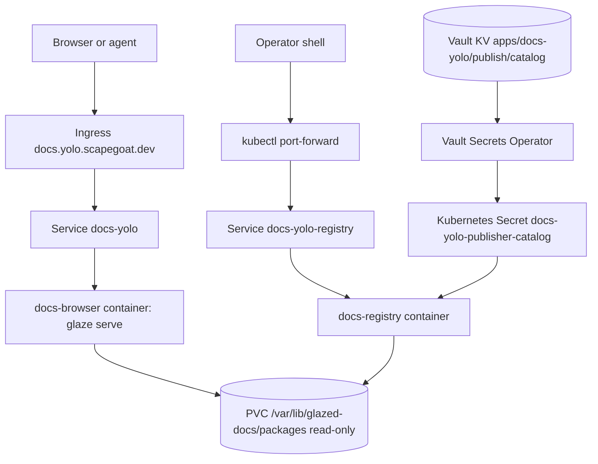
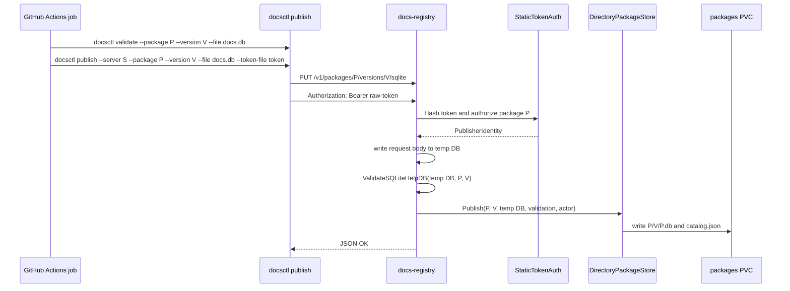
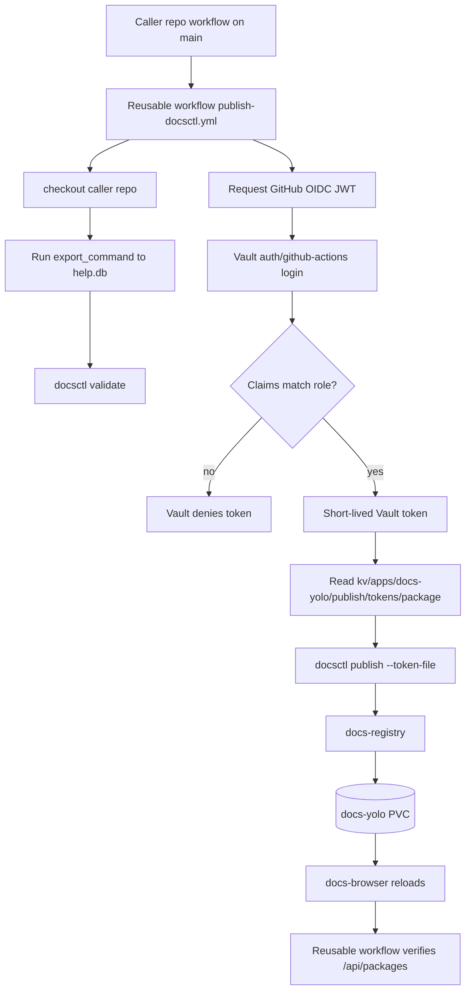
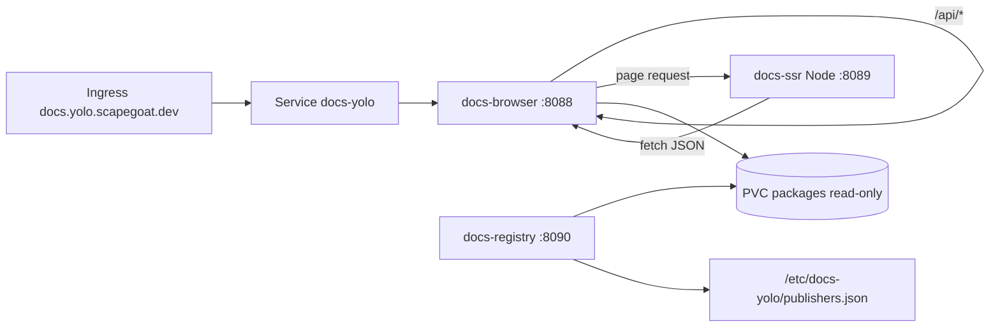

# Reusable GitHub CI/CD docsctl deployment guide

## 1. Executive summary

We need a reusable GitHub CI/CD mechanism that lets individual Go Go Golems repositories publish their Glazed help documentation to `https://docs.yolo.scapegoat.dev` without copying long shell scripts and without storing long-lived publish tokens in GitHub repository secrets. The target deployment is the existing `docs-yolo` system: a public browser reads versioned SQLite help databases from a shared PVC, while an internal registry accepts authenticated `docsctl publish` uploads and writes those databases into the same PVC.

The recommended design has four layers:

1. **A reusable GitHub Actions workflow** named something like `publish-docsctl.yml` in a shared automation repository. Callers pass package metadata and an export command. The workflow checks out the caller repository, exports a SQLite help database, validates it with `docsctl`, retrieves a package-scoped publish token from Vault through GitHub OIDC, publishes the database, and verifies that the public browser API sees the new version.
2. **A Vault GitHub Actions JWT role per allowed caller/package.** The role must bind both the caller repository identity (`repository` or preferably `repository_id`) and the trusted reusable workflow identity (`job_workflow_ref`). This answers the security question “how do we validate that the caller is the right repo?” Vault validates the GitHub-signed OIDC token before releasing the raw `docsctl` package token.
3. **A controlled registry reachability decision.** GitHub-hosted runners cannot reach the current ClusterIP-only registry. Choose either a public write ingress on a separate host such as `docs-registry.yolo.scapegoat.dev` with package token auth and rate limiting, or a self-hosted runner in the cluster/VPN that can reach `svc/docs-yolo-registry`. Do not give GitHub Actions broad Kubernetes credentials just to port-forward.
4. **A k3s packaging and GitOps update for the SSR sidecar.** The browser code already has an SSR proxy flag and Node SSR server source, but the live k3s deployment only runs `docs-browser` and `docs-registry` containers from the Go image. The deployment needs a third `docs-ssr` container and an SSR image, and the `docs-browser` args need `--ssr-url http://127.0.0.1:8089`.

This document is written as an intern-ready implementation guide. It explains what each system component does, which files matter, how the security boundary works, what needs to be built, and how to validate the final path end-to-end.

## 2. Glossary

- **Glazed help database:** A SQLite database produced by a CLI's `help export --format sqlite` command. This is the publish artifact, not raw Markdown.
- **docsctl:** The CLI that validates and uploads a help SQLite database.
- **docs-registry:** The write-side HTTP service that receives `PUT /v1/packages/{package}/versions/{version}/sqlite` uploads.
- **docs-browser:** The read-side HTTP service running `glaze serve --from-sqlite-dir`; it serves the public docs UI and JSON API.
- **docs-yolo:** The k3s application hosting `docs-browser`, `docs-registry`, a shared PVC, Vault Secret Operator wiring, service definitions, and ingress for `docs.yolo.scapegoat.dev`.
- **Publisher token:** A package-scoped raw bearer token used by `docsctl publish`. The registry stores only a `sha256:` hash in `publishers.json`.
- **GitHub OIDC token:** A short-lived JWT minted by GitHub Actions for a running job when the workflow grants `id-token: write`.
- **Vault JWT role:** A Vault role under `auth/github-actions` that validates the GitHub OIDC token's issuer, audience, and bound claims, then returns a short-lived Vault token with narrow policies.
- **Reusable workflow:** A GitHub Actions workflow invoked with `jobs.<job_id>.uses: owner/repo/.github/workflows/file.yml@ref`.
- **`job_workflow_ref`:** A GitHub OIDC claim present for reusable workflow jobs. It identifies the reusable workflow file and ref. It should be bound in Vault in addition to the caller repository claim.

## 3. Current-state architecture

### 3.1 The docs-yolo read/write split

The current deployment has a clean split between browsing and publishing. The public host points at the browser service. The registry service is a separate ClusterIP service and is not exposed by the public ingress.



Evidence:

- The live deployment has `docs-browser` and `docs-registry` containers, both using `ghcr.io/go-go-golems/glazed:sha-14dcd4f` in `gitops/kustomize/docs-yolo/deployment.yaml` lines 25-66.
- The browser command uses `serve --from-sqlite-dir /var/lib/glazed-docs/packages --reload-interval 30s` in `deployment.yaml` lines 28-36.
- The registry command uses `/usr/local/bin/docs-registry --package-root /var/lib/glazed-docs/packages --publisher-catalog /etc/docs-yolo/publishers.json` in `deployment.yaml` lines 63-72.
- The browser mounts the package PVC read-only and the registry mounts it read-write in `deployment.yaml` lines 47-92.
- The public ingress routes only to service `docs-yolo`, not service `docs-yolo-registry`, in `gitops/kustomize/docs-yolo/ingress.yaml` lines 15-24.
- `gitops/kustomize/docs-yolo/service.yaml` defines a second ClusterIP service named `docs-yolo-registry`, which targets the registry port.

### 3.2 docsctl publish and registry API

`docsctl publish` validates a local SQLite help database, builds the registry upload URL, resolves a publish token, and sends a PUT request.



Evidence:

- The client constructs `{server}/v1/packages/{package}/versions/{version}/sqlite` and sends `Authorization: Bearer <token>` in `cmd/docsctl/publish.go` lines 67-96.
- The registry registers `PUT /v1/packages/{package}/versions/{version}/sqlite` in `pkg/help/publish/registry.go` line 72.
- The registry authorizes the request before accepting the upload in `registry.go` lines 93-108, receives a bounded upload, validates the temporary DB, then calls `Store.Publish` in lines 115-134.
- The static auth model binds one token hash to exactly one package in `pkg/help/publish/auth.go` lines 41-45 and rejects a known token when the requested package differs in lines 79-99.
- `DirectoryPackageStore.Publish` writes the database under the package/version path and updates `catalog.json` in `pkg/help/publish/directory_store.go` lines 32-104.

Important implementation note: `cmd/docsctl/publish.go` currently says token precedence is `--token`, `DOCSCTL_TOKEN`, then `--token-file`, but `resolvePublishToken` only checks `--token` and `--token-file` in lines 109-124. The reusable workflow should use `--token-file` initially. A small follow-up bugfix should either implement `DOCSCTL_TOKEN` lookup or fix the help text.

### 3.3 Vault-backed publisher catalog in k3s

The registry itself should not know raw publish tokens at rest. The current k3s system stores a registry-readable `publishers.json` catalog in Vault and syncs it into Kubernetes through the Vault Secrets Operator.

Current shape:

```json
{
  "publishers": [
    {
      "package": "glazed",
      "subject": "glazed-release",
      "tokenHash": "sha256:..."
    }
  ]
}
```

Evidence:

- `gitops/kustomize/docs-yolo/vault-static-secret.yaml` syncs `kv/apps/docs-yolo/publish/catalog` into a Kubernetes Secret named `docs-yolo-publisher-catalog`.
- `vault/policies/kubernetes/docs-yolo.hcl` grants the in-cluster `docs-yolo` service account read-only access to `kv/data/apps/docs-yolo/publish/catalog` and metadata read/list.
- `vault/roles/kubernetes/docs-yolo.json` binds the Kubernetes auth role to service account `docs-yolo` in namespace `docs-yolo`.

The proposed CI workflow should use a different Vault path for raw tokens:

```text
kv/apps/docs-yolo/publish/tokens/<package>
```

That path is for GitHub Actions release jobs only. It must not be included in the VSO-synced registry catalog path.

### 3.4 Existing GitHub Actions to Vault OIDC pattern

The Hetzner k3s repository already has a proven GitHub Actions OIDC pattern for GitOps PR credentials. It uses a dedicated `auth/github-actions` Vault JWT mount, repo-specific roles, and narrow policies.

Evidence:

- The operator playbook shows a role with `role_type: jwt`, `user_claim: repository`, `bound_audiences: ["https://vault.yolo.scapegoat.dev"]`, and `bound_claims` for `repository_owner`, `repository`, `ref`, and `event_name`.
- Terraform now owns the steady-state roles in `/home/manuel/code/wesen/terraform/vault/github-actions/envs/k3s/main.tf`. `vault_jwt_auth_backend_role.gitops_pr` binds `repository_owner = "wesen"`, `repository = each.value.repository`, `ref = "refs/heads/main"`, and `event_name = "push"` in lines 56-72.
- Vault's JWT auth docs say `bound_audiences` must exactly match at least one JWT `aud` claim when an `aud` claim is present, and arbitrary `bound_claims` can require matching claim values.
- GitHub's OIDC docs list useful claims: `repository`, `repository_id`, `repository_owner`, `ref`, `event_name`, `workflow_ref`, `job_workflow_ref`, `job_workflow_sha`, and `repository_visibility`.

The current pattern validates the source repository. For this ticket, we should extend it to validate both:

1. **The caller repository**: e.g. `repository = wesen/glazed` or `repository_id = <immutable id>`.
2. **The reusable workflow used to perform the sensitive operation**: e.g. `job_workflow_ref = go-go-golems/infra-tooling/.github/workflows/publish-docsctl.yml@refs/heads/main`.

That combination prevents an arbitrary workflow in the caller repo from reading the docs publish token unless it goes through the approved reusable workflow path, and prevents another repo from invoking the reusable workflow with someone else's Vault role.

### 3.5 SSR and a14y work that must be deployed with this path

The docs browser now has code-level support for agent-readable pages and server-side rendering, but the live k3s deployment has not yet been updated to run the Node sidecar.

Evidence:

- `pkg/help/server/serve.go` adds an `--ssr-url` flag, logs “SSR sidecar proxy enabled”, and wraps page requests with `newSSRProxy` when configured. Relevant lines: `SSRURL` field at line 50, flag definition around line 135, option wiring at line 191, and `newSSRProxy` at lines 534-593.
- The same server also intercepts well-known agent files before SPA/SSR fallback and handles Markdown content negotiation, which is the basis of DOCSCTL-A14Y.
- `web/package.json` has `build:ssr` and `build:all` scripts in lines 9-10.
- `web/server.mjs` is the Node SSR server. Its environment contract is `SSR_PORT`, `API_BASE`, and `BASE_URL` in lines 23-25. It fetches JSON from the Go API and injects canonical links, Markdown alternate links, JSON-LD, and preloaded state.
- The current Dockerfile builds Go binaries and embeds the client web assets, but the final image is Debian without Node and does not copy `web/server.mjs` or `web/dist/ssr`. See `Dockerfile` lines 21 and 30 for Go binary output only.
- The live k3s deployment has no `docs-ssr` container and the `docs-browser` args do not include `--ssr-url`.

## 4. Problem statement and scope

### 4.1 What we are trying to solve

We want every package repository to publish docs with a small, safe workflow call, not with hand-run port-forwards and local tokens. A repository maintainer should be able to write something like:

```yaml
name: Publish docs

on:
  push:
    branches: [main]
  workflow_dispatch: {}

permissions:
  contents: read
  id-token: write

jobs:
  docs:
    uses: go-go-golems/infra-tooling/.github/workflows/publish-docsctl.yml@main
    with:
      package_name: glazed
      package_version: ${{ github.ref_name == 'main' && format('sha-{0}', github.sha) || github.sha }}
      export_command: go run ./cmd/glaze help export --format sqlite --output-path ./dist/glazed-help.db
      help_db_path: ./dist/glazed-help.db
      registry_url: https://docs-registry.yolo.scapegoat.dev
      public_docs_url: https://docs.yolo.scapegoat.dev
      vault_role: docsctl-glazed-publisher
      vault_secret_path: kv/data/apps/docs-yolo/publish/tokens/glazed
```

The workflow should:

- build or install `docsctl` consistently;
- export the caller's help database;
- validate the database locally;
- retrieve the package publish token from Vault only when GitHub OIDC claims match;
- publish to the docs-yolo registry;
- verify the public browser sees the package/version after reload;
- produce clear logs and artifacts without leaking secrets.

### 4.2 What is out of scope for the first implementation

The first implementation should not rewrite the registry auth model to directly trust GitHub OIDC JWTs. That is a reasonable later improvement, but the current registry already uses package-scoped static token hashes and Vault-backed token management. Reusing it keeps the first CI path smaller.

The first implementation should also not give GitHub Actions a broad kubeconfig just to port-forward into the cluster. That would replace a narrow package-publish token with broad cluster reachability. If we do not want a public registry ingress, use a self-hosted runner in the cluster or VPN instead.

## 5. Proposed architecture

### 5.1 End-to-end CI publish flow



### 5.2 Vault OIDC authorization model

Each package/caller pair should get a Vault role. Start with a naming convention:

```text
docsctl-<package>-publisher
```

A concrete role for `glazed` should look like this when managed by Terraform:

```hcl
resource "vault_policy" "docsctl_publish" {
  name = "gha-docsctl-glazed-publisher"

  policy = <<-EOT
    path "kv/data/apps/docs-yolo/publish/tokens/glazed" {
      capabilities = ["read"]
    }

    path "auth/token/lookup-self" {
      capabilities = ["read"]
    }

    path "auth/token/revoke-self" {
      capabilities = ["update"]
    }
  EOT
}

resource "vault_jwt_auth_backend_role" "docsctl_glazed_publisher" {
  backend   = vault_jwt_auth_backend.github_actions.path
  role_name = "docsctl-glazed-publisher"
  role_type = "jwt"

  user_claim      = "repository"
  bound_audiences = ["vault://docs-yolo/docsctl-publish/glazed"]

  bound_claims = {
    repository_owner = "go-go-golems"
    repository       = "go-go-golems/glazed"
    ref              = "refs/heads/main"
    event_name       = "push"
    job_workflow_ref = "go-go-golems/infra-tooling/.github/workflows/publish-docsctl.yml@refs/heads/main"
  }

  token_policies         = [vault_policy.docsctl_publish.name]
  token_ttl              = 600
  token_max_ttl          = 1800
  token_explicit_max_ttl = 1800
}
```

Prefer immutable IDs after the first proof:

```hcl
bound_claims = {
  repository_owner_id = "<org-id>"
  repository_id       = "<repo-id>"
  ref                 = "refs/heads/main"
  event_name          = "push"
  job_workflow_ref    = "go-go-golems/infra-tooling/.github/workflows/publish-docsctl.yml@refs/heads/main"
}
```

Why this validates the caller:

- `repository` / `repository_id` belongs to the caller repository where the workflow run was triggered.
- `ref` prevents feature-branch runs from publishing production docs.
- `event_name = push` prevents pull request runs from forks from receiving publish tokens.
- `job_workflow_ref` proves the sensitive Vault read happens inside the approved reusable workflow, not an arbitrary copied workflow.
- `bound_audiences` ties the token request to this exact Vault use case. Use a custom audience such as `vault://docs-yolo/docsctl-publish/<package>`, and pass the same value as `jwtGithubAudience` to `hashicorp/vault-action`.

If GitHub's default OIDC subject customization is not changed, Vault can still bind these claims directly with `bound_claims`; Vault is not limited to matching only `sub`. GitHub's docs also support a custom `sub` that includes `job_workflow_ref`, but that is optional for Vault because Vault can validate arbitrary claims directly.

### 5.3 Reusable workflow contract

Create a reusable workflow in a shared automation repository, for example:

```text
go-go-golems/infra-tooling/.github/workflows/publish-docsctl.yml
```

Proposed `workflow_call` interface:

```yaml
name: Publish docsctl package

on:
  workflow_call:
    inputs:
      package_name:
        type: string
        required: true
      package_version:
        type: string
        required: true
      export_command:
        type: string
        required: true
      help_db_path:
        type: string
        required: true
      registry_url:
        type: string
        required: false
        default: https://docs-registry.yolo.scapegoat.dev
      public_docs_url:
        type: string
        required: false
        default: https://docs.yolo.scapegoat.dev
      vault_addr:
        type: string
        required: false
        default: https://vault.yolo.scapegoat.dev
      vault_role:
        type: string
        required: true
      vault_secret_path:
        type: string
        required: true
      vault_secret_field:
        type: string
        required: false
        default: token
      go_version:
        type: string
        required: false
        default: "1.25.x"
      verify_timeout_seconds:
        type: number
        required: false
        default: 120
      normalize_legacy_db:
        type: boolean
        required: false
        default: true
```

The job should request minimal permissions:

```yaml
permissions:
  contents: read
  id-token: write
```

Core workflow pseudocode:

```yaml
jobs:
  publish:
    runs-on: ubuntu-latest
    permissions:
      contents: read
      id-token: write
    steps:
      - uses: actions/checkout@v4

      - uses: actions/setup-go@v5
        with:
          go-version: ${{ inputs.go_version }}

      - name: Install docsctl
        run: |
          go install github.com/go-go-golems/glazed/cmd/docsctl@latest
          echo "$(go env GOPATH)/bin" >> "$GITHUB_PATH"

      - name: Export help SQLite database
        shell: bash
        run: |
          set -euo pipefail
          mkdir -p "$(dirname '${{ inputs.help_db_path }}')"
          ${{ inputs.export_command }}
          test -s "${{ inputs.help_db_path }}"

      - name: Validate help SQLite database
        run: |
          docsctl validate \
            --package "${{ inputs.package_name }}" \
            --version "${{ inputs.package_version }}" \
            --file "${{ inputs.help_db_path }}"

      - name: Read docsctl publish token from Vault
        uses: hashicorp/vault-action@v3
        with:
          url: ${{ inputs.vault_addr }}
          method: jwt
          path: github-actions
          role: ${{ inputs.vault_role }}
          jwtGithubAudience: vault://docs-yolo/docsctl-publish/${{ inputs.package_name }}
          exportToken: false
          secrets: |
            ${{ inputs.vault_secret_path }} ${{ inputs.vault_secret_field }} | DOCSCTL_PUBLISH_TOKEN

      - name: Publish help DB to docs-yolo registry
        shell: bash
        run: |
          set -euo pipefail
          token_file="$RUNNER_TEMP/docsctl-token"
          umask 077
          printf '%s' "$DOCSCTL_PUBLISH_TOKEN" > "$token_file"
          docsctl publish \
            --server "${{ inputs.registry_url }}" \
            --package "${{ inputs.package_name }}" \
            --version "${{ inputs.package_version }}" \
            --file "${{ inputs.help_db_path }}" \
            --token-file "$token_file"
          rm -f "$token_file"

      - name: Verify public docs browser sees package version
        shell: bash
        run: |
          set -euo pipefail
          deadline=$((SECONDS + ${{ inputs.verify_timeout_seconds }}))
          while [ "$SECONDS" -lt "$deadline" ]; do
            json="$(curl -fsS '${{ inputs.public_docs_url }}/api/packages')"
            if jq -e \
              --arg p '${{ inputs.package_name }}' \
              --arg v '${{ inputs.package_version }}' \
              '.packages[] | select(.name == $p) | .versions | index($v)' \
              <<<"$json" >/dev/null; then
              echo "OK: docs browser sees ${{ inputs.package_name }}@${{ inputs.package_version }}"
              exit 0
            fi
            sleep 10
          done
          echo "Timed out waiting for docs browser reload" >&2
          curl -fsS '${{ inputs.public_docs_url }}/api/packages' | jq . >&2
          exit 1
```

Implementation notes:

- Use `--token-file` until `docsctl publish` implements `DOCSCTL_TOKEN` environment lookup.
- Always write the token into `$RUNNER_TEMP` with `umask 077`; never echo it.
- Do not use `continue-on-error` for Vault in the final production workflow. A successful export but skipped publish should be a failed release.
- Upload the generated SQLite DB as a workflow artifact on failure for debugging if it does not contain secrets.
- Pin third-party actions by major version initially (`actions/checkout@v4`, `hashicorp/vault-action@v3`), and consider SHA pinning once the shared workflow is stable.

### 5.4 Caller workflow contract

Each package repository gets a tiny wrapper. Example for `glazed`:

```yaml
name: Publish docs to docs-yolo

on:
  push:
    branches: [main]
  workflow_dispatch:
    inputs:
      version:
        description: Version to publish, e.g. v1.2.15 or sha-...
        required: false
        type: string

permissions:
  contents: read
  id-token: write

jobs:
  docs:
    uses: go-go-golems/infra-tooling/.github/workflows/publish-docsctl.yml@main
    with:
      package_name: glazed
      package_version: ${{ inputs.version || format('sha-{0}', github.sha) }}
      export_command: go run ./cmd/glaze help export --format sqlite --output-path ./dist/glazed-help.db
      help_db_path: ./dist/glazed-help.db
      vault_role: docsctl-glazed-publisher
      vault_secret_path: kv/data/apps/docs-yolo/publish/tokens/glazed
```

For a repository with local config-sensitive exports, isolate `HOME`:

```yaml
export_command: HOME=$(mktemp -d) go run ./cmd/sqleton help export --format sqlite --output-path ./dist/sqleton-help.db
```

That pattern comes from the `sqleton` manual publish lesson: local configuration can affect export commands and should not leak into CI.

### 5.5 Registry reachability options

The reusable workflow needs to reach `docs-registry`. The current ClusterIP-only service is correct for manual operator port-forwarding but insufficient for GitHub-hosted CI. Choose one of these options explicitly.

#### Option A: Public registry ingress on a separate host (recommended first path)

Create a new ingress host, for example:

```text
https://docs-registry.yolo.scapegoat.dev -> svc/docs-yolo-registry
```

Keep it separate from `docs.yolo.scapegoat.dev` so the public browser and write API stay mentally and operationally distinct.

Minimum controls:

- TLS through cert-manager.
- Route only the registry service, not the browser service.
- Keep registry bearer-token auth required.
- Add Traefik rate limiting if available.
- Use package-scoped tokens from Vault and rotate them per package/repo.
- Monitor 401/403/5xx registry responses.

Risk: if a raw package token leaks, anyone on the internet can publish that package until the token is rotated. The token remains package-scoped, but this is a real exposure increase compared to ClusterIP-only.

#### Option B: Self-hosted GitHub runner in the cluster or VPN

Run the reusable workflow on a self-hosted runner that can reach `http://docs-yolo-registry.docs-yolo.svc.cluster.local`.

Benefits:

- The registry stays internal-only.
- A leaked package token is less useful from outside the network.

Costs:

- You must operate runner lifecycle, isolation, updates, and cleanup.
- Do not run untrusted pull request jobs on this runner.
- The runner becomes sensitive infrastructure.

#### Option C: In-cluster publish controller (future)

CI uploads the SQLite DB as an OCI artifact or GitHub release artifact, then opens a GitOps PR or calls a small broker. An in-cluster controller pulls the artifact and writes to the PVC. This avoids exposing the registry and avoids self-hosted GitHub runners, but requires new infrastructure and more moving parts.

#### Explicit anti-pattern: GitHub Actions kubeconfig + port-forward

Avoid storing a kubeconfig in Vault and having GitHub Actions run `kubectl port-forward`. That makes the CI job a cluster client. It is broader than a package-scoped docs publish token and harder to audit safely.

### 5.6 SSR sidecar deployment architecture

The desired k3s pod shape is:



Modify `gitops/kustomize/docs-yolo/deployment.yaml` roughly like this:

```yaml
containers:
  - name: docs-browser
    image: ghcr.io/go-go-golems/glazed:sha-<go-image-sha>
    args:
      - serve
      - --address
      - :8088
      - --from-sqlite-dir
      - /var/lib/glazed-docs/packages
      - --reload-interval
      - 30s
      - --ssr-url
      - http://127.0.0.1:8089
    ports:
      - containerPort: 8088
        name: http

  - name: docs-ssr
    image: ghcr.io/go-go-golems/glazed-docs-ssr:sha-<web-image-sha>
    env:
      - name: SSR_PORT
        value: "8089"
      - name: API_BASE
        value: http://127.0.0.1:8088/api
      - name: BASE_URL
        value: https://docs.yolo.scapegoat.dev
    ports:
      - containerPort: 8089
        name: ssr
    readinessProbe:
      httpGet:
        path: /health
        port: ssr
    livenessProbe:
      httpGet:
        path: /health
        port: ssr

  - name: docs-registry
    image: ghcr.io/go-go-golems/glazed:sha-<go-image-sha>
    command: [/usr/local/bin/docs-registry]
```

The service does not need to expose the SSR port because only the browser container uses it over pod-local `127.0.0.1`.

### 5.7 SSR image packaging

Add a Dockerfile for the SSR sidecar, for example `web/ssr.Dockerfile`:

```dockerfile
# syntax=docker/dockerfile:1

FROM node:22-bookworm-slim AS deps
WORKDIR /app
RUN corepack enable
COPY web/package.json web/pnpm-lock.yaml ./
RUN pnpm install --frozen-lockfile

FROM deps AS build
COPY web/ ./
RUN pnpm build:all
RUN pnpm prune --prod

FROM node:22-bookworm-slim
WORKDIR /app
ENV NODE_ENV=production \
    SSR_PORT=8089 \
    API_BASE=http://127.0.0.1:8088/api \
    BASE_URL=https://docs.yolo.scapegoat.dev
COPY --from=build /app/package.json ./package.json
COPY --from=build /app/node_modules ./node_modules
COPY --from=build /app/dist ./dist
COPY --from=build /app/server.mjs ./server.mjs
USER node
EXPOSE 8089
CMD ["node", "server.mjs"]
```

Build and push tags:

```bash
docker build -f Dockerfile -t ghcr.io/go-go-golems/glazed:sha-$GITHUB_SHA .
docker build -f web/ssr.Dockerfile -t ghcr.io/go-go-golems/glazed-docs-ssr:sha-$GITHUB_SHA .
docker push ghcr.io/go-go-golems/glazed:sha-$GITHUB_SHA
docker push ghcr.io/go-go-golems/glazed-docs-ssr:sha-$GITHUB_SHA
```

The shared docs publishing workflow does not necessarily build these images for every package. The SSR image belongs to the docs-browser application release path, likely the `glazed` repository or a dedicated docs-browser release workflow. However, this ticket must account for it because docsctl CI publish and a14y quality depend on the production browser actually running the SSR sidecar.

## 6. Implementation phases

### Phase 1: Fix local docsctl and registry assumptions

Tasks:

1. Fix or document `docsctl publish` token precedence.
   - Preferred code fix: make `resolvePublishToken` check `DOCSCTL_TOKEN` between `--token` and `--token-file`, matching its help text.
   - Test: add a unit test for `--token`, env, and token-file precedence.
2. Ensure `docsctl validate` rejects or normalizes legacy SQLite schemas before upload.
   - The manual `sqleton` incident showed a DB can validate and publish but later require write-time migration on the read-only browser mount.
   - Preferred behavior: validation should fail with a clear message or `docsctl publish --normalize` should write a normalized temporary DB.
3. Add a `docsctl publish --json` stable output contract for CI logs if current JSON is not enough.

### Phase 2: Add the shared reusable workflow

Files to create in the shared automation repository:

```text
.github/workflows/publish-docsctl.yml
scripts/verify-docsctl-publish.sh          # optional helper
README.md or docs/publish-docsctl.md       # caller onboarding
```

Validation steps:

- Run the workflow manually from a sandbox package with a `vtest` or `sha-...` version.
- Confirm Vault denies a feature branch, pull request event, wrong repository, wrong reusable workflow ref, and wrong audience.
- Confirm Vault allows a `push` to `main` from the intended caller through the intended reusable workflow.
- Confirm the workflow never prints raw tokens.

### Phase 3: Add Terraform-owned Vault roles and policies

Extend `/home/manuel/code/wesen/terraform/vault/github-actions/envs/k3s/main.tf` with a new local map, separate from GitOps PR roles:

```hcl
locals {
  docsctl_publish_roles = {
    docsctl-glazed-publisher = {
      repository       = "go-go-golems/glazed"
      repository_id    = null # fill after first lookup
      package_name     = "glazed"
      secret_path      = "kv/data/apps/docs-yolo/publish/tokens/glazed"
      audience         = "vault://docs-yolo/docsctl-publish/glazed"
      job_workflow_ref = "go-go-golems/infra-tooling/.github/workflows/publish-docsctl.yml@refs/heads/main"
      policy_name      = "gha-docsctl-glazed-publisher"
    }
  }
}
```

Then create `vault_policy.docsctl_publish` and `vault_jwt_auth_backend_role.docsctl_publish` resources using `for_each`.

Operator steps:

```bash
cd /home/manuel/code/wesen/terraform/vault/github-actions/envs/k3s
export VAULT_ADDR=https://vault.yolo.scapegoat.dev
vault login -method=oidc role=operators
terraform fmt
terraform plan
terraform apply
```

Seed the raw package token:

```bash
vault kv put kv/apps/docs-yolo/publish/tokens/glazed token="$DOCSCTL_GLAZED_TOKEN"
```

Update the registry-readable hash catalog separately:

```bash
# Pseudocode: generate hash with docsctl or small helper.
docsctl token hash --token "$DOCSCTL_GLAZED_TOKEN"

vault kv put kv/apps/docs-yolo/publish/catalog \
  publishers.json=@publishers.json
```

If `docsctl token hash` does not exist, add it. Today hashing exists as Go function `publish.HashPublishToken`, but operators need a safe CLI to compute the catalog hash without writing custom snippets.

### Phase 4: Decide and implement registry reachability

If choosing public registry ingress:

1. Add `gitops/kustomize/docs-yolo/registry-ingress.yaml`.
2. Add it to `kustomization.yaml`.
3. Point host `docs-registry.yolo.scapegoat.dev` at service `docs-yolo-registry` port 80.
4. Add rate-limit middleware if the cluster Traefik setup supports it.
5. Validate:

```bash
curl -fsS https://docs-registry.yolo.scapegoat.dev/healthz
curl -i -X PUT https://docs-registry.yolo.scapegoat.dev/v1/packages/glazed/versions/vbad/sqlite
# should be 401 without token, not 404
```

If choosing self-hosted runner:

1. Create a dedicated runner namespace and service account.
2. Run only trusted `push`/manual workflows, never untrusted pull request code.
3. Point the reusable workflow at `http://docs-yolo-registry.docs-yolo.svc.cluster.local`.
4. Document runner maintenance and cleanup.

### Phase 5: Package and deploy the SSR sidecar

1. Add `web/ssr.Dockerfile` to `glazed`.
2. Update the `glazed` image publishing workflow to build and push both the Go image and SSR image.
3. Update `gitops/kustomize/docs-yolo/deployment.yaml` to add `docs-ssr` and `--ssr-url`.
4. Open a GitOps PR to `/home/manuel/code/wesen/2026-03-27--hetzner-k3s`.
5. Merge and validate Argo CD.

Validation:

```bash
kubectl -n docs-yolo get pods
kubectl -n docs-yolo logs deployment/docs-yolo -c docs-ssr --tail=100
kubectl -n docs-yolo logs deployment/docs-yolo -c docs-browser --tail=100 | rg 'SSR sidecar proxy enabled'

curl -fsS https://docs.yolo.scapegoat.dev/glazed/_/sections/<slug> | rg '<h1|application/ld\+json|__PRELOADED_STATE__'
curl -fsSI https://docs.yolo.scapegoat.dev/glazed/_/sections/<slug> | rg -i 'link:.*text/markdown'
```

### Phase 6: Onboard first package, then generalize

Recommended first package: `glazed`, because it owns `docsctl`, `docs-registry`, `glaze serve`, and the web app.

Then onboard:

- `pinocchio`
- `remarquee`
- `sqleton`

For each package:

1. Create or rotate a package publish token.
2. Add token hash to `publishers.json` in Vault catalog.
3. Add raw token to `kv/apps/docs-yolo/publish/tokens/<package>`.
4. Add a Vault JWT role binding the caller repo to the reusable workflow.
5. Add caller workflow.
6. Run a `workflow_dispatch` publish to a test version.
7. Run a real `main` publish.

## 7. Testing and validation strategy

### 7.1 Local tests

Run in `glazed`:

```bash
go test ./pkg/help/publish ./cmd/docsctl -count=1
(cd web && pnpm test)
(cd web && pnpm build:all)
docker build -t glazed:test .
docker build -f web/ssr.Dockerfile -t glazed-docs-ssr:test .
```

### 7.2 Registry contract tests

With a local registry:

```bash
# Start registry with a temp package root and fixture publishers.json.
docs-registry \
  --address :8090 \
  --package-root /tmp/docs-yolo-packages \
  --publisher-catalog /tmp/publishers.json

# Publish a fixture DB.
docsctl publish \
  --server http://127.0.0.1:8090 \
  --package glazed \
  --version vtest-ci \
  --file /tmp/glazed-help.db \
  --token-file /tmp/glazed-token
```

Negative tests:

- no token → 401;
- wrong token → 401;
- right token wrong package → 403;
- oversized upload → 413;
- malformed SQLite DB → 400;
- legacy schema needing write-time migration → fail before publishing or publish normalized DB.

### 7.3 Vault claim tests

Use a temporary workflow that prints non-sensitive OIDC claims with GitHub's official debugging approach or a safe JWT decoding step that never prints the raw token.

For each role, prove:

| Scenario | Expected result |
|---|---|
| caller repo main push through reusable workflow | Vault login succeeds |
| caller repo feature branch | Vault login fails |
| caller repo pull request | Vault login fails |
| wrong caller repo | Vault login fails |
| copied workflow not reusable workflow | Vault login fails if `job_workflow_ref` is bound |
| correct repo but wrong audience | Vault login fails |

### 7.4 End-to-end CI tests

A successful run should show:

```text
Export help SQLite database ✓
Validate help SQLite database ✓
Read docsctl publish token from Vault ✓
Publish help DB to docs-yolo registry ✓
Verify public docs browser sees package version ✓
```

The workflow should then prove public API visibility:

```bash
curl -fsS https://docs.yolo.scapegoat.dev/api/packages \
  | jq '.packages[] | select(.name == "glazed") | {name, versions, sectionCount}'
```

### 7.5 Production SSR/a14y validation

After deploying the SSR sidecar:

```bash
curl -fsS https://docs.yolo.scapegoat.dev/llms.txt | head
curl -fsS https://docs.yolo.scapegoat.dev/sitemap.xml | xmllint --noout -
curl -fsS -H 'Accept: text/markdown' https://docs.yolo.scapegoat.dev/glazed/_/sections/<slug> | head
curl -fsS https://docs.yolo.scapegoat.dev/glazed/_/sections/<slug> | rg '<h1|<h2|application/ld\+json'
```

Then rerun the a14y audit used in DOCSCTL-A14Y.

## 8. Security model and review checklist

### 8.1 Secret boundaries

| Secret | Where it lives | Who can read it | Notes |
|---|---|---|---|
| registry token hash catalog | `kv/apps/docs-yolo/publish/catalog` | docs-yolo pod through VSO | Contains only `sha256:` token hashes. |
| raw package publish token | `kv/apps/docs-yolo/publish/tokens/<package>` | GitHub Actions Vault role for that package | Do not mount into Kubernetes. |
| short-lived Vault token | GitHub Actions memory | one job | TTL 10-30 minutes. |
| GitHub OIDC JWT | GitHub Actions memory | one job | Used only to login to Vault. |
| package SQLite DB | CI workspace/artifact and registry PVC | public content | Should contain documentation only. |

### 8.2 Required Vault role constraints

A production docs publish role should bind at least:

- `repository_owner` or `repository_owner_id`;
- `repository` or `repository_id`;
- `ref = refs/heads/main` for automatic production publishes;
- `event_name = push` for automatic production publishes;
- `job_workflow_ref` for the approved reusable workflow;
- custom `bound_audiences` per package or per docs publish use case.

Optional but useful:

- `repository_visibility`, if all allowed repos should be private/internal/public;
- `workflow_ref`, if you want to restrict the caller's wrapper workflow path;
- `environment`, if publishing should require a protected GitHub environment.

### 8.3 GitHub workflow safety rules

- Do not run the publish job on `pull_request` from forks.
- Do not set `permissions: write-all`.
- Do not persist checkout credentials if not needed.
- Do not print `$DOCSCTL_PUBLISH_TOKEN`, `$VAULT_TOKEN`, or raw OIDC JWTs.
- Do not use `continue-on-error` for Vault or publish in final production.
- Do not let caller-provided inputs choose arbitrary Vault secret paths unless the Vault role policy is already narrow. The workflow can accept `vault_secret_path`, but Vault policy must enforce the actual path.
- Do not rely on GitHub `secrets.*` in job-level `if:` expressions; use explicit env/shell checks when needed.

### 8.4 Registry exposure review if public ingress is chosen

Before exposing `docs-registry` publicly:

- Confirm unauthenticated upload returns 401.
- Confirm wrong package returns 403 even with a valid token for another package.
- Confirm max upload size remains bounded.
- Add access logs and alerting.
- Decide token rotation playbook.
- Confirm public browser ingress and registry ingress are separate hosts.
- Consider additional Traefik middleware: rate limits, request body limits, and possibly IP allowlist if runners are predictable.

## 9. API references

### 9.1 docsctl publish CLI

Current contract:

```bash
docsctl publish \
  --server <registry-base-url> \
  --package <package-name> \
  --version <package-version> \
  --file <help.sqlite.db> \
  --token-file <file-containing-raw-token>
```

HTTP contract:

```http
PUT /v1/packages/{package}/versions/{version}/sqlite HTTP/1.1
Authorization: Bearer <raw package token>
Content-Type: application/vnd.sqlite3

<sqlite bytes>
```

Success shape:

```json
{
  "ok": true,
  "package": {
    "packageName": "glazed",
    "version": "v1.2.15",
    "sectionCount": 146,
    "slugCount": 146,
    "path": "glazed/v1.2.15/glazed.db",
    "sha256": "...",
    "publishedBy": "glazed-release",
    "publishedAt": "2026-05-26T10:00:00Z"
  },
  "validation": { "...": "..." },
  "actor": {
    "subject": "glazed-release",
    "packageName": "glazed",
    "method": "static-token"
  }
}
```

### 9.2 Vault action contract

```yaml
- uses: hashicorp/vault-action@v3
  with:
    url: https://vault.yolo.scapegoat.dev
    method: jwt
    path: github-actions
    role: docsctl-glazed-publisher
    jwtGithubAudience: vault://docs-yolo/docsctl-publish/glazed
    exportToken: false
    secrets: |
      kv/data/apps/docs-yolo/publish/tokens/glazed token | DOCSCTL_PUBLISH_TOKEN
```

Vault login endpoint under the hood:

```http
POST /v1/auth/github-actions/login
Content-Type: application/json

{"role":"docsctl-glazed-publisher","jwt":"<github-oidc-jwt>"}
```

### 9.3 GitHub OIDC claims to inspect

Use these claim names in Vault `bound_claims`:

```text
repository
repository_id
repository_owner
repository_owner_id
repository_visibility
ref
ref_type
event_name
workflow_ref
workflow_sha
job_workflow_ref
job_workflow_sha
actor
actor_id
run_id
run_attempt
```

For reusable workflows, `job_workflow_ref` is the important “approved workflow” claim. The `repository` claim remains the caller repository; that is what answers whether the caller is the right repo.

### 9.4 docs-yolo k3s runtime contract

Browser:

```bash
glaze serve \
  --address :8088 \
  --from-sqlite-dir /var/lib/glazed-docs/packages \
  --reload-interval 30s \
  --ssr-url http://127.0.0.1:8089
```

SSR sidecar:

```bash
SSR_PORT=8089 \
API_BASE=http://127.0.0.1:8088/api \
BASE_URL=https://docs.yolo.scapegoat.dev \
node server.mjs
```

Registry:

```bash
docs-registry \
  --address :8090 \
  --package-root /var/lib/glazed-docs/packages \
  --publisher-catalog /etc/docs-yolo/publishers.json
```

## 10. Alternatives considered

### 10.1 Keep manual port-forward publishing

This is the safest current operation but does not satisfy reusable CI/CD. It depends on an operator's shell, local tokens, and manual verification.

### 10.2 Store docs publish tokens as GitHub repository secrets

This is simple but loses central Vault audit/control. It also makes token rotation per package/repo less consistent. Use only as a temporary migration fallback.

### 10.3 Have GitHub Actions port-forward to the internal registry

Rejected for the first design. It requires giving CI a kubeconfig or similar cluster credential. That credential is more powerful and more complex to constrain than a package-scoped docs publish token.

### 10.4 Make docs-registry validate GitHub OIDC directly

This is attractive long-term. `docsctl publish` could request an OIDC token and send it directly to the registry; the registry could verify GitHub JWKS and claims. However, it duplicates Vault's already-proven JWT policy machinery and requires new registry code, claim configuration, and key rotation handling. Keep it as a Phase 2+ hardening path.

### 10.5 Use GitOps to store published SQLite DBs in git

Rejected for normal operation. SQLite help databases can be generated artifacts, and storing every version in GitOps would bloat the repository and couple content publishing to Argo CD reconciliation. The PVC-backed registry is already the correct content store.

## 11. Risks and open questions

1. **Public registry ingress risk.** Exposing the write API increases the blast radius of leaked package tokens. Mitigate with Vault-gated token access, package-scoped tokens, rate limits, logs, and a rotation playbook. If this is unacceptable, choose a self-hosted runner.
2. **Reusable workflow claim details must be proven in a live run.** The design relies on `repository` identifying the caller and `job_workflow_ref` identifying the called workflow. This matches GitHub's documented claims, but the first implementation should log non-sensitive decoded claim names/values in a sandbox before finalizing roles.
3. **Token hash catalog reload.** The article notes that the registry currently reads the publisher catalog at startup even though a reloadable catalog type exists. After adding or rotating a token hash, the deployment may need a restart unless periodic reload is implemented.
4. **Legacy SQLite normalization.** CI should not publish a database that later tries to migrate itself on the browser's read-only mount.
5. **Image release coupling.** The Go image, docs-registry binary, browser web assets, and SSR sidecar need compatible versions. A mismatch can produce hydration errors or missing API behavior.
6. **Version naming.** Decide whether CI publishes semantic tags, `sha-<commit>`, or both. The browser default-version behavior should be defined separately.
7. **GitHub org/repo names.** Some local paths use `go-go-golems` and some deployment references use `wesen`. Confirm the actual GitHub owner for each package before writing Vault `repository` claims.

## 12. Intern implementation checklist

Start here if you are implementing this ticket.

1. Read this document completely.
2. Read the copied source article at `sources/01-article-docsctl-and-docs-yolo-documentation-deployment.md`.
3. In `glazed`, inspect:
   - `cmd/docsctl/publish.go`
   - `pkg/help/publish/registry.go`
   - `pkg/help/publish/auth.go`
   - `pkg/help/server/serve.go`
   - `web/server.mjs`
   - `web/package.json`
4. In the k3s repo, inspect:
   - `gitops/kustomize/docs-yolo/deployment.yaml`
   - `gitops/kustomize/docs-yolo/service.yaml`
   - `gitops/kustomize/docs-yolo/ingress.yaml`
   - `gitops/kustomize/docs-yolo/vault-static-secret.yaml`
   - `vault/policies/kubernetes/docs-yolo.hcl`
   - `vault/roles/kubernetes/docs-yolo.json`
   - `docs/github-actions-vault-oidc-playbook.md`
   - `/home/manuel/code/wesen/terraform/vault/github-actions/envs/k3s/main.tf`
5. Fix `docsctl publish` token env behavior or use `--token-file` only.
6. Build `web/ssr.Dockerfile` and prove the SSR sidecar locally.
7. Add the GitOps deployment changes for `docs-ssr` and `--ssr-url`.
8. Add Terraform roles/policies for one package.
9. Create the reusable workflow.
10. Run a sandbox publish to `vtest` or `sha-<commit>`.
11. Run negative Vault claim tests.
12. Onboard remaining packages.

## 13. References

Local references:

- `/home/manuel/code/wesen/go-go-golems/go-go-parc/Projects/2026/05/24/ARTICLE - Docsctl and Docs-Yolo Documentation Deployment.md`
- `/home/manuel/workspaces/2026-05-25/docsctl-cicd-deploy/glazed/ttmp/2026/05/25/DOCSCTL-SSR--server-side-rendering-via-node-js-sidecar-for-docs-browser/design-doc/01-ssr-sidecar-analysis-and-implementation-guide.md`
- `/home/manuel/workspaces/2026-05-25/docsctl-cicd-deploy/glazed/ttmp/2026/05/25/DOCSCTL-A14Y--improve-a14y-score-for-docs-yolo-scapegoat-dev-from-42-to-80/design-doc/01-a14y-agent-readability-improvement-design-and-implementation-guide.md`
- `/home/manuel/code/wesen/2026-03-27--hetzner-k3s/docs/github-actions-vault-oidc-playbook.md`
- `/home/manuel/code/wesen/2026-03-27--hetzner-k3s/docs/source-app-deployment-infrastructure-playbook.md`
- `/home/manuel/code/wesen/terraform/vault/github-actions/envs/k3s/main.tf`

Official/API references:

- GitHub OIDC reference: `https://docs.github.com/actions/reference/openid-connect-reference`
- GitHub OIDC with reusable workflows: `https://docs.github.com/en/actions/deployment/security-hardening-your-deployments/using-openid-connect-with-reusable-workflows`
- GitHub reusable workflows: `https://docs.github.com/en/actions/using-workflows/reusing-workflows`
- Vault JWT auth method: `https://developer.hashicorp.com/vault/docs/auth/jwt`
- Vault Terraform provider `vault_jwt_auth_backend_role`: `https://registry.terraform.io/providers/hashicorp/vault/latest/docs/resources/jwt_auth_backend_role`
