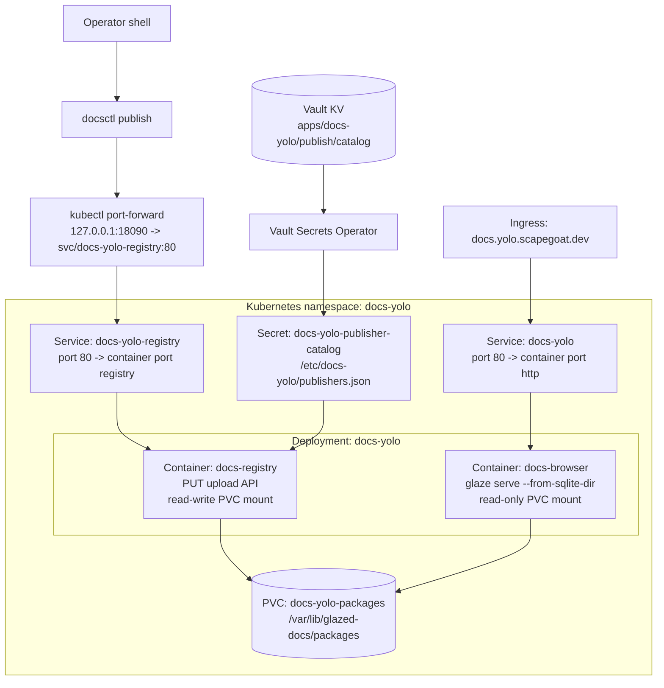
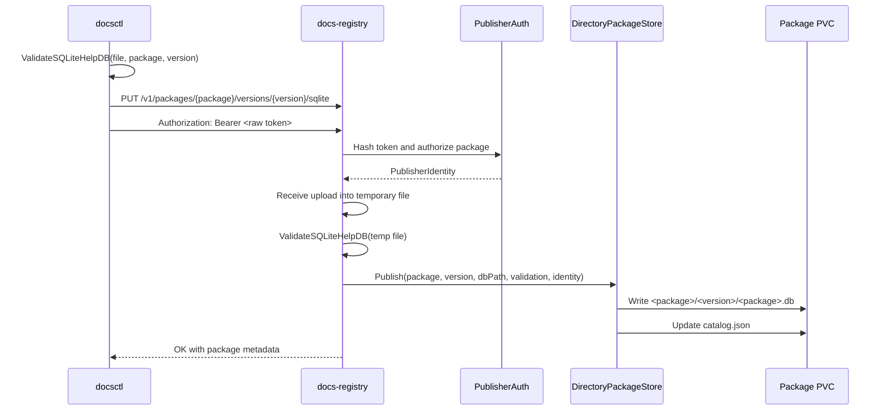

# Docsctl and Docs-Yolo Documentation Deployment

This report explains how the Go Go Golems documentation publishing system works today. The system has three main responsibilities: command-line tools export help content into SQLite databases, an internal registry receives authenticated uploads, and a browser process serves the accumulated package documentation from shared storage. The implementation lives partly in the Glazed repository, where `docsctl`, `docs-registry`, and `glaze serve` are implemented, and partly in the Hetzner k3s GitOps repository, where Kubernetes, Vault, and ArgoCD deploy the running service.

> [!summary]
> - `docsctl publish` validates a local help SQLite database and uploads it to `docs-registry` with a package-scoped bearer token.
> - `docs-registry` stores each uploaded database under `/var/lib/glazed-docs/packages/<package>/<version>/<package>.db` and updates `catalog.json`.
> - `docs-browser` serves the public documentation UI from the same package directory, but the registry write API is currently internal-only and reached through `kubectl port-forward`.
> - Publisher authorization is controlled by a Vault-backed `publishers.json` catalog synced into Kubernetes by the Vault Secrets Operator.

## Why this note exists

The documentation deployment has several moving parts that are easy to confuse if they are only described as commands. A future operator needs to know which component owns each responsibility, which URL is public, which service accepts writes, where tokens live, and why a publish operation sometimes uses `localhost` even though the final documentation appears on a public domain.

The key distinction is between reading documentation and publishing documentation. Reading documentation goes through the public host `https://docs.yolo.scapegoat.dev`, which routes to the browser service. Publishing documentation goes to `docs-registry`, which is not exposed by the public ingress. The current publishing workflow therefore uses a local port-forward to reach the internal registry service.

## Repository and file map

The deployment spans two primary repositories.

| Repository | Path | Responsibility |
|---|---|---|
| Hetzner k3s GitOps | `/home/manuel/code/wesen/2026-03-27--hetzner-k3s` | Kubernetes manifests, ArgoCD applications, Vault policies, Vault Kubernetes auth roles, docmgr ticket documentation. |
| Glazed | `/home/manuel/code/wesen/go-go-golems/glazed` | `glaze`, `docsctl`, `docs-registry`, help SQLite validation, registry upload handling, package storage, and browser server code. |

The most important GitOps files are:

| File | Meaning |
|---|---|
| `gitops/applications/docs-yolo.yaml` | ArgoCD application that watches `gitops/kustomize/docs-yolo` on `main`. |
| `gitops/kustomize/docs-yolo/deployment.yaml` | Runs the two-container `docs-yolo` pod: `docs-browser` and `docs-registry`. |
| `gitops/kustomize/docs-yolo/service.yaml` | Defines the public browser service and the internal registry service. |
| `gitops/kustomize/docs-yolo/ingress.yaml` | Exposes `docs.yolo.scapegoat.dev` to the browser service only. |
| `gitops/kustomize/docs-yolo/vault-static-secret.yaml` | Syncs the publisher catalog from Vault into a Kubernetes Secret. |
| `vault/policies/kubernetes/docs-yolo.hcl` | Grants the docs-yolo service account read access to the publisher catalog path. |
| `vault/roles/kubernetes/docs-yolo.json` | Binds the Kubernetes service account to the Vault policy. |

The most important Glazed files are:

| File | Meaning |
|---|---|
| `cmd/docsctl/publish.go` | Implements `docsctl publish`, including local validation, token handling, and HTTP upload. |
| `cmd/docsctl/validate.go` | Implements local SQLite validation without uploading. |
| `cmd/docs-registry/main.go` | Starts the registry service and loads the publisher catalog. |
| `pkg/help/publish/registry.go` | Defines the registry HTTP API, including `PUT /v1/packages/{package}/versions/{version}/sqlite`. |
| `pkg/help/publish/auth.go` | Implements token hashing and package-scoped authorization. |
| `pkg/help/publish/directory_store.go` | Stores uploaded databases under the package/version directory layout and updates `catalog.json`. |
| `pkg/help/store/store.go` | Defines the current help SQLite schema and migration behavior. |

## System architecture

The deployed `docs-yolo` application is a single Kubernetes Deployment with two containers sharing one persistent volume. The browser container reads from the package directory. The registry container writes to the same package directory. This arrangement keeps the write path and read path separate while allowing new uploads to become visible without rebuilding the browser image.



The browser process is started with:

```text
glaze serve \
  --address :8088 \
  --from-sqlite-dir /var/lib/glazed-docs/packages \
  --reload-interval 30s
```

The registry process is started with:

```text
docs-registry \
  --address :8090 \
  --package-root /var/lib/glazed-docs/packages \
  --publisher-catalog /etc/docs-yolo/publishers.json
```

The public ingress routes only to the browser service:

```text
https://docs.yolo.scapegoat.dev -> svc/docs-yolo -> docs-browser
```

The registry service exists inside the namespace:

```text
svc/docs-yolo-registry -> docs-registry
```

This is why `docsctl publish --server https://docs.yolo.scapegoat.dev` returns `404 Not Found`. The public host is a read path. It does not route to the registry API. The working publishing endpoint is reached through a local port-forward:

```text
http://127.0.0.1:18090 -> svc/docs-yolo-registry:80 -> docs-registry:8090
```

## The help database as the unit of publication

The documentation system publishes SQLite databases, not individual Markdown files. Each package CLI exposes Glazed help sections through its `help export` command. The export command writes a portable SQLite database with a `sections` table and related indexes. That database becomes the unit uploaded to the registry.

A typical export command looks like this:

```bash
cd /home/manuel/code/wesen/go-go-golems/glazed

VERSION=v1.2.15
OUT=/tmp/glazed-help-${VERSION}.db

go run ./cmd/glaze help export \
  --format sqlite \
  --output-path "$OUT"
```

The database is then validated with `docsctl`:

```bash
go run ./cmd/docsctl validate \
  --package glazed \
  --version "$VERSION" \
  --file "$OUT"
```

Validation checks that the file is a SQLite help database and that package/version metadata is acceptable for the registry path. Validation is necessary because the registry stores the uploaded database as a versioned artifact. A malformed or mismatched database would either fail at read time or produce incorrect package/version listings.

The core publishing sequence is:



`docsctl publish` constructs the upload URL from the server, package, and version:

```text
{server}/v1/packages/{package}/versions/{version}/sqlite
```

It sends the database with:

```text
Authorization: Bearer <raw-token>
Content-Type: application/vnd.sqlite3
```

The registry accepts a maximum upload size of 64 MiB by default. It writes the request body to a temporary file, validates that temporary file, and only then publishes it into the package directory.

## Publisher tokens and package authorization

Publisher authentication is deliberately package-scoped. A token hash in `publishers.json` authorizes exactly one package. This is visible in `pkg/help/publish/auth.go`: `StaticPublisherToken` stores `Subject`, `PackageName`, and `TokenHash`, and `AuthorizePublish` returns forbidden if the token matches but the requested package differs.

The publisher catalog has this shape:

```json
{
  "publishers": [
    {
      "package": "glazed",
      "subject": "glazed-release",
      "tokenHash": "sha256:..."
    },
    {
      "package": "pinocchio",
      "subject": "pinocchio-release",
      "tokenHash": "sha256:..."
    }
  ]
}
```

The raw tokens are operator secrets. The registry never needs the raw token at rest. It stores and reads only SHA-256 hashes with the `sha256:` prefix. During a publish request, it hashes the presented bearer token and compares it to the configured hashes using constant-time comparison.

The live deployment stores two different classes of Vault data:

| Vault path | Purpose | Mounted into pod? |
|---|---|---|
| `kv/apps/docs-yolo/publish/catalog` | Contains `publishers.json`, the registry-readable token hash catalog. | Yes, through VSO. |
| `kv/apps/docs-yolo/publish/tokens/<package>` | Contains raw package tokens for operator use. | No. |

This separation matters. The Vault Secrets Operator syncs all keys from a configured Vault KV path into a Kubernetes Secret. Raw tokens must not live in the VSO-synced path, because they would become mounted files in the pod. The synced path contains only the `publishers.json` catalog.

The VSO resource is:

```yaml
apiVersion: secrets.hashicorp.com/v1beta1
kind: VaultStaticSecret
metadata:
  name: docs-yolo-publisher-catalog
  namespace: docs-yolo
spec:
  vaultAuthRef: docs-yolo
  mount: kv
  type: kv-v2
  path: apps/docs-yolo/publish/catalog
  refreshAfter: 30s
  destination:
    name: docs-yolo-publisher-catalog
    create: true
    overwrite: true
```

The Deployment mounts that Secret at `/etc/docs-yolo`, so the key `publishers.json` becomes the file `/etc/docs-yolo/publishers.json`.

## Storage layout and catalog updates

The registry writes uploaded databases into a deterministic directory layout:

```text
/var/lib/glazed-docs/packages/
├── catalog.json
├── glazed/
│   ├── v1.2.15/
│   │   └── glazed.db
│   └── vtest/
│       └── glazed.db
├── pinocchio/
│   ├── v0.10.26/
│   │   └── pinocchio.db
│   └── vtest/
│       └── pinocchio.db
├── remarquee/
│   └── v0.0.7/
│       └── remarquee.db
└── sqleton/
    └── v0.4.4/
        └── sqleton.db
```

The registry also updates `catalog.json`. The catalog records package/version metadata, section counts, slug counts, SHA-256 hashes, publishing subjects, and timestamps. The browser reads the directory and catalog information through `glaze serve --from-sqlite-dir`. Because the browser has `--reload-interval 30s`, new publishes usually appear in the browser API after the next reload cycle.

A current verification command is:

```bash
curl -fsS https://docs.yolo.scapegoat.dev/api/packages | jq '.packages | map({name, versions, sectionCount})'
```

After publishing `glazed`, `pinocchio`, `remarquee`, and `sqleton`, the browser API reported:

```json
[
  {
    "name": "glazed",
    "versions": ["vtest", "v1.2.15"],
    "sectionCount": 146
  },
  {
    "name": "pinocchio",
    "versions": ["vtest", "v0.10.26"],
    "sectionCount": 127
  },
  {
    "name": "remarquee",
    "versions": ["v0.0.7"],
    "sectionCount": 12
  },
  {
    "name": "sqleton",
    "versions": ["v0.4.4"],
    "sectionCount": 35
  }
]
```

The `sectionCount` in this API is the total count loaded by package, not necessarily the count for one version. For example, `pinocchio` includes both `vtest` and `v0.10.26`.

## The current operator workflow

The working publishing process is intentionally conservative. The registry is not exposed publicly. An operator with Kubernetes access creates a temporary port-forward to the registry service and publishes through `localhost`.

The sequence is:

1. Confirm `docs-yolo` is synced and healthy.
2. Export a package help database from the source checkout.
3. Validate the database with `docsctl validate`.
4. Start a port-forward to `svc/docs-yolo-registry`.
5. Run `docsctl publish` against `http://127.0.0.1:18090`.
6. Wait for the browser reload interval.
7. Confirm the package/version appears in `https://docs.yolo.scapegoat.dev/api/packages`.

A compact command skeleton is:

```bash
cd /home/manuel/code/wesen/go-go-golems/glazed

VERSION=v1.2.15
OUT=/tmp/glazed-help-${VERSION}.db

go run ./cmd/glaze help export --format sqlite --output-path "$OUT"
go run ./cmd/docsctl validate --package glazed --version "$VERSION" --file "$OUT"

kubectl -n docs-yolo port-forward svc/docs-yolo-registry 18090:80
```

Then, in another shell:

```bash
go run ./cmd/docsctl publish \
  --server http://127.0.0.1:18090 \
  --package glazed \
  --version "$VERSION" \
  --file "$OUT" \
  --token "$DOCSCTL_TOKEN"
```

For packages with package-specific tokens, use the matching token variable:

| Package | Token variable used in the operator environment |
|---|---|
| `glazed` | `DOCSCTL_TOKEN` |
| `remarquee` | `DOCSCTL_REMARQUEE_TOKEN` |
| `pinocchio` | `DOCSCTL_PINOCCHIO_TOKEN` |
| `sqleton` | `DOCSCTL_SQLETON_TOKEN` |

## Deployment lifecycle

The GitOps lifecycle is conventional ArgoCD deployment with one important operational detail: ArgoCD tracks `main`, not arbitrary feature branches. A change to `gitops/kustomize/docs-yolo` becomes live only after it reaches `origin/main`.

The docs-yolo application source is:

```yaml
source:
  repoURL: https://github.com/wesen/2026-03-27--hetzner-k3s.git
  targetRevision: main
  path: gitops/kustomize/docs-yolo
```

ArgoCD uses automated sync, pruning, self-heal, namespace creation, and server-side apply. The deployment also uses sync waves so that supporting resources are created before the deployment attempts to mount or use them:

| Resource | Sync wave | Reason |
|---|---:|---|
| `ServiceAccount` | `-3` | Needed by Vault Kubernetes auth. |
| `VaultConnection`, `VaultAuth` | `-2` | Needed before VSO can authenticate. |
| `VaultStaticSecret` | `-1` | Creates the Kubernetes Secret before the pod mounts it. |
| Deployment and services | `1` | Runtime resources. |
| Ingress | `2` | Public route after service exists. |

A failed manual force sync exposed an important rule: do not combine ArgoCD force sync with server-side apply. The application has `ServerSideApply=true`. A forced operation attempted to use `--force` with `--server-side`, which Kubernetes rejects. The normal automated sync path works.

Useful deployment checks are:

```bash
kubectl get application docs-yolo -n argocd \
  -o jsonpath='{.status.sync.status}{"\n"}{.status.health.status}{"\n"}'

kubectl get pods -n docs-yolo
kubectl get vaultstaticsecret -n docs-yolo
kubectl get secret docs-yolo-publisher-catalog -n docs-yolo \
  -o jsonpath='{.data.publishers\.json}' | base64 -d | jq .
```

## Failure modes and the current lessons

### Publishing to the public browser URL returns 404

This command fails:

```bash
docsctl publish --server https://docs.yolo.scapegoat.dev ...
```

The reason is not token failure. The reason is routing. The public ingress routes `/` to the browser service, and the browser service does not implement `PUT /v1/packages/{package}/versions/{version}/sqlite`. The registry service implements that route, but it is internal-only.

The fix is to use a port-forward:

```bash
kubectl -n docs-yolo port-forward svc/docs-yolo-registry 18090:80
```

and publish to:

```text
http://127.0.0.1:18090
```

### Registry catalog changes require registry reload

`docs-registry` loads `publishers.json` at startup. The implementation uses `NewReloadablePublisherCatalog`, but the current `cmd/docs-registry/main.go` calls `Reload` once during startup and does not run a periodic reload loop. When the Vault-backed catalog changes, VSO updates the mounted Kubernetes Secret, but the already-running registry process does not automatically reload it.

The operational fix is:

```bash
kubectl rollout restart deployment/docs-yolo -n docs-yolo
```

This restarts both containers, including `docs-registry`, and causes the registry to read the new publisher catalog.

### A legacy help database can validate but fail in the browser

`sqleton` exposed a subtle compatibility issue. Its exported help database validated and published successfully, but the browser failed to load it from the read-only PVC mount. The log line was:

```text
failed to rename legacy sections table: attempt to write a readonly database
```

The reason is that the current Glazed help store migrates older `sections` table layouts to the package-aware schema when opening the database. The browser mounts the package directory read-only, so it cannot perform that migration in place. The database must be normalized before publishing.

The temporary normalization procedure was:

```bash
cp /tmp/sqleton-help-v0.4.4.db /tmp/sqleton-help-v0.4.4-normalized.db

cat >/tmp/migrate-help-db.go <<'EOF'
package main

import (
  "fmt"
  "os"
  "github.com/go-go-golems/glazed/pkg/help/store"
)

func main() {
  if len(os.Args) != 2 { panic("usage: migrate-help-db DB") }
  s, err := store.New(os.Args[1])
  if err != nil { panic(err) }
  if err := s.Close(); err != nil { panic(err) }
  fmt.Println("migrated", os.Args[1])
}
EOF

go run /tmp/migrate-help-db.go /tmp/sqleton-help-v0.4.4-normalized.db
```

After publishing the normalized database, `sqleton@v0.4.4` appeared in the browser API.

### Local CLI configuration can affect export commands

`sqleton help export` initially failed because the operator's normal `~/.sqleton/config.yaml` used a legacy top-level `repositories` field. Running the export with an isolated `HOME` avoided that local configuration:

```bash
HOME=$(mktemp -d) go run ./cmd/sqleton help export \
  --format sqlite \
  --output-path /tmp/sqleton-help-v0.4.4.db
```

This failure mode is local to the export command. It is not a registry or Kubernetes problem.

## Security posture

The registry write API is intentionally internal-only in the current deployment. This gives two layers of control: Kubernetes access is required to reach the service, and a package-scoped bearer token is required to publish. The public browser endpoint remains read-only.

The current security design has these properties:

| Property | Current state |
|---|---|
| Public docs browsing | Enabled at `https://docs.yolo.scapegoat.dev`. |
| Public publishing | Disabled. |
| Registry access | Internal service plus operator port-forward. |
| Publisher auth | Package-scoped bearer tokens. |
| Token storage in git | Avoided. |
| Token hash storage | Vault-backed `publishers.json`, VSO synced to Kubernetes. |
| Raw token storage | Local ignored `.envrc` and Vault token paths, not mounted into the pod. |
| Rate limiting | Not part of the current design. |
| OIDC/mTLS for publish | Not part of the current design. |

Exposing the registry publicly is possible, but it changes the risk profile. If the registry were exposed, a leaked package token would be enough to publish that package from the internet. Additional controls such as a separate host, rate limiting, IP allowlists, or an authentication proxy should be considered before exposing the write API.

## Current state

The deployed docs-yolo service currently serves these packages:

| Package | Version(s) | Notes |
|---|---|---|
| `glazed` | `vtest`, `v1.2.15` | `v1.2.15` was published through `docsctl`. |
| `pinocchio` | `vtest`, `v0.10.26` | `v0.10.26` was published through `docsctl`. |
| `remarquee` | `v0.0.7` | Published through `docsctl`. |
| `sqleton` | `v0.4.4` | Required local DB normalization before the browser could load it. |

The current browser image and registry image are both:

```text
ghcr.io/go-go-golems/glazed:sha-14dcd4f
```

The older `glaze.docs.scapegoat.dev` deployment is separate from `docs-yolo`. It runs `glaze serve` with documentation baked into the image. The `docs-yolo` system is the dynamic registry-based deployment described in this report.

## Recommended next improvements

The current workflow is functional. The following improvements would make it safer and easier to operate.

1. `docsctl publish` should normalize or reject legacy-schema databases. The `sqleton` incident shows that validation can pass while the browser later fails on a read-only mount.

2. `docs-registry` should reload `publishers.json` periodically or on signal. VSO can update the mounted file, but the registry process currently reads it only at startup.

3. The publishing playbook should become a script or Makefile target. A checked-in command can standardize port-forward handling, validation, optional normalization, and verification.

4. Package token management should be documented as a first-class operation. The current package-scoped model is good for least privilege, but operators need a repeatable procedure for creating a token, storing the raw token, updating the Vault catalog, and restarting the registry.

5. The browser should have explicit default-version behavior. The API can list a new version while `defaultVersion` still points at `vtest`. A clear selection rule would make the UI behavior easier to predict.

6. If CI publishing becomes necessary, use a separate package token per CI workflow. Do not reuse an operator token in CI unless the token scope and rotation plan are explicit.

## Key points

- The public documentation site and the publishing registry are different services. The public host routes to the browser; the registry is internal.
- `docsctl publish` uploads SQLite databases, not Markdown files. Export and validation happen before upload.
- The registry authorizes one package per token. This keeps a leaked token from publishing unrelated packages.
- Vault stores both the pod-readable publisher catalog and the operator-only raw tokens, but they live in separate paths.
- VSO syncs the publisher catalog into a Kubernetes Secret, and the registry reads it as `/etc/docs-yolo/publishers.json`.
- The shared PVC is the handoff point between write-time registry behavior and read-time browser behavior.
- Legacy SQLite schema migration must happen before publishing if the browser will read the database from a read-only mount.

## Related local documentation

The implementation work is documented in the Hetzner k3s repo under:

```text
/home/manuel/code/wesen/2026-03-27--hetzner-k3s/ttmp/2026/05/24/docs-yolo-vault-publisher-token--wire-docs-yolo-publisher-token-through-vault-vso-instead-of-configmap/
```

The most useful files are:

| File | Purpose |
|---|---|
| `design/01-implementation-guide.md` | Initial design for Vault/VSO-backed publisher authorization. |
| `playbooks/01-publish-glazed-docs-via-docsctl.md` | Current manual publishing playbook. |
| `reference/01-diary.md` | Chronological implementation diary, including ArgoCD sync recovery and package publishing notes. |
| `changelog.md` | Ticket-level change history. |
