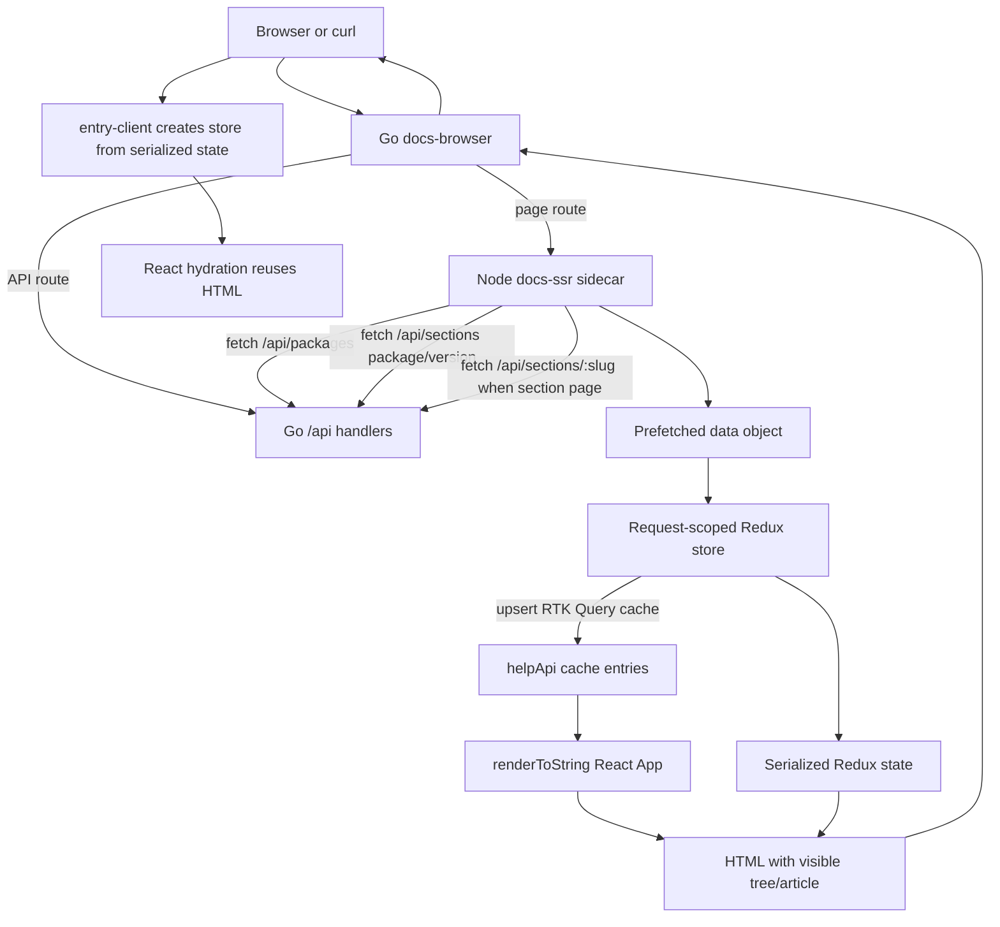

# React SSR HTML Rendering Implementation Guide

## Executive Summary

`docs.yolo.scapegoat.dev` now has the infrastructure required for server-side rendering: the k3s `docs-yolo` pod runs a private Node `docs-ssr` sidecar, the public Go `docs-browser` process proxies page requests to that sidecar through `--ssr-url`, static assets are served from root-relative URLs, and direct section URLs hydrate without JavaScript module MIME failures. That deployment solved the transport and routing half of SSR.

The remaining problem is the React data-rendering half. The current sidecar fetches package, section-list, and section-detail data from the Go API, serializes that data into `window.__PRELOADED_STATE__`, and injects metadata and some hidden/noscript fallback content. However, `web/src/entry-server.tsx` does not populate the RTK Query cache before `renderToString()`, and `web/src/entry-client.tsx` explicitly deletes `window.__PRELOADED_STATE__` instead of using it to initialize the client store. As a result, a `curl` of a package or section URL receives an HTML shell, script tags, metadata, hidden headings, and JSON, but not a fully rendered visible documentation tree and article body produced by React on the server.

This ticket continues the SSR work. The target state is: a direct `curl https://docs.yolo.scapegoat.dev/glazed/v1.2.15/sections/exposing-a-simple-sql-table` should show the visible tree markup and the article body in the initial HTML, without requiring browser JavaScript. Browser hydration should reuse that markup, initialize the Redux/RTK Query store from the same state, and avoid refetch flicker or hydration mismatches.

## Problem Statement

The current production sidecar proves that page requests can reach Node SSR and return valid HTML, but the React render itself still behaves as if it has no data during server rendering. The key files show the gap:

- `/home/manuel/workspaces/2026-05-25/docsctl-cicd-deploy/glazed/web/server.mjs` fetches data from the Go API and calls `renderApp(url, { packages, sections, section })`.
- `/home/manuel/workspaces/2026-05-25/docsctl-cicd-deploy/glazed/web/src/entry-server.tsx` receives that `_data` argument but ignores it. It creates a new store with only `helpApi.reducer`, then renders `App` while all `useListPackagesQuery`, `useListSectionsQuery`, and `useGetSectionQuery` hooks are cold.
- `/home/manuel/workspaces/2026-05-25/docsctl-cicd-deploy/glazed/web/src/entry-client.tsx` declares `window.__PRELOADED_STATE__` but deletes it and imports the singleton `store` from `web/src/store.ts`.
- `/home/manuel/workspaces/2026-05-25/docsctl-cicd-deploy/glazed/web/src/store.ts` exports a singleton store with no `preloadedState` option.
- `/home/manuel/workspaces/2026-05-25/docsctl-cicd-deploy/glazed/web/src/App.tsx` renders the tree and article entirely from RTK Query hooks. If those hooks have no cache entries at server render time, SSR cannot produce the final tree/article DOM.

The current result is useful but incomplete. It improves direct navigation, asset loading, metadata, and agent hints, but it does not satisfy the stronger SSR acceptance criterion: **the initial HTML response itself should contain the same user-visible documentation UI that a hydrated browser shows**.

## Current Production Behavior

The current production deployment has these properties:

- `docs-browser` image: `ghcr.io/go-go-golems/glazed:sha-a6d688b`.
- `docs-ssr` image: `ghcr.io/go-go-golems/glazed-ssr:sha-a6d688b`.
- `docs-browser` passes `--ssr-url http://127.0.0.1:8089`.
- root and nested assets such as `/assets/main-eukdJBop.js` and `/glazed/v1.3.4/assets/main-eukdJBop.js` return `text/javascript`.
- direct section URLs hydrate in a browser without the previous module MIME error.
- section markdown mirrors work, for example `/glazed/v1.3.4/sections/exposing-a-simple-sql-table.md`.

The incomplete behavior is visible through `curl`:

```bash
curl -sS https://docs.yolo.scapegoat.dev/glazed/v1.2.15 \
  | grep -E 'Documentation Index|Exposing a simple SQL table|__PRELOADED_STATE__|main-'
```

The response contains scripts and serialized JSON, but it does not yet contain the same rich visible DOM that Playwright sees after hydration. This distinction is the reason for this ticket.

## Desired Acceptance Criteria

A correct implementation must satisfy all of the following.

### Curl-level HTML criteria

For a package/version landing page such as:

```text
https://docs.yolo.scapegoat.dev/glazed/v1.2.15
```

initial HTML must contain, before browser JavaScript executes:

- the visible app shell;
- package selector state for `glazed` and `v1.2.15`;
- a documentation tree or index with real section titles;
- `Documentation Index` and the correct section count;
- root-relative asset URLs such as `/assets/main-*.js`;
- a serialized preloaded Redux/RTK Query state blob;
- canonical metadata for the package/version URL.

For a section page such as:

```text
https://docs.yolo.scapegoat.dev/glazed/v1.2.15/sections/exposing-a-simple-sql-table
```

initial HTML must contain:

- the visible sidebar tree with real sections;
- the active article title;
- the article body text;
- section headings and markdown-rendered content;
- canonical metadata for the section URL;
- an alternate markdown link to the `.md` mirror;
- a preloaded state blob matching the data used to render the HTML.

### Browser hydration criteria

In Playwright, direct package and section URLs must:

- hydrate without React mismatch warnings;
- preserve the current URL path after hydration;
- show the same selected package/version/section as the server-rendered HTML;
- avoid the visible `Loading…` flash when the server already provided data;
- avoid module MIME errors;
- only tolerate known unrelated errors such as the external Chicago font 404 until that font issue is fixed separately.

### Regression criteria

The implementation must not regress:

- `/api/*` routes;
- `/assets/*` root static asset routes;
- nested legacy asset normalization;
- `/site-config.js` root and nested normalized serving;
- `.md` section mirrors;
- `llms.txt`, `AGENTS.md`, and sitemap routes;
- SSR fallback to SPA when the sidecar is unavailable or returns an error.

## Architecture

The target data flow is a request-scoped store hydration pipeline. The server side and client side should use the same route table and the same store factory.



The invariant is simple: **the data used to render the server HTML and the data used to initialize the browser store must be the same data**. If the server renders from one representation but the client starts with another, hydration drift becomes likely.

## Proposed Solution

### 1. Introduce a store factory

Replace the hard-coded singleton store pattern with a factory that can create either a fresh request-scoped server store or a browser store initialized from `preloadedState`.

Suggested shape:

```ts
// web/src/store.ts
import { configureStore, type PreloadedState } from '@reduxjs/toolkit';
import { helpApi } from './services/api';

export function makeStore(preloadedState?: PreloadedState<RootState>) {
  return configureStore({
    reducer: {
      [helpApi.reducerPath]: helpApi.reducer,
    },
    middleware: (getDefaultMiddleware) =>
      getDefaultMiddleware().concat(helpApi.middleware),
    preloadedState,
  });
}

export const store = makeStore();
export type AppStore = ReturnType<typeof makeStore>;
export type RootState = ReturnType<AppStore['getState']>;
export type AppDispatch = AppStore['dispatch'];
```

TypeScript details may require avoiding direct recursive `RootState` use in the `PreloadedState` generic. If that becomes awkward, accept `preloadedState?: any` at the factory boundary and keep typed selectors/hooks elsewhere. The important design rule is not the exact generic; it is that store construction must be reusable and request-scoped.

### 2. Centralize routes

`main.tsx`, `entry-client.tsx`, and `entry-server.tsx` currently duplicate the route definitions. This duplication already caused one production bug: the first deployed SSR sidecar rendered metadata for a section, but hydration mounted `App` without matching routes and navigated back to the package index.

Create a shared route component:

```tsx
// web/src/AppRoutes.tsx
import { Routes, Route } from 'react-router-dom';
import App from './App';

export function AppRoutes() {
  return (
    <Routes>
      <Route path="/:package/:version/sections/:slug" element={<App />} />
      <Route path="/:package/:version" element={<App />} />
      <Route path="*" element={<App />} />
    </Routes>
  );
}
```

Then use `AppRoutes` from all three entry points. This is not only cleanup; it is an SSR correctness requirement.

### 3. Preload RTK Query cache in `entry-server.tsx`

RTK Query exposes utilities that can insert known results into the cache without making another request. The SSR sidecar already has the exact data that the hooks need. The server render should insert those results under the same endpoint names and argument values that `App.tsx` will use.

The relevant hook calls in `App.tsx` are:

```ts
useListPackagesQuery();
useListSectionsQuery(
  selectedPackage ? { packageName: selectedPackage, version: effectiveVersion } : undefined,
);
useGetSectionQuery({
  slug: activeSlug!,
  packageName: selectedPackage,
  version: effectiveVersion,
}, { skip: !activeSlug || !selectedPackage });
```

Therefore the server must upsert these cache entries:

```ts
store.dispatch(helpApi.util.upsertQueryData('listPackages', undefined, data.packages));
store.dispatch(helpApi.util.upsertQueryData('listSections', {
  packageName,
  version,
}, data.sections));

if (slug && data.section) {
  store.dispatch(helpApi.util.upsertQueryData('getSection', {
    slug,
    packageName,
    version,
  }, data.section));
}
```

The package/version/slug values must be derived exactly the same way on server and client. The sidecar already has `parseDocUrl(pathname)`, but a better long-term design is to move that route parsing into a shared TypeScript module used by both `server.mjs` and `entry-server.tsx`, or pass the parsed values directly into `renderApp` as part of the data contract.

### 4. Return both HTML and state from `renderApp`

Change the SSR result contract:

```ts
export interface SSRResult {
  html: string;
  preloadedState: unknown;
}
```

After rendering, return `store.getState()`:

```ts
const html = renderToString(...);
const preloadedState = store.getState();
return { html, preloadedState };
```

`server.mjs` should serialize this returned state, not a parallel hand-built `{ packages, sections, section }` object. The browser should receive the actual Redux state shape that `makeStore(preloadedState)` expects.

### 5. Initialize the browser store from serialized state

`entry-client.tsx` currently deletes `window.__PRELOADED_STATE__`. Replace that with store initialization:

```ts
const preloadedState = window.__PRELOADED_STATE__;
delete window.__PRELOADED_STATE__;
const store = makeStore(preloadedState as any);

hydrateRoot(
  document.getElementById('root')!,
  <React.StrictMode>
    <Provider store={store}>
      <BrowserRouter future={{ v7_startTransition: true, v7_relativeSplatPath: true }}>
        <ErrorBoundary>
          <AppRoutes />
        </ErrorBoundary>
      </BrowserRouter>
    </Provider>
  </React.StrictMode>,
);
```

The `delete` remains useful after reading the state so the large object is not retained globally longer than necessary.

### 6. Serialize safely

`server.mjs` must serialize state in a way that does not allow script injection. At minimum, keep the existing `<` escaping and also consider escaping the Unicode separators that have historically affected inline scripts:

```js
function serializeForInlineScript(value) {
  return JSON.stringify(value)
    .replace(/</g, '\\u003c')
    .replace(/>/g, '\\u003e')
    .replace(/&/g, '\\u0026')
    .replace(/\u2028/g, '\\u2028')
    .replace(/\u2029/g, '\\u2029');
}
```

Then inject:

```html
<script>window.__PRELOADED_STATE__ = ...;</script>
```

Do not insert raw markdown HTML or unescaped JSON into this script block.

## Implementation Plan

### Phase 0: Baseline failing tests and evidence

Add a small script or test fixture that proves the current gap. It should fetch a real SSR page and assert that visible section body text is not present before hydration. This can be a documented curl check or a Node-level SSR test.

Acceptance evidence:

```bash
curl -sS https://docs.yolo.scapegoat.dev/glazed/v1.2.15/sections/exposing-a-simple-sql-table \
  | grep 'TODO(manuel, 2022-12-10)'
```

Today this should fail or be unreliable. After implementation it should succeed.

### Phase 1: Store factory and shared route component

Files:

- `web/src/store.ts`
- `web/src/AppRoutes.tsx` (new)
- `web/src/main.tsx`
- `web/src/entry-client.tsx`
- `web/src/entry-server.tsx`

Tasks:

- Introduce `makeStore(preloadedState?)`.
- Keep the singleton `store` export for development compatibility if needed.
- Extract `AppRoutes` and use it in all entry points.
- Run `cd web && pnpm test`.

### Phase 2: Server-side RTK Query cache preloading

Files:

- `web/src/entry-server.tsx`
- optionally `web/src/ssr/routeData.ts` or similar new helper

Tasks:

- Change `renderApp(url, data)` to use its `data` argument.
- Derive the same package/version/slug query arguments that `App.tsx` uses.
- Dispatch `helpApi.util.upsertQueryData` for `listPackages`, `listSections`, and `getSection`.
- Return `{ html, preloadedState: store.getState() }`.
- Add unit tests around the SSR render if feasible.

### Phase 3: Client-side hydration from preloaded Redux state

Files:

- `web/src/entry-client.tsx`
- `web/src/store.ts`
- `web/src/types` if the global declaration is moved

Tasks:

- Read `window.__PRELOADED_STATE__`.
- Create the browser store with that state.
- Delete `window.__PRELOADED_STATE__` only after reading it.
- Hydrate with `AppRoutes`.
- Verify that the client does not immediately show the loading state for already-rendered data.

### Phase 4: Server-side serialization in `server.mjs`

File:

- `web/server.mjs`

Tasks:

- Use `renderApp`'s returned `preloadedState` instead of manually serializing `{ packages, sections, section }`.
- Add robust inline-script JSON escaping.
- Keep existing metadata/canonical/JSON-LD generation.
- Ensure section and package pages both get appropriate metadata.

### Phase 5: Tests and local validation

Commands:

```bash
cd /home/manuel/workspaces/2026-05-25/docsctl-cicd-deploy/glazed

go test ./pkg/help/server ./pkg/web ./cmd/docs-registry ./cmd/docsctl

cd web
pnpm test
pnpm build
pnpm build:ssr
```

Local SSR image smoke test:

```bash
cd /home/manuel/workspaces/2026-05-25/docsctl-cicd-deploy/glazed

docker build --target ssr -t glazed-ssr:react-html .
docker run --rm -p 8089:8089 \
  -e SSR_PORT=8089 \
  -e API_BASE=https://docs.yolo.scapegoat.dev/api \
  -e BASE_URL=https://docs.yolo.scapegoat.dev \
  glazed-ssr:react-html
```

Then in another shell:

```bash
curl -sS http://127.0.0.1:8089/glazed/v1.2.15/sections/exposing-a-simple-sql-table \
  | grep 'TODO(manuel, 2022-12-10)'
```

### Phase 6: Production rollout

After Glazed changes are merged/pushed and container images are built:

- update `gitops/kustomize/docs-yolo/deployment.yaml` to the new `sha-*` image tags;
- push the k3s GitOps commit;
- force Argo refresh if needed:

```bash
kubectl -n argocd annotate application docs-yolo argocd.argoproj.io/refresh=hard --overwrite
```

- watch rollout:

```bash
kubectl -n docs-yolo rollout status deploy/docs-yolo --timeout=300s
```

- run curl and Playwright validation against production.

## Pseudocode

### Request-scoped SSR render

```ts
export function renderApp(url: string, data: SSRData): SSRResult {
  const store = makeStore();
  const route = parseDocsRoute(url);

  if (data.packages) {
    store.dispatch(helpApi.util.upsertQueryData('listPackages', undefined, data.packages));
  }

  if (route.packageName && data.sections) {
    store.dispatch(helpApi.util.upsertQueryData('listSections', {
      packageName: route.packageName,
      version: route.version,
    }, data.sections));
  }

  if (route.packageName && route.slug && data.section) {
    store.dispatch(helpApi.util.upsertQueryData('getSection', {
      slug: route.slug,
      packageName: route.packageName,
      version: route.version,
    }, data.section));
  }

  const html = renderToString(
    <Provider store={store}>
      <StaticRouter location={url}>
        <AppRoutes />
      </StaticRouter>
    </Provider>,
  );

  return { html, preloadedState: store.getState() };
}
```

### Client hydration

```ts
const preloadedState = window.__PRELOADED_STATE__;
delete window.__PRELOADED_STATE__;

const store = makeStore(preloadedState);

hydrateRoot(root, (
  <Provider store={store}>
    <BrowserRouter>
      <ErrorBoundary>
        <AppRoutes />
      </ErrorBoundary>
    </BrowserRouter>
  </Provider>
));
```

## Common Failure Modes

### Cache key mismatch

If SSR inserts `listSections` with `{ packageName: 'glazed', version: 'v1.2.15' }` but `App.tsx` calls the hook with `{ packageName: 'glazed', version: '' }`, the hook will miss the cache and render loading state. The route parser and `versionFromUrl` rules must match exactly.

### Singleton store leakage on the server

Do not reuse the browser singleton store for SSR. A shared server store can leak one request's package/version/section data into another request. Always create a fresh store inside `renderApp`.

### Hydration route drift

Do not duplicate routes in three files. The previous deployment already demonstrated how route drift causes a section URL to hydrate back to a package index. Use `AppRoutes` everywhere.

### Unsafe state serialization

Do not inline raw JSON without escaping. A section title or markdown-derived string containing `</script>` must not break out of the script tag. Use a dedicated serializer.

### StrictMode surprises

React StrictMode can double-invoke some logic in development. The production build behavior is different, but tests should not rely on single-invocation side effects. Store creation for SSR should be outside component effects and per request.

### Overclaiming SSR completeness

Metadata and hidden headings are useful for agents, but they are not the same as full visible React SSR. The acceptance criterion should inspect visible article text and tree nodes in the initial HTML.

## Test Plan

### Unit tests

Add tests for:

- `makeStore(preloadedState)` initializes RTK Query state;
- `renderApp` with package data produces package tree/index HTML;
- `renderApp` with section data produces section title and body HTML;
- `entry-client` initializes from `window.__PRELOADED_STATE__` without deleting it first;
- shared route parsing handles `/glazed/v1.2.15`, `/glazed/v1.2.15/`, and `/glazed/v1.2.15/sections/<slug>`.

### Integration tests

Add tests that call the built SSR bundle or a local SSR server and assert:

```text
GET /glazed/v1.2.15
contains Documentation Index
contains at least one known section title
contains window.__PRELOADED_STATE__

GET /glazed/v1.2.15/sections/exposing-a-simple-sql-table
contains Exposing a simple SQL table using glaze
contains TODO(manuel, 2022-12-10)
contains window.__PRELOADED_STATE__
```

### Production smoke tests

After deployment:

```bash
curl -sS https://docs.yolo.scapegoat.dev/glazed/v1.2.15 \
  | grep 'Documentation Index'

curl -sS https://docs.yolo.scapegoat.dev/glazed/v1.2.15 \
  | grep 'Exposing a simple SQL table using glaze'

curl -sS https://docs.yolo.scapegoat.dev/glazed/v1.2.15/sections/exposing-a-simple-sql-table \
  | grep 'TODO(manuel, 2022-12-10)'
```

Then use Playwright to verify hydration and console output.

## Rollback Plan

The rollback plan is the same shape as the sidecar deployment rollback:

1. Revert the Glazed image tag in `gitops/kustomize/docs-yolo/deployment.yaml` to the last known good `sha-a6d688b` images.
2. Push the k3s GitOps revert.
3. Force Argo refresh if necessary.
4. Watch `kubectl -n docs-yolo rollout status deploy/docs-yolo --timeout=300s`.

If the issue is only client hydration but the sidecar remains healthy, it is also safe to temporarily remove `--ssr-url` from `docs-browser` to fall back to the SPA shell while preserving API and registry behavior.

## Open Questions

- Should package/version pages get richer title metadata, for example `glazed v1.2.15 — Glazed Help Browser`, as part of this ticket or a follow-up?
- Should the SSR sidecar render package-level `.md` mirrors, or should those remain Go server responsibilities?
- Should `server.mjs` continue to fetch data manually, or should `entry-server.tsx` dispatch RTK Query `initiate()` calls and await `getRunningQueriesThunk()`? Manual fetching is simpler because it already exists, but RTK Query initiation may reduce cache-key drift.
- Should Playwright browser tests become part of CI for the web package?

## File Reference Map

| File | Why it matters |
|---|---|
| `web/server.mjs` | Node SSR sidecar; fetches data, calls `renderApp`, injects HTML/state/metadata. |
| `web/src/entry-server.tsx` | Current SSR React entry; must populate RTK Query cache before `renderToString()`. |
| `web/src/entry-client.tsx` | Browser hydration entry; must initialize store from `window.__PRELOADED_STATE__`. |
| `web/src/store.ts` | Needs a reusable store factory for server and browser. |
| `web/src/services/api.ts` | Defines endpoint names and query argument shapes that determine RTK Query cache keys. |
| `web/src/App.tsx` | Consumes RTK Query hooks and renders tree/article from query results. |
| `web/src/main.tsx` | Development entry; should share the same `AppRoutes` component as SSR/client entries. |
| `pkg/help/server/serve.go` | Go SSR proxy/static routing; should not need major changes for data-backed React SSR but must be regression-tested. |
| `Dockerfile` | Builds the SSR bundle/image; must still include updated server/client bundles. |
| `.github/workflows/container.yml` | Publishes runtime and SSR sidecar images after changes land. |
| `gitops/kustomize/docs-yolo/deployment.yaml` | k3s image tags for production rollout after implementation. |

## Related Tickets

- `DOCSCTL-SSR-K3S` — deployed the SSR sidecar and fixed deep-link/static asset mechanics.
- `DOCSCTL-VAULT-OIDC-JWT` — production-proven docs publishing credentials and registry auth.
- `DOCSCTL-CICD-DEPLOY` — original reusable docs publishing CI/CD design.
