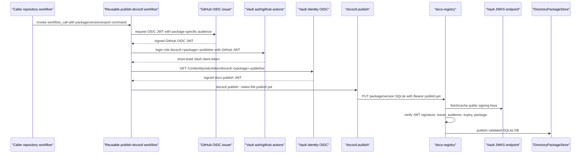

# Vault Identity OIDC publish JWT implementation guide

## 1. Executive summary

This design replaces the `docs-registry` production authentication model based on `publishers.json` token hashes with a Vault-issued, short-lived, OIDC-compliant publish JWT. The new flow keeps GitHub Actions CI/CD elegant: a caller repository uses GitHub OIDC to log into Vault, Vault validates the caller repository and trusted reusable workflow, Vault issues a short-lived JWT whose claims say which package may be published, and `docsctl publish` sends that JWT to `docs-registry`. The registry validates the JWT signature and claims before accepting the SQLite help database upload.

The most important improvement is that `docs-registry` no longer needs a synchronized static token catalog. There is no long-lived raw package token to store in GitHub or mount into Kubernetes. Authorization moves into Vault's existing identity system and Terraform-managed policy, while the registry receives an application-specific token whose audience is `docs-registry`, whose lifetime is short, and whose package claim must match the URL being published.

This is the second implementation step after the simpler `vault-token` introspection design. It is more work than asking Vault about a presented Vault client token, but it has a cleaner service boundary: `docs-registry` receives a docs publish token, not a Vault API token. The registry can validate that token with Vault's unauthenticated OIDC discovery and JWKS endpoints, cache the public signing keys, and avoid calling Vault on every successful publish.

## 2. What the reader should understand

By the end of this guide, an intern should be able to explain and implement the full path:

```text
GitHub Actions OIDC JWT
  -> Vault auth/github-actions validates caller repo and workflow
  -> Vault client token with permission to mint one package-specific identity token
  -> Vault Identity/OIDC signed publish JWT
  -> docsctl publish sends publish JWT to docs-registry
  -> docs-registry verifies issuer, audience, signature, expiration, and package claim
  -> registry validates and stores the SQLite help DB
```

The guide has a dedicated cryptography and OIDC section because this feature is easy to implement incorrectly if the terms are blurred. GitHub's OIDC token, Vault's client token, and Vault's docs publish JWT are three different credentials with different issuers, audiences, lifetimes, and consumers.

## 3. Current state

### 3.1 Current registry auth path

The current registry code already has a useful abstraction: `PublisherAuth`. `pkg/help/publish/auth.go` defines the interface at line 37:

```go
type PublisherAuth interface {
    AuthorizePublish(ctx context.Context, rawToken string, req PublishRequest) (*PublisherIdentity, error)
}
```

The static implementation stores package token hashes. It hashes the presented bearer token, compares it to configured `sha256:` hashes, and then checks that the matched token belongs to the requested package. The package check is important because it prevents a `glazed` token from publishing `pinocchio`.

Current behavior is wired in `cmd/docs-registry/main.go`:

- The command requires `--publisher-catalog` in lines 32 and 50.
- `run` constructs `publish.NewReloadablePublisherCatalog(...)` in line 84.
- It passes that catalog as the `PublisherAuth` to `publish.NewRegistryHandler(catalog, store)` in line 89.

The HTTP handler lives in `pkg/help/publish/registry.go`:

- `PUT /v1/packages/{package}/versions/{version}/sqlite` is registered in line 72.
- The handler calls `h.Auth.AuthorizePublish(...)` before accepting and publishing the upload in line 107.
- The bearer token is extracted from the `Authorization` header in lines 195-204.

This means JWT auth can be added without rewriting the upload and storage path. The new code should implement another `PublisherAuth` and add a registry flag that chooses between static catalog mode and Vault-issued JWT mode.

### 3.2 Current docsctl publish path

`cmd/docsctl/publish.go` already sends a bearer token. It constructs the upload URL and sets headers in lines 67-90:

```go
req.Header.Set("Authorization", "Bearer "+token)
req.Header.Set("Content-Type", "application/vnd.sqlite3")
```

That is compatible with a publish JWT. For the first JWT implementation, `docsctl` does not need to understand JWT internals. The reusable workflow can obtain a Vault-issued publish JWT and pass it with `--token-file`. A later improvement can add a first-class `docsctl publish --auth vault-identity-token` mode that logs into Vault and mints the token itself.

### 3.3 Current k3s runtime

The `docs-yolo` deployment currently runs the registry container from the same `ghcr.io/go-go-golems/glazed` image as the browser. The registry container overrides the command to `/usr/local/bin/docs-registry`, and passes `--publisher-catalog /etc/docs-yolo/publishers.json`. The relevant deployment file is:

```text
/home/manuel/code/wesen/2026-03-27--hetzner-k3s/gitops/kustomize/docs-yolo/deployment.yaml
```

Evidence:

- `docs-registry` container starts at line 61.
- The command override uses `/usr/local/bin/docs-registry` at line 65.
- The registry args include `--publisher-catalog` at line 71.
- The publisher catalog Secret is mounted at `/etc/docs-yolo` in lines 91-92.

In JWT mode, production no longer needs the publisher catalog Secret mount. The deployment instead needs flags such as `--auth-mode vault-oidc-jwt`, `--jwt-issuer`, and `--jwt-client-id`.

## 4. Proposed architecture

### 4.1 Main flow



The workflow has two token exchanges. First, GitHub proves the workflow's identity to Vault. Second, Vault issues the application token that `docs-registry` understands. These exchanges have different purposes and should remain separate in code and documentation.

### 4.2 Token inventory

| Token | Issuer | Consumer | Lifetime | Purpose |
|---|---|---|---|---|
| GitHub OIDC JWT | GitHub Actions OIDC issuer | Vault `auth/github-actions` | minutes | Proves the workflow run identity to Vault. |
| Vault client token | Vault auth method | Vault Identity token endpoint | 5-10 minutes | Allows this authenticated workflow to mint exactly one package-specific publish JWT role. |
| Docs publish JWT | Vault Identity/OIDC | `docs-registry` | 5 minutes recommended | Authorizes publishing one package to docs-registry. |

A correct implementation must never treat these as interchangeable. The registry validates the docs publish JWT. It should not accept raw GitHub OIDC tokens in this implementation. It should not accept Vault client tokens in this implementation unless a separate `vault-token` auth mode is enabled.

### 4.3 Why this design removes publishers.json

The current `publishers.json` file encodes this relation:

```text
sha256(raw static token) -> package name, subject
```

The new design encodes the relation in Vault:

```text
GitHub repository + ref + event + reusable workflow -> Vault role -> permission to mint docsctl-<package>-publisher identity token
```

The registry then enforces:

```text
signed token from Vault + aud docs-registry + package claim equals URL package -> publish allowed
```

There is still an allowlist. It lives in Terraform-managed Vault roles and policies rather than a mounted JSON file.

## 5. Cryptography and OIDC foundations for the intern

This section explains the security mechanism without relying on external assumptions. The implementation is small, but it depends on precise validation.

### 5.1 A JWT is signed data, not encrypted data

A JSON Web Token is three base64url-encoded parts separated by dots:

```text
base64url(header).base64url(payload).base64url(signature)
```

The payload is readable by anyone who has the token. The signature prevents undetected modification. If an attacker changes `"package":"glazed"` to `"package":"pinocchio"`, the signature no longer matches. The registry rejects the token.

A typical Vault-issued publish JWT header should look like:

```json
{
  "alg": "RS256",
  "kid": "vault-key-version-id",
  "typ": "JWT"
}
```

The `alg` tells the verifier which signing algorithm was used. `RS256` means RSA signature with SHA-256. The `kid` tells the verifier which public key from the JWKS should verify the signature.

The payload contains claims:

```json
{
  "iss": "https://vault.yolo.scapegoat.dev/v1/identity/oidc",
  "sub": "vault-entity-id",
  "aud": "docs-registry",
  "iat": 1760000000,
  "exp": 1760000300,
  "package": "glazed",
  "repository": "go-go-golems/glazed",
  "repository_id": "123456789",
  "job_workflow_ref": "go-go-golems/infra-tooling/.github/workflows/publish-docsctl.yml@refs/heads/main",
  "run_id": "1234567890"
}
```

The payload is not secret. It is evidence. The secret is the private signing key held by Vault.

### 5.2 Public-key verification

Vault creates or manages an OIDC signing key. The private part stays in Vault. The public part is published through an unauthenticated JWKS endpoint so clients can verify tokens.

The registry's verification process is:

1. Parse the JWT header to find `kid` and `alg`.
2. Fetch the JSON Web Key Set from Vault's `.well-known/keys` endpoint or use a cached copy.
3. Find the public key with the matching `kid`.
4. Verify the signature over `header.payload`.
5. Decode claims only after the signature is valid.
6. Check semantic claims: issuer, audience, expiration, and package.

Vault's identity token docs state that identity tokens are signed JWTs following the OIDC ID token structure, and that public keys are published through OIDC discovery and JWKS conventions. This is why standard Go OIDC/JWT libraries can validate the token.

### 5.3 Required claims and their meaning

OIDC ID tokens always include a small required set of claims:

| Claim | Meaning | Registry check |
|---|---|---|
| `iss` | Issuer URL. | Must equal configured Vault issuer. |
| `sub` | Subject. For Vault identity tokens, this is the Vault entity ID. | Useful for logs; not enough by itself for package auth. |
| `aud` | Audience/client ID. | Must equal `docs-registry`. |
| `iat` | Issued-at time. | Library can validate clock constraints. |
| `exp` | Expiration time. | Must be in the future. |

The docs publish token adds package-specific claims:

| Claim | Meaning | Registry check |
|---|---|---|
| `package` | Package this token may publish. | Must equal `{package}` path value in the upload URL. |
| `repository` | GitHub repository that authenticated to Vault. | Log and optionally validate against package allowlist. |
| `repository_id` | Immutable GitHub repository ID. | Prefer over name where available. |
| `job_workflow_ref` | Reusable workflow that performed the Vault token mint. | Log; Vault role already validated it before minting. |
| `run_id` | GitHub run ID. | Log for audit and debugging. |

The registry should make the package claim the primary local authorization check. Vault already validated the caller before issuing the token. The registry still verifies that the issued package claim matches the requested publish path.

### 5.4 Issuer and audience are not optional details

The issuer and audience prevent token confusion.

The issuer tells the registry which authority signed the token. The registry must not accept a token with the same shape but a different issuer. The configured issuer should be explicit, for example:

```text
https://vault.yolo.scapegoat.dev/v1/identity/oidc
```

The audience tells the registry that the token was minted for this service. Use a stable client ID such as:

```text
docs-registry
```

If the token has a different audience, the registry rejects it even if Vault signed it. This matters because Vault may issue identity tokens for other systems.

### 5.5 Key rotation and JWKS caching

Vault Identity OIDC keys have a rotation period and verification TTL. Rotation creates a new signing key. Verification TTL controls how long the old public key remains available after rotation. The registry should use an OIDC/JWKS library that respects `kid` and refreshes JWKS on cache miss or after cache expiration.

A safe initial configuration is:

```text
algorithm: RS256
rotation_period: 24h
verification_ttl: 24h
token ttl: 5m
```

`RS256` is recommended for the first implementation because Go libraries support it well and it avoids ECDSA signature-format issues that appear when using lower-level signing APIs. Vault Identity tokens already expose normal JWKS keys, so the registry should not need to handle raw crypto operations directly.

### 5.6 Why this is not Vault Transit

Vault Transit signs arbitrary data with keys managed by Vault. That is useful for systems that already have a trusted issuer that constructs the data to be signed. It is not sufficient by itself for this design because CI must not be allowed to choose arbitrary claims and ask Vault to sign them.

Vault Identity/OIDC roles are better here because the operator configures a role and template. The caller requests a token for a role; it cannot send an arbitrary JWT payload. The package claim is fixed by the role template, and access to `identity/oidc/token/docsctl-glazed-publisher` is controlled by Vault policy.

### 5.7 What can go wrong

The common implementation mistakes are:

- Validating the JWT signature but not checking `aud`.
- Checking `aud` but not checking `iss`.
- Trusting the `package` claim without verifying the signature first.
- Letting CI choose the package claim dynamically at token-mint time.
- Using a long token TTL, which turns a publish JWT into a replayable long-lived credential.
- Logging the full token in CI or registry logs.
- Accepting GitHub OIDC tokens directly in a registry mode that is intended to accept only Vault-issued docs publish JWTs.

The registry should reject by default. Every successful publish must pass signature verification and claim validation.

## 6. Vault configuration design

### 6.1 Use Vault Identity Tokens, not the interactive OIDC provider flow

Vault has two related features:

1. **Identity Tokens**: an authenticated Vault client calls `GET /v1/identity/oidc/token/:role` and receives a signed ID token.
2. **OIDC Provider authorization code flow**: browser-style OIDC clients use authorization and token endpoints with redirect URIs, clients, assignments, and scopes.

For GitHub Actions publishing, use Identity Tokens. CI already authenticates to Vault through `auth/github-actions`; it does not need a browser redirect flow. The registry needs a signed JWT and JWKS. The Identity Token API provides exactly that.

### 6.2 Vault objects

The implementation needs these Vault objects:

| Object | Purpose |
|---|---|
| `vault_jwt_auth_backend.github_actions` | Existing auth mount configured against GitHub's OIDC issuer. |
| `vault_jwt_auth_backend_role.docsctl_publish` | One role per package/caller that validates GitHub claims and grants token-mint permission. |
| `vault_identity_oidc` | Sets the Identity Token issuer URL if default `api_addr` is not the desired issuer. |
| `vault_identity_oidc_key.docs_registry` | Signing key for docs publish JWTs. |
| `vault_identity_oidc_role.docsctl_publish` | One token role per package. Defines client ID, TTL, key, and claims template. |
| `vault_policy.docsctl_issue_token` | Allows the GitHub-authenticated Vault client to read only its package's token endpoint. |

The existing Terraform file already manages GitHub Actions JWT roles for GitOps PR credentials:

```text
/home/manuel/code/wesen/terraform/vault/github-actions/envs/k3s/main.tf
```

This ticket should extend that Terraform module or add a sibling module for docsctl publish roles.

### 6.3 Terraform provider support

The local Terraform provider schema confirms these resources are available:

- `vault_identity_oidc`
- `vault_identity_oidc_key`
- `vault_identity_oidc_role`
- `vault_identity_oidc_provider`
- `vault_identity_oidc_client`
- `vault_identity_oidc_scope`
- `vault_jwt_auth_backend_role`

The first implementation needs only `vault_identity_oidc`, `vault_identity_oidc_key`, and `vault_identity_oidc_role` for Identity Tokens. It does not need an OIDC Provider client/redirect flow unless we later decide to expose a full interactive OIDC provider.

### 6.4 Terraform sketch

Start with a data map:

```hcl
locals {
  docsctl_publishers = {
    glazed = {
      repository       = "go-go-golems/glazed"
      repository_id    = "123456789" # replace with real immutable GitHub repo ID
      workflow_ref     = "go-go-golems/glazed/.github/workflows/publish-docs.yml@refs/heads/main"
      job_workflow_ref = "go-go-golems/infra-tooling/.github/workflows/publish-docsctl.yml@refs/heads/main"
      github_audience  = "vault://docs-yolo/docsctl-publish/glazed"
      token_role       = "docsctl-glazed-publisher"
    }
  }

  docs_registry_client_id = "docs-registry"
}
```

Configure the identity token issuer:

```hcl
resource "vault_identity_oidc" "docs_yolo" {
  issuer = "https://vault.yolo.scapegoat.dev/v1/identity/oidc"
}
```

Create a signing key:

```hcl
resource "vault_identity_oidc_key" "docs_registry" {
  name               = "docs-registry-publish"
  algorithm          = "RS256"
  rotation_period    = 86400
  verification_ttl   = 86400
  allowed_client_ids = [local.docs_registry_client_id]
}
```

Create one Identity Token role per package. The role template fixes the package claim. It also copies selected GitHub identity metadata from the Vault entity alias created by the GitHub Actions JWT auth mount.

```hcl
resource "vault_identity_oidc_role" "docsctl_publish" {
  for_each = local.docsctl_publishers

  name      = each.value.token_role
  key       = vault_identity_oidc_key.docs_registry.name
  client_id = local.docs_registry_client_id
  ttl       = 300

  template = <<EOT
{
  "token_use": "docsctl-publish",
  "package": "${each.key}",
  "repository": {{identity.entity.aliases.${vault_jwt_auth_backend.github_actions.accessor}.metadata.github_repository}},
  "repository_id": {{identity.entity.aliases.${vault_jwt_auth_backend.github_actions.accessor}.metadata.github_repository_id}},
  "workflow_ref": {{identity.entity.aliases.${vault_jwt_auth_backend.github_actions.accessor}.metadata.github_workflow_ref}},
  "job_workflow_ref": {{identity.entity.aliases.${vault_jwt_auth_backend.github_actions.accessor}.metadata.github_job_workflow_ref}},
  "run_id": {{identity.entity.aliases.${vault_jwt_auth_backend.github_actions.accessor}.metadata.github_run_id}}
}
EOT
}
```

The exact alias metadata expressions must be validated in a proof run. The important point is that `claim_mappings` on the GitHub Actions JWT auth role copies GitHub claims into Vault alias/token metadata, and the Identity Token role template reads those values when minting the publish JWT.

Create the Vault policy that allows minting only the package-specific Identity Token role:

```hcl
resource "vault_policy" "docsctl_issue_token" {
  for_each = local.docsctl_publishers

  name = "gha-docsctl-issue-${each.key}-publish-jwt"

  policy = <<-EOT
    path "identity/oidc/token/${each.value.token_role}" {
      capabilities = ["read"]
    }

    path "auth/token/lookup-self" {
      capabilities = ["read"]
    }

    path "auth/token/revoke-self" {
      capabilities = ["update"]
    }
  EOT
}
```

Create the GitHub Actions JWT auth role:

```hcl
resource "vault_jwt_auth_backend_role" "docsctl_publish" {
  for_each = local.docsctl_publishers

  backend   = vault_jwt_auth_backend.github_actions.path
  role_name = "docsctl-${each.key}-publisher"
  role_type = "jwt"

  user_claim      = "repository"
  bound_audiences = [each.value.github_audience]

  bound_claims = {
    repository       = each.value.repository
    repository_id    = each.value.repository_id
    ref              = "refs/heads/main"
    event_name       = "push"
    job_workflow_ref = each.value.job_workflow_ref
  }

  claim_mappings = {
    repository       = "github_repository"
    repository_id    = "github_repository_id"
    workflow_ref     = "github_workflow_ref"
    job_workflow_ref = "github_job_workflow_ref"
    run_id           = "github_run_id"
    run_attempt      = "github_run_attempt"
    actor            = "github_actor"
    actor_id         = "github_actor_id"
  }

  token_policies         = [vault_policy.docsctl_issue_token[each.key].name]
  token_ttl              = 300
  token_max_ttl          = 600
  token_explicit_max_ttl = 600
}
```

This role validates GitHub's OIDC token. The Identity Token role does not validate GitHub directly. It relies on the fact that only a Vault client token created by this GitHub role has permission to read the package's `identity/oidc/token/...` endpoint.

### 6.5 Vault API sequence for manual proof

After Terraform apply, a CI job can mint a publish JWT with:

```bash
curl -fsS \
  -H "X-Vault-Token: $VAULT_TOKEN" \
  https://vault.yolo.scapegoat.dev/v1/identity/oidc/token/docsctl-glazed-publisher \
  | jq -r '.data.token' > "$RUNNER_TEMP/docs-publish.jwt"
```

Decode without verifying, only for debugging in a trusted sandbox:

```bash
python3 - <<'PY' "$RUNNER_TEMP/docs-publish.jwt"
import base64, json, sys
header, payload, sig = open(sys.argv[1]).read().strip().split('.')
for part in (header, payload):
    part += '=' * (-len(part) % 4)
    print(json.dumps(json.loads(base64.urlsafe_b64decode(part)), indent=2))
PY
```

Never print the token itself in production logs. Printing decoded claims is acceptable only in a temporary proof job if no sensitive values are included.

## 7. docs-registry implementation design

### 7.1 New auth mode flag

Extend `cmd/docs-registry/main.go` settings:

```go
type settings struct {
    Address          string `glazed:"address"`
    MaxUploadBytes   int64  `glazed:"max-upload-bytes"`
    TempDir          string `glazed:"temp-dir"`
    PackageRoot      string `glazed:"package-root"`

    AuthMode         string `glazed:"auth-mode"`
    PublisherCatalog string `glazed:"publisher-catalog"`

    JWTIssuer        string `glazed:"jwt-issuer"`
    JWTClientID      string `glazed:"jwt-client-id"`
}
```

Recommended flag behavior:

```text
--auth-mode static-catalog   # current behavior, requires --publisher-catalog
--auth-mode vault-oidc-jwt   # new behavior, requires --jwt-issuer and --jwt-client-id
```

Keep static mode for local development and for a safe migration. Production can switch to `vault-oidc-jwt` when CI minting works.

### 7.2 New PublisherAuth implementation

Add a new file:

```text
pkg/help/publish/jwt_auth.go
```

Pseudocode:

```go
type JWTPublisherAuth struct {
    Issuer   string
    ClientID string
    verifier *oidc.IDTokenVerifier
}

type docsPublishClaims struct {
    TokenUse       string `json:"token_use"`
    Package        string `json:"package"`
    Repository     string `json:"repository"`
    RepositoryID   string `json:"repository_id"`
    WorkflowRef    string `json:"workflow_ref"`
    JobWorkflowRef string `json:"job_workflow_ref"`
    RunID          string `json:"run_id"`
}

func NewJWTPublisherAuth(ctx context.Context, issuer, clientID string) (*JWTPublisherAuth, error) {
    provider, err := oidc.NewProvider(ctx, issuer)
    if err != nil {
        return nil, err
    }
    verifier := provider.Verifier(&oidc.Config{ClientID: clientID})
    return &JWTPublisherAuth{Issuer: issuer, ClientID: clientID, verifier: verifier}, nil
}

func (a *JWTPublisherAuth) AuthorizePublish(ctx context.Context, rawToken string, req PublishRequest) (*PublisherIdentity, error) {
    if rawToken == "" {
        return nil, ErrUnauthorized
    }
    if err := ValidatePackageVersion(req.PackageName, req.Version); err != nil {
        return nil, err
    }

    idToken, err := a.verifier.Verify(ctx, rawToken)
    if err != nil {
        return nil, ErrUnauthorized
    }

    var claims docsPublishClaims
    if err := idToken.Claims(&claims); err != nil {
        return nil, ErrUnauthorized
    }

    if claims.TokenUse != "docsctl-publish" {
        return nil, ErrForbidden
    }
    if claims.Package != req.PackageName {
        return nil, ErrForbidden
    }

    subject := claims.Repository
    if subject == "" {
        subject = idToken.Subject
    }

    return &PublisherIdentity{
        Subject:     subject,
        PackageName: claims.Package,
        Method:      "vault-oidc-jwt",
    }, nil
}
```

Use `github.com/coreos/go-oidc/v3/oidc` for OIDC discovery and verification unless the project prefers another maintained JWT/OIDC library. The library should validate issuer, audience, signature, and expiration. Custom code should only validate application-specific claims such as `token_use` and `package`.

### 7.3 Auth selection in main.go

Pseudocode:

```go
func buildPublisherAuth(ctx context.Context, s *settings) (publish.PublisherAuth, error) {
    switch s.AuthMode {
    case "", "static-catalog":
        if s.PublisherCatalog == "" {
            return nil, errors.New("--publisher-catalog is required for static-catalog auth")
        }
        catalog := publish.NewReloadablePublisherCatalog(
            publish.FilePublisherCatalogSource{Path: s.PublisherCatalog},
        )
        if err := catalog.Reload(ctx); err != nil {
            return nil, fmt.Errorf("load publisher catalog: %w", err)
        }
        return catalog, nil

    case "vault-oidc-jwt":
        if s.JWTIssuer == "" || s.JWTClientID == "" {
            return nil, errors.New("--jwt-issuer and --jwt-client-id are required for vault-oidc-jwt auth")
        }
        return publish.NewJWTPublisherAuth(ctx, s.JWTIssuer, s.JWTClientID)

    default:
        return nil, fmt.Errorf("unknown --auth-mode %q", s.AuthMode)
    }
}
```

Then `run` becomes:

```go
auth, err := buildPublisherAuth(ctx, s)
if err != nil { return err }
store := publish.NewDirectoryPackageStore(s.PackageRoot)
h := publish.NewRegistryHandler(auth, store)
```

### 7.4 Registry runtime flags

For production JWT mode:

```bash
docs-registry \
  --auth-mode vault-oidc-jwt \
  --jwt-issuer https://vault.yolo.scapegoat.dev/v1/identity/oidc \
  --jwt-client-id docs-registry \
  --address :8090 \
  --package-root /var/lib/glazed-docs/packages
```

The registry no longer needs:

```text
--publisher-catalog /etc/docs-yolo/publishers.json
```

### 7.5 HTTP API does not change

Keep the publish API stable:

```http
PUT /v1/packages/{package}/versions/{version}/sqlite
Authorization: Bearer <vault-issued-docs-publish-jwt>
Content-Type: application/vnd.sqlite3
```

The client still calls `docsctl publish`. The difference is only the token content and server-side validation mode.

## 8. docsctl and reusable workflow design

### 8.1 Minimal workflow implementation

For the first implementation, do not modify `docsctl` beyond any existing token-file fixes. Use `hashicorp/vault-action` and `curl` to mint the publish JWT.

```yaml
name: Publish docs to docs-yolo

on:
  workflow_call:
    inputs:
      package_name:
        type: string
        required: true
      package_version:
        type: string
        required: true
      export_command:
        type: string
        required: true
      help_db_path:
        type: string
        required: true
      vault_role:
        type: string
        required: true
      vault_token_role:
        type: string
        required: true
      vault_audience:
        type: string
        required: true
      registry_url:
        type: string
        default: https://docs-registry.yolo.scapegoat.dev

jobs:
  publish:
    runs-on: ubuntu-latest
    permissions:
      contents: read
      id-token: write
    steps:
      - uses: actions/checkout@v4

      - uses: actions/setup-go@v5
        with:
          go-version: "1.25.x"

      - name: Install docsctl
        run: go install github.com/go-go-golems/glazed/cmd/docsctl@latest

      - name: Export help DB
        run: ${{ inputs.export_command }}

      - name: Validate help DB
        run: |
          docsctl validate \
            --package "${{ inputs.package_name }}" \
            --version "${{ inputs.package_version }}" \
            --file "${{ inputs.help_db_path }}"

      - name: Login to Vault through GitHub OIDC
        uses: hashicorp/vault-action@v3
        with:
          url: https://vault.yolo.scapegoat.dev
          method: jwt
          path: github-actions
          role: ${{ inputs.vault_role }}
          jwtGithubAudience: ${{ inputs.vault_audience }}
          exportToken: true

      - name: Mint docs-registry publish JWT
        shell: bash
        run: |
          set -euo pipefail
          curl -fsS \
            -H "X-Vault-Token: $VAULT_TOKEN" \
            "https://vault.yolo.scapegoat.dev/v1/identity/oidc/token/${{ inputs.vault_token_role }}" \
            | jq -r '.data.token' > "$RUNNER_TEMP/docs-publish.jwt"
          test -s "$RUNNER_TEMP/docs-publish.jwt"

      - name: Publish to docs-registry
        run: |
          docsctl publish \
            --server "${{ inputs.registry_url }}" \
            --package "${{ inputs.package_name }}" \
            --version "${{ inputs.package_version }}" \
            --file "${{ inputs.help_db_path }}" \
            --token-file "$RUNNER_TEMP/docs-publish.jwt"
```

### 8.2 Future docsctl first-class mode

After proving the flow, add a first-class mode to `docsctl publish`:

```bash
docsctl publish \
  --auth vault-identity-oidc \
  --vault-addr https://vault.yolo.scapegoat.dev \
  --vault-token-role docsctl-glazed-publisher \
  --server https://docs-registry.yolo.scapegoat.dev \
  --package glazed \
  --version v1.2.15 \
  --file ./dist/glazed-help.db
```

This mode should assume `VAULT_TOKEN` is already present. That keeps GitHub OIDC login in the workflow where `hashicorp/vault-action` already handles it. `docsctl` only mints the package-specific Identity Token and publishes.

Pseudocode:

```go
func resolvePublishToken(ctx context.Context, opts *publishOptions) (string, error) {
    switch opts.AuthMode {
    case "static-token":
        return resolveStaticToken(opts)
    case "vault-identity-oidc":
        return mintVaultIdentityToken(ctx, opts.VaultAddr, os.Getenv("VAULT_TOKEN"), opts.VaultTokenRole)
    default:
        return "", fmt.Errorf("unknown auth mode")
    }
}
```

## 9. k3s deployment changes

Current deployment uses `--publisher-catalog`. JWT mode should remove that flag and add JWT validation flags.

Before:

```yaml
args:
  - --address
  - :8090
  - --package-root
  - /var/lib/glazed-docs/packages
  - --publisher-catalog
  - /etc/docs-yolo/publishers.json
```

After:

```yaml
args:
  - --address
  - :8090
  - --package-root
  - /var/lib/glazed-docs/packages
  - --auth-mode
  - vault-oidc-jwt
  - --jwt-issuer
  - https://vault.yolo.scapegoat.dev/v1/identity/oidc
  - --jwt-client-id
  - docs-registry
```

Remove the `publisher-catalog` volume mount for the registry when static auth is no longer used in production. The Vault Secrets Operator resources for the publisher catalog can remain during migration or be removed after all environments use JWT mode.

## 10. Implementation phases

### Phase 1: Vault proof with one package

Use `glazed` as the first package.

1. Add Terraform locals for `docsctl_publishers.glazed`.
2. Add `vault_identity_oidc` issuer configuration if not already configured.
3. Add `vault_identity_oidc_key.docs_registry`.
4. Add `vault_identity_oidc_role.docsctl_publish["glazed"]` with `client_id = "docs-registry"` and `ttl = 300`.
5. Add `vault_policy.docsctl_issue_token["glazed"]`.
6. Add `vault_jwt_auth_backend_role.docsctl_publish["glazed"]` with GitHub claim bindings and claim mappings.
7. Run a GitHub Actions proof job and decode the minted JWT claims.

Validation criteria:

- Feature branch login fails.
- Pull request login fails.
- Wrong repository login fails.
- Correct main push through trusted reusable workflow succeeds.
- Minted publish JWT has `aud = docs-registry`.
- Minted publish JWT has `package = glazed`.
- Minted publish JWT expires within 5 minutes.

### Phase 2: Registry JWT auth mode

1. Add `pkg/help/publish/jwt_auth.go`.
2. Add unit tests with a local JWKS test server or signed test tokens.
3. Add `--auth-mode`, `--jwt-issuer`, and `--jwt-client-id` to `cmd/docs-registry/main.go`.
4. Keep static auth tests passing.
5. Run:

```bash
go test ./pkg/help/publish ./cmd/docs-registry ./pkg/help/server ./cmd/docsctl
```

Test cases:

| Case | Expected result |
|---|---|
| Valid Vault-issued JWT for requested package | publish allowed |
| Valid JWT for different package | 403 |
| Expired JWT | 401 |
| Wrong issuer | 401 |
| Wrong audience | 401 |
| Unsigned or tampered JWT | 401 |
| Missing `token_use` | 403 |
| Missing `package` | 403 |

### Phase 3: Reusable workflow proof

1. Add a reusable workflow input for `vault_token_role`.
2. Mint the docs publish JWT using the Vault Identity Token endpoint.
3. Publish a test version such as `vtest-jwt`.
4. Verify public browser visibility after reload.

### Phase 4: k3s deployment migration

1. Build and push a new `ghcr.io/go-go-golems/glazed:sha-...` image containing the registry JWT auth mode.
2. Update `gitops/kustomize/docs-yolo/deployment.yaml` to use JWT auth flags.
3. Keep the old static catalog deployment as rollback documentation.
4. Merge GitOps PR and validate Argo CD.

### Phase 5: Onboard remaining packages

Add package entries and run the same proof sequence for:

- `pinocchio`
- `remarquee`
- `sqleton`

## 11. Testing strategy

### 11.1 Unit tests for JWT auth

Create tests in `pkg/help/publish/jwt_auth_test.go`.

Test setup should generate an RSA key, serve a minimal OIDC discovery document and JWKS, mint tokens with controlled claims, and assert authorization outcomes. This avoids depending on live Vault in unit tests.

Pseudocode:

```go
func TestJWTPublisherAuthAllowsMatchingPackage(t *testing.T) {
    issuer := startTestOIDCIssuer(t)
    auth := NewJWTPublisherAuth(ctx, issuer.URL, "docs-registry")

    token := issuer.Sign(map[string]any{
        "aud": "docs-registry",
        "package": "glazed",
        "token_use": "docsctl-publish",
        "repository": "go-go-golems/glazed",
        "exp": time.Now().Add(5*time.Minute).Unix(),
    })

    ident, err := auth.AuthorizePublish(ctx, token, PublishRequest{PackageName: "glazed", Version: "vtest"})
    require.NoError(t, err)
    require.Equal(t, "vault-oidc-jwt", ident.Method)
}
```

Negative tests should mutate one property at a time. This teaches future maintainers exactly which checks are security-critical.

### 11.2 Vault integration proof

The integration proof should not run in normal unit tests. Store it as a script under the ticket or repository scripts, for example:

```text
scripts/prove-docsctl-vault-identity-token.sh
```

Proof script outline:

```bash
set -euo pipefail
: "${VAULT_ADDR:=https://vault.yolo.scapegoat.dev}"
: "${VAULT_TOKEN:?set by hashicorp/vault-action or vault login}"
ROLE="docsctl-glazed-publisher"

jwt="$(curl -fsS -H "X-Vault-Token: $VAULT_TOKEN" \
  "$VAULT_ADDR/v1/identity/oidc/token/$ROLE" | jq -r '.data.token')"

./scripts/decode-jwt-header-payload.py <<<"$jwt" | jq .
```

### 11.3 End-to-end publish proof

```bash
docsctl publish \
  --server https://docs-registry.yolo.scapegoat.dev \
  --package glazed \
  --version vtest-jwt \
  --file ./dist/glazed-help.db \
  --token-file "$RUNNER_TEMP/docs-publish.jwt"

curl -fsS https://docs.yolo.scapegoat.dev/api/packages \
  | jq '.packages[] | select(.name == "glazed")'
```

## 12. Operational guidance

### 12.1 Logging

Registry logs should include:

- package;
- version;
- auth method;
- repository claim;
- repository ID claim;
- workflow claim;
- run ID;
- status code.

Registry logs must not include:

- full JWT;
- raw Authorization header;
- Vault client token;
- GitHub OIDC token.

### 12.2 Token TTL

Use short TTLs:

| Token | Suggested TTL |
|---|---:|
| GitHub OIDC JWT | GitHub controlled, short-lived |
| Vault client token | 5-10 minutes |
| Docs publish JWT | 5 minutes |

The publish JWT needs to survive export, validation, and upload only if minted before export. Prefer minting it immediately before publish.

### 12.3 Public registry exposure

JWT mode improves public exposure safety because leaked static package tokens disappear. It does not remove the need for ingress controls. A public registry still needs:

- TLS;
- separate host such as `docs-registry.yolo.scapegoat.dev`;
- rate limits;
- request body limits;
- logging and alerting;
- package/version overwrite policy;
- storage quota monitoring.

An attacker can still send invalid tokens repeatedly. The registry should reject those cheaply and ingress should limit request volume.

## 13. Alternatives considered

### 13.1 Static publishers.json tokens

This is the current model. It is simple and works internally, but it requires long-lived package tokens and a synchronized hash catalog. It is less attractive when exposing the registry publicly.

### 13.2 Vault client-token introspection

This is the simplest Vault-backed replacement. CI logs into Vault and sends the Vault client token to the registry. The registry calls Vault `lookup-self` and `capabilities-self` to decide whether the token can publish the package.

This is a good first implementation if we want the shortest path. The drawback is that the registry receives a Vault API token and depends on Vault at publish time. The publish JWT design avoids both of those properties.

### 13.3 GitHub OIDC token sent directly to registry

The registry could accept GitHub OIDC tokens and validate them directly or delegate validation to Vault. This removes a token exchange, but it requires `docsctl` or the workflow to fetch GitHub OIDC tokens and makes the registry aware of GitHub's claim model. The proposed design keeps GitHub validation in Vault.

### 13.4 Vault Transit signing

Vault Transit can sign JWT payloads, but it is a signing primitive. It does not by itself prevent CI from asking Vault to sign arbitrary claims. Safe Transit usage would require a broker or plugin that constructs the claims. Vault Identity Token roles already provide a controlled token-issuing surface, so they are a better fit for this ticket.

## 14. Open questions

1. Confirm whether the deployed Vault version supports the Identity Token API and Terraform resources exactly as expected.
2. Confirm the public issuer URL to use. It should be reachable by `docs-registry` and should match the JWT `iss` claim exactly.
3. Confirm whether multiple Vault Identity Token roles may share `client_id = "docs-registry"` in the deployed Vault version. If not, use package-specific audiences such as `docs-registry:glazed` and configure registry accepted audiences accordingly.
4. Confirm the exact GitHub repository owner and immutable repository IDs for `glazed`, `pinocchio`, `remarquee`, and `sqleton`.
5. Confirm how claim mappings appear in Vault entity alias metadata for GitHub Actions JWT auth. The proof job should inspect the minted publish JWT and adjust the template if needed.
6. Decide whether production should keep static auth mode available as a rollback flag.

## 15. File reference map

| File | Why it matters |
|---|---|
| `/home/manuel/workspaces/2026-05-25/docsctl-cicd-deploy/glazed/cmd/docs-registry/main.go` | Add auth mode flags and select JWT auth implementation. |
| `/home/manuel/workspaces/2026-05-25/docsctl-cicd-deploy/glazed/pkg/help/publish/auth.go` | Existing `PublisherAuth` interface and static token behavior. |
| `/home/manuel/workspaces/2026-05-25/docsctl-cicd-deploy/glazed/pkg/help/publish/registry.go` | Upload route calls `AuthorizePublish`; should not need major changes. |
| `/home/manuel/workspaces/2026-05-25/docsctl-cicd-deploy/glazed/cmd/docsctl/publish.go` | Sends bearer token; can send publish JWT using existing `--token-file`. |
| `/home/manuel/workspaces/2026-05-25/docsctl-cicd-deploy/glazed/Dockerfile` | Builds `/usr/local/bin/docs-registry` into the container image. |
| `/home/manuel/workspaces/2026-05-25/docsctl-cicd-deploy/glazed/.github/workflows/container.yml` | Publishes the image consumed by k3s. |
| `/home/manuel/code/wesen/terraform/vault/github-actions/envs/k3s/main.tf` | Existing Terraform Vault GitHub Actions auth pattern; extend or mirror for docsctl. |
| `/home/manuel/code/wesen/2026-03-27--hetzner-k3s/gitops/kustomize/docs-yolo/deployment.yaml` | Runtime flags and Secret mounts must change for JWT mode. |

## 16. References

Ticket-local sources:

- `sources/01-vault-identity-tokens.defuddle.md`
- `sources/02-vault-identity-token-api.defuddle.md`
- `sources/03-vault-oidc-provider-concepts.defuddle.md`
- `sources/04-vault-jwt-auth.defuddle.md`
- `sources/05-github-oidc-reference.defuddle.md`
- `sources/terraform-vault-oidc-resource-schema.txt`

Related local docs:

- `/home/manuel/workspaces/2026-05-25/docsctl-cicd-deploy/glazed/ttmp/2026/05/26/DOCSCTL-CICD-DEPLOY--reusable-github-ci-cd-action-for-docsctl-docs-yolo-deployments/design-doc/01-reusable-github-ci-cd-docsctl-deployment-guide.md`
- `/home/manuel/code/wesen/2026-03-27--hetzner-k3s/docs/github-actions-vault-oidc-playbook.md`
- `/home/manuel/code/wesen/2026-03-27--hetzner-k3s/ttmp/2026/05/02/HK3S-0028--enable-github-actions-oidc-access-to-vault/index.md`

Official sources:

- Vault Identity Tokens: `https://developer.hashicorp.com/vault/docs/secrets/identity/identity-token`
- Vault Identity Token API: `https://developer.hashicorp.com/vault/api-docs/secret/identity/tokens`
- Vault OIDC Provider concepts: `https://developer.hashicorp.com/vault/docs/concepts/oidc-provider`
- Vault JWT auth: `https://developer.hashicorp.com/vault/docs/auth/jwt`
- GitHub Actions OIDC reference: `https://docs.github.com/actions/reference/openid-connect-reference`
