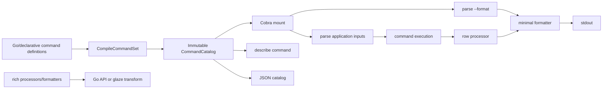

# Design: Minimal Structured Output and Machine-Readable Command Manifests

## Executive summary

Glazed currently gives every `cmds.GlazeCommand` a complete structured-data manipulation language. During Cobra construction, the framework automatically attaches nine settings sections containing 44 flags for field selection, regular-expression filtering, renaming, replacement, templating, jq, sorting, pagination, file management, table styling, Excel, SQL, and other output behavior. That design was valuable when a human needed to perform every transformation directly from a shell command. It is now too broad for applications primarily driven by scripts and LLM agents: it makes help noisy, creates application/framework flag collisions, obscures which inputs belong to the business operation, and duplicates transformations that callers can express more clearly in JavaScript, jq, DuckDB, or a dedicated data-transformation tool.

This design makes two coordinated changes:

1. A `GlazeCommand` receives only a small serialization boundary: `--format table|json|jsonl|csv|tsv`. Structured row processors and rich formatters remain reusable Go libraries, but generic transformations are no longer mounted on every application command. Query filters, pagination, projections, and sorting remain command flags only when they affect the operation itself, such as a database query or remote API call.
2. Glazed gains a static, versioned command-manifest model and a standard root-level `describe` command. `app describe`, `app describe search`, and `app describe transcript index` return canonical JSON describing command paths, application and framework inputs, output shape, side effects, execution properties, aliases, and examples without executing the target command or resolving runtime values.

The implementation should be a major-version hard cut. It must not install compatibility aliases or silently preserve the 44-flag surface. Applications that want a transformation pipeline can explicitly use the retained processor libraries or a dedicated `glaze transform` command.

## Decision

Adopt the following framework policy:

- Glazed owns command definition, typed input parsing, structured row transport, a minimal stdout serialization choice, static command discovery, and validation of the complete command tree.
- An application owns flags that change the work it performs.
- The caller owns ad hoc post-processing, destination redirection, and presentation customization.
- A dedicated transformation command owns reusable CLI data manipulation.
- Static description is a compile-time operation. Runtime resolution and execution planning are separate APIs.
- Missing effect information means `unknown`, never `none`.
- Command-tree compilation is atomic: either every command and alias validates and mounts, or none do.

## Why this belongs in Glazed

An application can add a one-off `--describe` flag, but it cannot solve the framework problem consistently. Glazed already knows the command descriptions, schemas, defaults, choices, aliases, parent paths, command implementation interfaces, and framework-injected settings. It is therefore the only layer that can produce a complete and comparable manifest across Go commands, YAML commands, JavaScript-defined verbs, aliases, and future loaders.

The same applies to output simplification. The excessive flags are injected by Glazed in `pkg/cli/cobra.go`, not by individual applications. Removing them application by application would create different discovery rules and output semantics in every binary. The framework should define one small contract and provide explicit extension points.

## Current state and concrete failure modes

### Automatic surface expansion

`BuildCobraCommandFromCommandAndFunc` in `pkg/cli/cobra.go` detects `cmds.GlazeCommand`, clones its schema, and attaches `settings.NewGlazedSection()` when the section is absent. `NewGlazedSection` in `pkg/settings/glazed_section.go` constructs all of these sections:

- fields and filters;
- output;
- rename;
- replace/add fields;
- select;
- templates;
- jq;
- sort;
- skip/limit.

The YAML definitions under `pkg/settings/flags/` currently declare 44 flags:

| Section | Count | Flags |
|---|---:|---|
| Fields/filtering | 8 | `fields`, `filter`, `regex-fields`, `regex-filters`, `sort-columns`, `remove-nulls`, `remove-duplicates`, `reorder-columns` |
| Output | 19 | `output`, `output-file`, `template-file`, `output-file-template`, `output-multiple-files`, `template-data`, `table-format`, `stream`, `table-style`, `table-style-file`, `print-table-style`, `with-headers`, `csv-separator`, `output-as-objects`, `flatten`, `sheet-name`, `sql-table-name`, `sql-upsert`, `sql-split-by-rows` |
| Rename | 3 | `rename`, `rename-regexp`, `rename-yaml` |
| Replace | 2 | `replace-file`, `add-fields` |
| Select | 3 | `select`, `select-template`, `select-separator` |
| Template | 3 | `template`, `template-field`, `use-row-templates` |
| jq | 3 | `jq`, `field-jq`, `jq-file` |
| Pagination | 2 | `glazed-skip`, `glazed-limit` |
| Sort | 1 | `sort-by` |

This creates four systemic problems.

First, the apparent command API is much larger than the business API. An agent inspecting help has to distinguish a few operation inputs from dozens of unrelated post-processing switches.

Second, framework flags consume common names. A command that naturally declares `output-file`, `template`, `fields`, or `filter` can collide with the injected section. This is not hypothetical: application authors regularly want an `output-file` that denotes a report artifact rather than a generic Glazed sink.

Third, several flags mix distinct responsibilities. `--output json` is serialization; `--output excel` creates an artifact; `--output sql` generates statements with database-specific settings; `--template-file` executes a rendering program; and `--output-multiple-files` performs destination routing. A single output section cannot describe these effects precisely.

Fourth, `AddCommandsToRootCommand` currently logs an error from `BuildCobraCommandFromCommand` and returns `nil`. A collision can therefore stop the registration loop, omit the failing command and every later command, and still report success. This error-masking behavior must be fixed before adding manifest compilation.

### Existing metadata is not a static contract

`cmds.CommandDescription` contains identity, prose, schema, tags, untyped metadata, parents, and source. It does not describe output, effects, execution constraints, or examples with typed fields. The existing `cmds.CommandWithMetadata.Metadata(ctx, parsedValues)` interface is runtime-dependent: it accepts resolved values and can perform arbitrary work. Calling it from `describe` would make discovery value-dependent and potentially side-effecting.

The existing `CommandDescription.ToJsonSchema` is useful input-schema machinery, but a JSON Schema for inputs is not a complete command contract. Agents also need to know whether a command emits rows or text, whether it writes files or uses the network, whether stdin is consumed, and whether an output schema is exact or dynamic.

## Goals

- Make ordinary command help small enough that the business operation is immediately visible.
- Preserve `middlewares.Processor` and formatter packages as reusable implementation primitives.
- Provide one canonical, stable JSON representation of a command tree.
- Allow discovery before required arguments are provided and without running target command code.
- Distinguish application inputs from framework inputs.
- Represent unknown information honestly.
- Support commands constructed in Go and commands loaded from declarative sources with the same manifest.
- Validate paths, aliases, input names, and framework collisions before mutating a Cobra tree.
- Give an intern a phased implementation path with testable checkpoints.

## Non-goals

- Replacing Cobra.
- Designing a general-purpose query language inside command manifests.
- Inferring exact row schemas from arbitrary Go code.
- Resolving configuration files, environment variables, credentials, or runtime profiles during `describe`.
- Preserving old output flags through aliases or adapters.
- Removing formatter or middleware libraries merely because their global flags disappear.
- Making `describe` predict the exact result of a particular invocation. That is a future `plan` concern.

## Responsibility boundary

The deciding question for a flag is: **does this value change the work performed by the command, or only transform already-produced rows?**

```text
                         changes source work?
                                |
                     +----------+----------+
                     |                     |
                    yes                    no
                     |                     |
          application command flag    caller or explicit
          (query/API/business logic)   transform pipeline
                                             |
                                  serialization only?
                                      |          |
                                     yes         no
                                      |          |
                              Glazed --format   caller / glaze transform
```

Examples:

- `search --limit 20` stays if it limits the vector search or API request before results are materialized.
- `search --fields title,url` stays if it controls a remote projection and reduces work or data transfer.
- Generic `--glazed-limit 20`, applied after all rows exist, is removed.
- Generic `--sort-by score` is removed; a search command may expose its own `--sort score` when that changes retrieval semantics.
- `--output-file report.json` is removed; shell redirection or a caller-owned file API owns the destination.
- `--format jsonl` stays because the command must frame its stdout contract.

## Flag disposition

### Keep as the default Glazed surface

Introduce one framework flag:

```text
--format table|json|jsonl|csv|tsv
```

Semantics are deliberately fixed:

- `table`: one deterministic human-readable table style; intended for terminals.
- `json`: a JSON array on stdout.
- `jsonl`: one JSON object per line; the preferred streaming and agent format.
- `csv`: RFC-style comma-separated rows with a header row.
- `tsv`: tab-separated rows with a header row.

The default remains `table` for direct human use. Automation should always pass `--format json` or `--format jsonl`. The framework writes to stdout only. Diagnostics and logs remain on stderr.

`jsonl` is a format, not a `--stream` modifier. This makes framing explicit and prevents invalid combinations such as a streaming Excel workbook or a streamed pretty table with unstable columns.

### Remove from automatic command mounting

| Current capability | Disposition | Rationale / replacement |
|---|---|---|
| Field include/exclude and regex selection | Remove | Caller uses JavaScript/jq/DuckDB; application reintroduces projection only when it affects source work. |
| Column sorting/reordering | Remove | Presentation concern; caller transforms rows. |
| Null removal and deduplication | Remove | Data transformation with policy choices that belong in an explicit pipeline. |
| Row sorting | Remove | Caller sorts; application-specific sort remains when it changes retrieval. |
| Generic skip/limit | Remove | Caller slices rows; command-specific pagination stays when pushed down. |
| Rename and regex rename | Remove | Caller maps keys or uses explicit transformation tooling. |
| Replace and add fields | Remove | Caller executes a script/transformation. |
| Select/template/select separator | Remove | Caller owns text rendering. |
| jq, field-jq, jq-file | Remove | Invoke jq directly or use the dedicated transformation command. |
| Template and per-row templates | Remove | Rendering is a separate effectful operation, not universal serialization. |
| Output file and multi-file routing | Remove | Shell redirection or caller file APIs own destinations. |
| Table format/style/style files | Remove | Keep one stable table renderer; rich presentation is explicit tooling. |
| Header and CSV separator controls | Remove | Define stable CSV/TSV contracts. |
| `output-as-objects` and `stream` | Remove | `json` versus `jsonl` defines framing. |
| Flatten | Remove | Caller transforms nested values deliberately. |
| YAML output | Remove from default | JSON is the machine contract; applications may explicitly opt into YAML if their domain requires it. |
| Markdown output | Remove | Rendering concern; use a transformer or dedicated report command. |
| Excel output and sheet name | Remove | Artifact creation belongs to an explicit export command. |
| SQL output/upsert/table/splitting | Remove | SQL generation is a dedicated command with explicit effects and domain flags. |
| Generic template output and template data | Remove | Executable rendering behavior should not be attached to every command. |

### Keep as libraries and explicit tools

Removing automatic flags does not mean deleting the underlying packages. The following should remain available to Go callers:

- row and table processor interfaces;
- JSON, CSV, TSV, table, YAML, Excel, SQL, and template formatters;
- rename, filter, select, jq, sort, skip/limit, and other middleware constructors;
- programmatic options for file writers and renderers where those APIs remain useful.

A separate `glaze transform` command may compose those primitives for humans and shell pipelines:

```text
app search --format jsonl |
  glaze transform --script normalize.js |
  jq -s 'sort_by(.score) | reverse'
```

That command is intentionally not a compatibility façade. It has its own coherent pipeline API, documentation, and effects. The implementation of the minimal output surface must not wait for it.

## Proposed architecture



The important structural change is compilation before mounting. Today description cloning, framework section injection, parser construction, and Cobra mutation are interleaved. The new flow first produces an immutable catalog, validates it, and only then mutates the root command.

## Static command contract

### Typed authoring model

Add a pure-data contract package that does not import `cmds`:

```go
// pkg/cmds/contract/contract.go
package contract

type CommandContract struct {
    Output    OutputContract    `json:"output" yaml:"output,omitempty"`
    Effects   EffectsContract   `json:"effects" yaml:"effects,omitempty"`
    Execution ExecutionContract `json:"execution" yaml:"execution,omitempty"`
    Examples  []Example         `json:"examples,omitempty" yaml:"examples,omitempty"`
}

type OutputContract struct {
    Mode       OutputMode    `json:"mode" yaml:"mode"` // rows, text, none, dynamic
    Schema     *ObjectSchema `json:"schema,omitempty" yaml:"schema,omitempty"`
    SchemaKind SchemaKind    `json:"schemaKind" yaml:"schemaKind"` // exact, partial, dynamic, unknown
    Formats    []string      `json:"formats,omitempty" yaml:"formats,omitempty"`
    Streaming  Support       `json:"streaming" yaml:"streaming"` // supported, unsupported, unknown
}

type EffectsContract struct {
    Knowledge Knowledge `json:"knowledge" yaml:"knowledge"` // declared, none, unknown
    Items     []Effect  `json:"items,omitempty" yaml:"items,omitempty"`
}

type Effect struct {
    Kind        EffectKind `json:"kind" yaml:"kind"`
    Target      string     `json:"target,omitempty" yaml:"target,omitempty"`
    Description string     `json:"description,omitempty" yaml:"description,omitempty"`
}

type ExecutionContract struct {
    Stdin         InputMode `json:"stdin" yaml:"stdin"` // none, optional, required, unknown
    Interactive   Support   `json:"interactive" yaml:"interactive"`
    Idempotence   Knowledge `json:"idempotence" yaml:"idempotence"`
    Deterministic Knowledge `json:"deterministic" yaml:"deterministic"`
}

type Example struct {
    Name        string   `json:"name" yaml:"name"`
    Description string   `json:"description,omitempty" yaml:"description,omitempty"`
    Arguments   []string `json:"arguments,omitempty" yaml:"arguments,omitempty"`
}
```

Use closed string enums with validation rather than boolean fields. A boolean cannot distinguish “the author declared no network effect” from “the author supplied no effect information.”

Extend `CommandDescription` with a typed field and option:

```go
type CommandDescription struct {
    // existing fields...
    Contract *contract.CommandContract `json:"contract,omitempty" yaml:"contract,omitempty"`
}

func WithContract(c contract.CommandContract) CommandDescriptionOption
```

The contract must be cloned by `CommandDescription.Clone`. That clone currently omits several existing fields such as tags and metadata; contract work should add focused clone tests and decide whether to correct those omissions in the same prerequisite patch.

Do not reuse `CommandWithMetadata.Metadata`. That method remains runtime metadata for a concrete invocation. Static authoring must be data-only and safe to serialize.

### Inference policy

Glazed may infer only broad facts from command interfaces:

| Implementation | Safe inferred output mode |
|---|---|
| `cmds.GlazeCommand` | `rows` |
| `cmds.WriterCommand` | `text` |
| `cmds.BareCommand` | `dynamic` or `none` only if explicitly declared |
| Multiple interfaces / dual mode | Explicit declaration or `dynamic` |

An interface cannot reveal an exact row schema, side effects, or determinism. Those remain `unknown` until declared. Validation should reject contradictions—for example, a command declared as `output.mode: rows` that cannot execute as a `GlazeCommand`—but should permit incomplete contracts during incremental adoption.

### Declarative command sources

Because the contract is serializable, YAML command descriptions can include it directly. JavaScript verb loaders should map their metadata into the same Go type rather than inventing a second manifest format. A representative declarative block is:

```yaml
name: search
short: Search indexed transcripts
contract:
  output:
    mode: rows
    schemaKind: exact
    streaming: supported
    schema:
      fields:
        - { name: id, type: string, required: true }
        - { name: score, type: number, required: true }
        - { name: text, type: string, required: true }
  effects:
    knowledge: declared
    items:
      - kind: filesystem-read
        target: index
  execution:
    stdin: none
    interactive: unsupported
    idempotence: declared
  examples:
    - name: semantic-search
      arguments: ["--query", "retry policy", "--limit", "10", "--format", "jsonl"]
```

For JavaScript ecosystems that use a `__verb__` object, add `returns`, `effects`, `execution`, and `examples` there and translate them to `CommandContract`. The stable public artifact is the Glazed manifest, not the loader-specific metadata syntax.

## Compiled manifest and catalog

Authoring structs are convenient but are not a stable wire representation. Introduce immutable normalized DTOs produced by compilation:

```go
type CommandCatalog struct {
    APIVersion string            `json:"apiVersion"`
    Kind       string            `json:"kind"` // CommandCatalog
    Program    ProgramManifest   `json:"program"`
    Commands   []CommandManifest `json:"commands"`
}

type CommandManifest struct {
    APIVersion string            `json:"apiVersion"`
    Kind       string            `json:"kind"` // Command
    Path       []string          `json:"path"`
    Name       string            `json:"name"`
    Summary    string            `json:"summary"`
    Description string           `json:"description,omitempty"`
    Type       string            `json:"type,omitempty"`
    Tags       []string          `json:"tags,omitempty"`
    Source     string            `json:"source,omitempty"`
    Inputs     []InputManifest   `json:"inputs"`
    Output     OutputManifest    `json:"output"`
    Effects    EffectsManifest   `json:"effects"`
    Execution  ExecutionManifest `json:"execution"`
    Aliases    []AliasManifest   `json:"aliases,omitempty"`
    Examples   []ExampleManifest `json:"examples,omitempty"`
}

type InputManifest struct {
    Name        string          `json:"name"`
    Kind        string          `json:"kind"` // flag or argument
    Owner       string          `json:"owner"` // application or framework
    Section     string          `json:"section"`
    Type        string          `json:"type"`
    Required    bool            `json:"required"`
    Secret      bool            `json:"secret"`
    Default     json.RawMessage `json:"default,omitempty"`
    Choices     []string        `json:"choices,omitempty"`
    Description string          `json:"description,omitempty"`
}
```

Wire rules:

- Start with `apiVersion: glazed.dev/command-manifest/v1` and `kind: Command` or `CommandCatalog`.
- Sort commands by full path, inputs by section order then field order, aliases by path, and map-like schema fields by declared order. The output must be byte-stable for identical definitions.
- Emit arrays instead of JSON maps where ordering is meaningful.
- Never serialize resolved secret values. A secret input may disclose its name, type, and `secret: true`, but not its default.
- Mark the `--format` input as `owner: framework`; all command-authored fields are `owner: application` unless explicitly provided by another mounted framework section.
- Store a normalized snapshot. Do not expose mutable `*schema.Schema`, Cobra objects, or implementation pointers through the public catalog API.

The compiler should have an API similar to:

```go
type CompileOptions struct {
    StructuredOutput StructuredOutputPolicy
    FrameworkInputs  []FrameworkInputProvider
}

func CompileCommandSet(
    ctx context.Context,
    program ProgramDescription,
    commands []cmds.Command,
    aliases []*alias.CommandAlias,
    options CompileOptions,
) (*CommandCatalog, error)
```

Compilation is static. The `context.Context` supports cancellation and diagnostics collection; it must not be used to fetch credentials or execute a command.

## Validation and atomic mounting

Compilation validates the entire set before Cobra mutation:

1. Normalize every full command path.
2. Reject duplicate command paths.
3. Resolve aliases and reject missing targets and alias cycles.
4. Build application input manifests from each schema.
5. Add framework-owned inputs according to policy.
6. Reject duplicate flag names, duplicate argument positions, and application/framework collisions with an error naming both owners and the command source.
7. Validate contract enums, examples, output-schema fields, and command-interface contradictions.
8. Freeze and sort the catalog.
9. Only after success, build and mount Cobra commands from the compiled entries.

Pseudocode:

```text
catalog, diagnostics = compile(all commands, aliases, policy)
if diagnostics has errors:
    return diagnostics as error

built = []
for entry in catalog.commands:
    cobraCommand = buildFromCompiled(entry)
    built.append(cobraCommand)

for cobraCommand in built:
    mount(root, cobraCommand)

mount(root, newDescribeCommand(catalog))
return nil
```

The immediate bug fix is non-negotiable:

```go
// Current behavior: incorrect
if err != nil {
    log.Warn().Err(err).Msg("Could not build cobra command")
    return nil
}

// Required minimum behavior
if err != nil {
    return errors.Wrapf(err, "build command %s from %s", description.FullPath(), description.Source)
}
```

Atomic compilation is stronger than merely returning the error: no partially mounted tree should survive a later failure.

## `describe` command UX

### Command shape

Install a standard root subcommand:

```text
app describe
app describe <command> [<subcommand> ...]
app describe --format json
app describe search --format json
```

`app describe` returns a catalog. Supplying a command path returns one detailed manifest. JSON is the canonical and default output because this command exists primarily for machines. A future human renderer may be added as `--format table`, but it must render from the same catalog.

A leaf-level `app search --describe` is not the primary interface. Required arguments and application flags have already entered the leaf parser at that point, and `--describe` can collide with application input. A root subcommand cleanly separates discovery from execution and can inspect any target path without satisfying its required inputs.

Recommended exit behavior:

- exit 0: manifest emitted;
- exit 2: target path does not exist or is ambiguous;
- exit 1: catalog/compiler failure.

Examples:

```console
$ app describe transcript search
{
  "apiVersion": "glazed.dev/command-manifest/v1",
  "kind": "Command",
  "path": ["transcript", "search"],
  "name": "search",
  "inputs": [
    {
      "name": "query",
      "kind": "flag",
      "owner": "application",
      "section": "default",
      "type": "string",
      "required": true,
      "secret": false
    },
    {
      "name": "format",
      "kind": "flag",
      "owner": "framework",
      "section": "structured-output",
      "type": "choice",
      "required": false,
      "secret": false,
      "default": "table",
      "choices": ["table", "json", "jsonl", "csv", "tsv"]
    }
  ],
  "output": {
    "mode": "rows",
    "schemaKind": "exact",
    "streaming": "supported"
  },
  "effects": {
    "knowledge": "declared",
    "items": [{"kind": "filesystem-read", "target": "index"}]
  }
}
```

### Static guarantees

`describe` must not:

- run `Run`, `RunIntoWriter`, or `RunIntoGlazeProcessor`;
- call `CommandWithMetadata.Metadata`;
- load a user config merely to calculate effective values;
- read environment variables, keyrings, tokens, or input files;
- connect to a database or network service;
- initialize an interactive prompt;
- require target command arguments.

Command constructors still run when the application builds its command set. Constructors used in Glazed applications must therefore remain definition-only. A linter should eventually flag constructors that perform I/O, but that is outside the first implementation.

### `describe` versus `plan`

Keep these concepts separate:

- `describe` answers: “What can this command accept and what does it declare?” It is static, cacheable, safe, and may contain defaults from the definition.
- `plan` would answer: “Given this invocation and active configuration, what values and effects will be used?” It is runtime-dependent, must redact secrets, and may require profile/config resolution.

Do not add effective-value fields to v1 of the manifest. They would weaken the no-side-effect guarantee and couple discovery to configuration precedence.

## Minimal structured-output API

Replace automatic use of the full `settings.NewGlazedSection` with a small section, tentatively:

```go
const StructuredOutputSlug = "structured-output"

type StructuredOutputSettings struct {
    Format string `glazed.parameter:"format"`
}

func NewStructuredOutputSection(
    options ...schema.SectionOption,
) (*schema.SectionImpl, error)
```

Keep `NewGlazedSection` temporarily only as an explicitly selected rich processing API during the major-version development branch; it must no longer be injected based solely on `cmds.GlazeCommand`. If the project chooses to remove it completely in the same major release, applications can construct processor pipelines directly.

Formatter construction becomes narrow and exhaustive:

```go
func NewStructuredOutputFormatter(format Format) (formatters.OutputFormatter, error) {
    switch format {
    case FormatTable:
        return table.NewOutputFormatter("ascii")
    case FormatJSON:
        return json.NewArrayOutputFormatter()
    case FormatJSONL:
        return json.NewLinesOutputFormatter()
    case FormatCSV:
        return csv.NewCSVOutputFormatter()
    case FormatTSV:
        return csv.NewTSVOutputFormatter()
    default:
        return nil, errors.Errorf("unsupported structured output format %q", format)
    }
}
```

If current formatter interfaces cannot express JSONL cleanly, add a focused formatter rather than retaining `--stream` and `--output-as-objects`. Tests must define empty input, late-appearing columns, nested values, binary values, errors after partial streaming, and cancellation behavior for every retained format.

Applications must be able to opt out or replace the policy:

```go
cli.WithStructuredOutput(cli.StructuredOutputDisabled)
cli.WithStructuredOutput(cli.StructuredOutputMinimal)
cli.WithStructuredOutputProvider(customProvider)
```

The default for `GlazeCommand` is minimal. A custom provider participates in compilation, declares its framework-owned inputs, and cannot bypass collision validation.

## Package and file plan

Suggested boundaries:

```text
pkg/cmds/contract/
  contract.go          typed authoring contracts and enums
  validate.go          contract-only validation
  schema.go            output field schema DTOs

pkg/cli/
  compile.go           CompileCommandSet and diagnostics
  manifest.go          immutable wire DTOs and canonical JSON
  mount.go             Cobra mounting from compiled entries
  describe.go          standard describe command
  structured_output.go minimal framework input provider

pkg/settings/
  structured_output.go minimal --format section and decoding

pkg/formatters/json/
  lines.go             JSONL formatter if not cleanly supported today
```

Existing files affected:

- `pkg/cmds/cmds.go`: add and clone typed contracts; keep runtime metadata separate.
- `pkg/cmds/json-schema.go`: reuse normalized input DTO logic or clearly document why JSON Schema and manifest have different representations.
- `pkg/cli/cobra.go`: stop injecting `NewGlazedSection`; return build errors; delegate to compile/mount steps.
- `pkg/cli/cobra-parser.go`: accept compiled schemas or participate in the new mount boundary.
- `pkg/settings/glazed_section.go`: cease default aggregation; retain rich pipeline construction only if explicitly chosen.
- `pkg/settings/settings_output.go`: split minimal serialization from rich artifact/rendering settings.
- `pkg/settings/flags/*.yaml`: remove from automatic path; delete obsolete global definitions after downstream migration.
- `pkg/analysis/glazedclilint`: recognize minimal framework output and diagnose manually attached rich sections on ordinary commands.

## Implementation plan

### Phase 0: lock behavior with characterization tests

- Add a fixture command with an application flag named `output-file` and prove the current collision.
- Add a multi-command fixture proving that `AddCommandsToRootCommand` returns success after the failure and omits later commands.
- Add a snapshot listing the current 44 automatically mounted flags.
- Add formatter characterization tests for retained formats, especially JSON framing and streaming.

Deliverable: tests fail only where they encode the known error-masking bug.

### Phase 1: restore registration correctness

- Return wrapped build errors from `AddCommandsToRootCommand`.
- Build all Cobra commands into an unattached collection before mounting them.
- Validate duplicate command paths and aliases before mutation.
- Include full path and `CommandDescription.Source` in every diagnostic.

Deliverable: a bad command leaves the root unchanged and returns a useful error.

### Phase 2: introduce contracts and normalized manifests

- Add `pkg/cmds/contract` enums and authoring types.
- Add `CommandDescription.Contract` and `WithContract`.
- Fix clone coverage and add clone tests.
- Build `InputManifest` values from schemas with stable ordering and secret redaction.
- Implement interface-based output-mode inference and honest unknowns.
- Add golden JSON tests for command and catalog manifests.

Deliverable: `CompileCommandSet` returns stable catalog JSON without Cobra.

### Phase 3: add `describe`

- Add the root-level standard command.
- Implement catalog and exact-path lookup.
- Include aliases and program metadata.
- Test commands with required arguments, nested paths, aliases, secrets, dynamic schemas, and incomplete effect declarations.
- Add a trap command whose execution methods panic; prove `describe` never calls them.

Deliverable: any Glazed application can expose its command catalog in canonical JSON.

### Phase 4: install the minimal output policy

- Add `NewStructuredOutputSection` with only `--format`.
- Add JSONL support and fixed semantics for the five formats.
- Switch `GlazeCommand` auto-injection from rich settings to the minimal policy.
- Mark the field as framework-owned in manifests.
- Add opt-out and custom-provider APIs.
- Delete or isolate code that assumes every `GlazeCommand` has the full `GlazedSection` value shape.

Deliverable: ordinary structured commands expose exactly one framework output flag.

### Phase 5: update declarative loaders and transformation tooling

- Decode typed contract YAML.
- Update JavaScript verb metadata adapters to populate the same contract.
- Decide whether `glaze transform` is an existing command to simplify or a new explicit command.
- Preserve useful middleware and formatter packages independent of CLI flag deletion.

Deliverable: Go, YAML, and JavaScript command sources produce equivalent manifests.

### Phase 6: hard-cut migration and documentation

- Remove the old flags from automatic registration without aliases.
- Update examples to use `--format` and stdout redirection.
- Document how to move source-affecting flags into the application schema.
- Document caller-side JavaScript/jq/DuckDB patterns for transformations.
- Publish a major-version migration table with compile/runtime failure examples.

Deliverable: no official example or help page teaches the old universal transformation surface.

## Documentation that must change

At minimum, audit and update:

- `pkg/doc/topics/commands-reference.md`: add contracts, manifests, output ownership, and `describe`.
- `pkg/doc/topics/31-glazed-cli-lint.md`: replace full-section recommendations with the minimal policy and new collision diagnostics.
- `pkg/doc/topics/07-dual-commands.md`: explain output modes and framework inputs for dual commands.
- `pkg/doc/tutorials/01-a-simple-table-cli.md`: use `--format`, show `describe`, and remove old output examples.
- `pkg/doc/tutorials/05-build-first-command.md`: teach `WithContract` and source-affecting versus post-processing flags.
- `pkg/doc/topics/sections-guide.md`: document framework-owned sections and compiler collision rules.
- `pkg/doc/topics/22-command-loaders.md`: include contract decoding and static-constructor requirements.
- `pkg/doc/tutorials/custom-section.md`: explain custom framework input providers and ownership.
- `pkg/doc/tutorials/migrating-to-facade-packages.md`: add the major-version hard cut only if this page remains the active migration index.
- formatter/output help pages discovered by searching for `--output`, `NewGlazedSection`, `glazed-limit`, `output-file`, and each removed flag.
- generated CLI reference and completion fixtures that snapshot the old flag set.

Add new pages:

- “Command manifests and `describe`” as the canonical JSON/API reference.
- “Structured output policy” with the five formats and stdout/stderr guarantees.
- “Migrating rich Glazed output flags” with caller-side and command-specific replacements.
- “Writing effect and output contracts” with honest unknowns and security guidance.

## Testing strategy

### Unit tests

- every contract enum accepts documented values and rejects unknown values;
- command cloning retains the contract without sharing mutable slices;
- schema fields normalize to stable input manifests;
- secret defaults are omitted;
- owner assignment is correct;
- command-interface inference never claims exact schemas or absent effects;
- canonical JSON is stable across repeated compilation;
- every retained formatter handles zero, one, and many rows.

### Compiler and mounting tests

- duplicate paths fail before mutation;
- application/framework flag collisions fail before mutation;
- a failure in command N leaves commands 1 through N-1 unmounted;
- aliases resolve by full path and cycles fail;
- source paths appear in errors;
- nested placeholder parents are deterministic;
- custom output providers declare all mounted fields.

### `describe` tests

- catalog mode and detailed mode use the specified API version;
- required target arguments are not required for discovery;
- command execution methods are never called;
- runtime metadata is never called;
- secrets and runtime values never appear;
- absent effects serialize as `knowledge: unknown`;
- aliases point to canonical targets;
- a nonexistent path exits with code 2 and a machine-readable diagnostic on stderr.

### Integration and downstream tests

- update at least one representative Go application, YAML-loaded application, and JavaScript-verb application;
- run `go test ./...` and `go build ./...` in Glazed;
- scan downstream help output for removed flags;
- compare manifest output between equivalent Go and declarative commands;
- run a JSONL pipeline through jq and a JavaScript caller to prove the intended composition boundary.

## Acceptance criteria

The issue is complete when all of the following are true:

- A normal `cmds.GlazeCommand` receives only `--format` from the structured-output framework.
- The accepted formats are exactly `table`, `json`, `jsonl`, `csv`, and `tsv`, with documented stable framing.
- None of the former 43 auxiliary flags are automatically mounted.
- Application-specific source filters, sorting, projection, and pagination remain possible as ordinary command fields.
- `CompileCommandSet` detects path, alias, and input collisions before changing the Cobra tree.
- `AddCommandsToRootCommand` never converts a build error into success.
- `app describe` emits a versioned deterministic catalog without executing target commands or reading runtime configuration.
- `app describe <path...>` includes application/framework input ownership, output, effects, execution, aliases, and examples.
- Unknown effects and output schemas are represented explicitly.
- Go and at least one declarative loader populate the same manifest model.
- Rich processors and formatters remain usable as libraries or through explicit transformation tooling.
- Migration documentation is complete and no compatibility aliases are added.

## Risks and mitigations

### Downstream breakage

Many applications and scripts likely use `--output`, `--output-file`, or generic filters. This is intended major-version breakage, but it must be measurable. Before removal, scan first-party repositories and publish replacements. Do not hide the breakage behind deprecated aliases because aliases preserve collisions and keep the oversized help surface alive.

### Overpromising effects

Authors may omit side effects or mark commands safe incorrectly. The manifest is a declared contract, not a sandbox. Use `unknown` by default, document that consumers must not treat declarations as enforcement, and consider later static linting.

### Dynamic output schemas

Some commands derive columns from input data. They should use `schemaKind: dynamic` and optionally provide a partial schema. Never fabricate an exact schema from the first observed row during static description.

### Formatter semantic changes

Replacing the old `output + stream + output-as-objects` matrix with JSON/JSONL may expose edge cases. Golden tests and explicit error-after-partial-output behavior are required before migration.

### Package cycles

`pkg/cmds/contract` must remain pure data and must not import `pkg/cmds`. `pkg/cmds` may import the contract package. Compilation belongs in `pkg/cli`, which can depend on both command and Cobra-facing packages.

## Alternatives considered

### Keep all flags but hide them from help

Rejected. Hidden flags still collide, remain part of the de facto API, complicate manifests, and preserve ambiguous ownership.

### Add only an application-specific `--describe`

Rejected. It would be parsed alongside execution inputs, vary across binaries, and lack framework input and alias knowledge.

### Generate manifests directly from Cobra

Rejected as the primary model. Cobra contains the final syntax but not typed output/effect contracts, ownership, or a safe authoring boundary. It also makes static compilation and atomic validation harder. Cobra may be used as a consistency check after mounting.

### Put contracts in `map[string]interface{}` metadata

Rejected. Untyped metadata cannot provide stable validation, enum evolution, documentation, or safe loader parity.

### Infer effects and output schemas automatically

Rejected. Interfaces reveal broad execution modes, not filesystem/network effects or exact dynamic row shapes. Incorrect claims are worse than explicit unknowns.

### Retain `--output` instead of introducing `--format`

`--output` is historically familiar, but it currently means both serialization type and artifact behavior. The hard cut is the right moment to use the narrower name `--format`. This is the only naming decision that should be confirmed before Phase 4; it must not result in supporting both names.

## Open questions

1. Should YAML be an opt-in standard formatter provider, or only a retained library? The default proposal excludes it because JSON/JSONL are the agent contract.
2. Should table be selected automatically only for TTY stdout, with JSONL for non-TTY stdout? The initial proposal keeps a deterministic `table` default to avoid environment-dependent manifests and behavior.
3. Does `CommandDescription.ToJsonSchema` become a view over manifest inputs, or remain a separate standards-oriented export? Either choice needs consistency tests.
4. What is the smallest useful closed vocabulary for effects in v1? Start with filesystem read/write, network, process execution, terminal interaction, and state mutation; version rather than accepting arbitrary strings silently.
5. Should aliases appear only on canonical command manifests or also as catalog entries? The proposal uses canonical commands plus alias records to avoid duplicated contracts.

## Review guide for a new intern

Read and implement in this order:

1. Start with `pkg/cmds/cmds.go`. Understand `CommandDescription`, `Command`, `BareCommand`, `WriterCommand`, and `GlazeCommand`. Notice that description and execution are separate.
2. Read `pkg/cli/cobra.go` from `BuildCobraCommandFromCommandAndFunc` through `AddCommandsToRootCommand`. Trace exactly when the full Glazed section is added and where errors are swallowed.
3. Read `pkg/settings/glazed_section.go` and the YAML files in `pkg/settings/flags/`. Make a checklist of all 44 flags and identify the settings decoder for each section.
4. Read `pkg/settings/settings_output.go` and `pkg/formatters/formatter.go`. Draw the difference between row formatters, table formatters, processors, serialization, and destination behavior.
5. Implement Phase 0 and Phase 1 without changing the public flag surface. These tests protect the compiler refactor.
6. Implement the pure contract types and JSON golden tests before touching Cobra.
7. Build `CompileCommandSet` as a pure normalization step. It should be easy to test using fake commands whose execution methods panic.
8. Add `describe` from the compiled catalog.
9. Only then replace the automatic full settings section with the minimal one. This sequencing makes regressions attributable.
10. Finish by migrating documentation and representative downstream commands. Do not add an alias from `--output` to `--format` unless the project explicitly reverses the hard-cut decision.

When reviewing a patch, ask:

- Can this code execute or resolve runtime state during compilation?
- Can a command/framework flag collision survive until Cobra mounting?
- Can a missing contract be confused with a safe contract?
- Is this capability serialization, business logic, or post-processing?
- Does the public JSON remain stable if Go maps iterate differently?
- Does an error name the full command path and source file?

## References

- `pkg/cmds/cmds.go` — current command descriptions and execution interfaces.
- `pkg/cmds/json-schema.go` — current input JSON-schema export.
- `pkg/cli/cobra.go` — automatic rich settings injection and command registration.
- `pkg/cli/cobra-parser.go` — schema-to-Cobra conversion.
- `pkg/settings/glazed_section.go` — aggregation of the nine current settings sections.
- `pkg/settings/flags/*.yaml` — source of the 44 current generic flags.
- `pkg/settings/settings_output.go` — current mixed serialization/artifact/rendering behavior.
- `pkg/formatters/formatter.go` — row and table formatter interfaces.
- `pkg/doc/topics/31-glazed-cli-lint.md` — current lint guidance around attaching Glazed settings.
